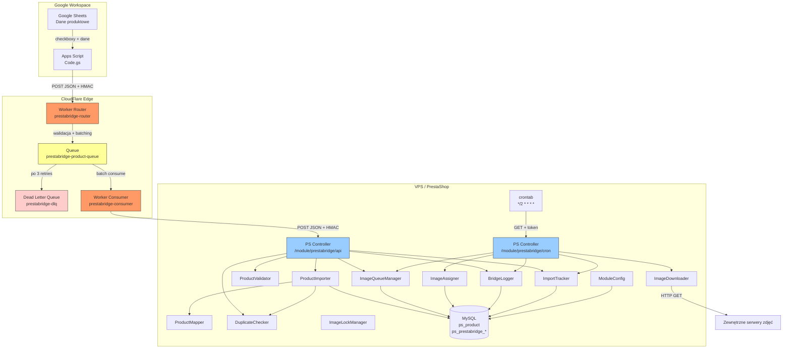
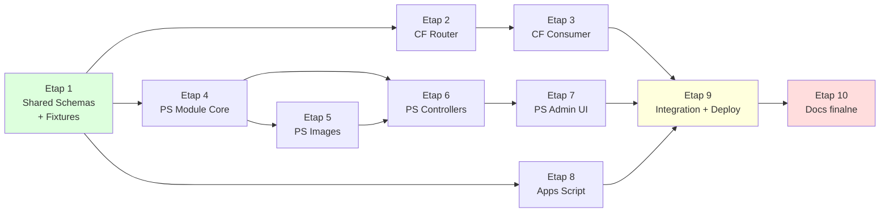

# DEPENDENCY-MAP.md — Mapa zależności komponentów PrestaBridge

## Diagram przepływu danych (Mermaid)



## Kolejność implementacji (zależności wyznaczają ścieżkę krytyczną)



## Ścieżka krytyczna

```
Etap 1 → Etap 4 → Etap 5 → Etap 6 → Etap 7 → Etap 9 → Etap 10
```

Elementy równoległe:
- Etap 2 (CF Router) i Etap 4 (PS Core) mogą być robione równolegle po Etapie 1
- Etap 8 (Apps Script) może być robiony równolegle z Etapami 4-7
- Etap 3 (CF Consumer) może być robiony zaraz po Etapie 2

## Macierz zależności klas PS

| Klasa | Zależy od | Jest używana przez |
|-------|-----------|-------------------|
| ModuleConfig | Configuration (PS) | Wszystkie klasy |
| BridgeLogger | Db (PS), ModuleConfig | Wszystkie klasy |
| HmacAuthenticator | — (standalone) | api.php controller |
| ProductValidator | — (standalone) | api.php, ProductImporter |
| DuplicateChecker | Db (PS) | api.php, ProductImporter |
| ProductMapper | Configuration (PS), Context (PS), ModuleConfig | ProductImporter |
| ProductImporter | ProductMapper, DuplicateChecker, BridgeLogger, Product (PS), StockAvailable (PS) | api.php controller |
| ImageQueueManager | Db (PS) | api.php, cron.php |
| ImageDownloader | ModuleConfig | cron.php |
| ImageAssigner | Product (PS), Image (PS), ImageType (PS), ImageManager (PS), BridgeLogger | cron.php |
| ImportTracker | Db (PS) | api.php, cron.php |

## Macierz zależności Worker modules

| Moduł | Zależy od | Jest używany przez |
|-------|-----------|-------------------|
| hmac.js | Web Crypto API | authMiddleware, authSigner |
| response.js | — | index.js, importHandler |
| logger.js | — | Wszystkie moduły |
| authMiddleware.js | hmac.js | index.js (Router) |
| authSigner.js | hmac.js | prestashopClient.js |
| validationService.js | — (standalone) | importHandler.js |
| batchService.js | — (standalone) | importHandler.js |
| queueService.js | — | importHandler.js |
| importHandler.js | validationService, batchService, queueService, logger, response | index.js (Router) |
| prestashopClient.js | authSigner, logger | queueHandler.js |
| queueHandler.js | prestashopClient, logger | index.js (Consumer) |
