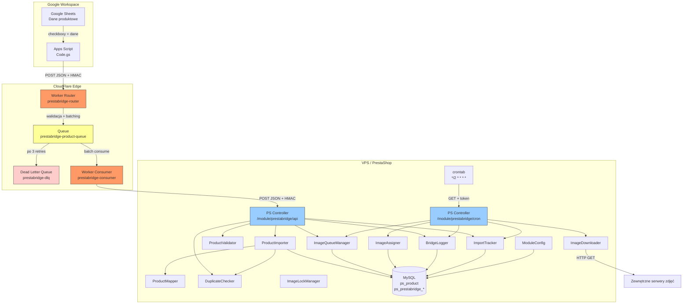
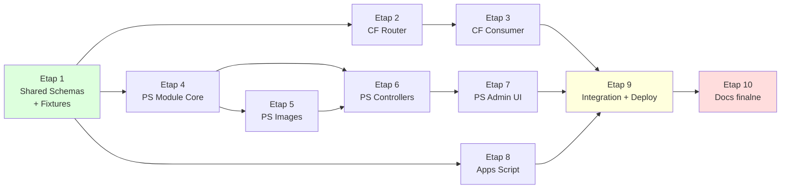

This file is a merged representation of a subset of the codebase, containing files not matching ignore patterns, combined into a single document by Repomix.

# File Summary

## Purpose
This file contains a packed representation of a subset of the repository's contents that is considered the most important context.
It is designed to be easily consumable by AI systems for analysis, code review,
or other automated processes.

## File Format
The content is organized as follows:
1. This summary section
2. Repository information
3. Directory structure
4. Repository files (if enabled)
5. Multiple file entries, each consisting of:
  a. A header with the file path (## File: path/to/file)
  b. The full contents of the file in a code block

## Usage Guidelines
- This file should be treated as read-only. Any changes should be made to the
  original repository files, not this packed version.
- When processing this file, use the file path to distinguish
  between different files in the repository.
- Be aware that this file may contain sensitive information. Handle it with
  the same level of security as you would the original repository.

## Notes
- Some files may have been excluded based on .gitignore rules and Repomix's configuration
- Binary files are not included in this packed representation. Please refer to the Repository Structure section for a complete list of file paths, including binary files
- Files matching these patterns are excluded: node_modules/**, vendor/**, .wrangler/**, .git/**, *.log, .env, .env.local, .dev.vars, .phpunit.cache/**, coverage/**, repomix_*.md, .idea/**, .vscode/**, *.lock, package-lock.json, composer.lock
- Files matching patterns in .gitignore are excluded
- Files matching default ignore patterns are excluded
- Files are sorted by Git change count (files with more changes are at the bottom)

# Directory Structure
```
.agent/rules/project-rules.md
.agent/skills/cloudflare-workers/SKILL.md
.agent/skills/deployment/SKILL.md
.agent/skills/error-handling/SKILL.md
.agent/skills/git-push/SKILL.md
.agent/skills/google-apps-script/SKILL.md
.agent/skills/prestashop-admin-ui/SKILL.md
.agent/skills/prestashop-module/SKILL.md
.agent/skills/race-conditions/SKILL.md
.agent/skills/repomix/SKILL.md
.agent/skills/security/SKILL.md
.agent/skills/testing/SKILL.md
.cursorrules
.github/copilot-instructions.md
.gitignore
.windsurfrules
CLAUDE.md
DECISIONS.md
DEPENDENCY-MAP.md
DEPLOYMENT.md
LICENSE.md
prestashop-module/prestabridge/composer.json
prestashop-module/prestabridge/config.xml
prestashop-module/prestabridge/phpunit.xml
prestashop-module/prestabridge/sql/install.sql
prestashop-module/prestabridge/sql/uninstall.sql
README.md
shared/fixtures/edge-cases.json
shared/fixtures/invalid-products.json
shared/fixtures/valid-products.json
shared/schemas/product-payload.json
shared/schemas/ps-response.json
shared/schemas/queue-message.json
shared/schemas/router-request.json
shared/schemas/router-response.json
TESTING-STRATEGY.md
workers/consumer/package.json
workers/consumer/vitest.config.js
workers/consumer/wrangler.toml
workers/router/package.json
workers/router/vitest.config.js
workers/router/wrangler.toml
```

# Files

## File: .agent/rules/project-rules.md
````markdown
# .cursorrules / .claude-rules — PrestaBridge Project Rules

> Ten plik zawiera zasady obowiązujące WSZYSTKIE agenty AI pracujące z projektem PrestaBridge.
> Obowiązuje zarówno w Claude Code, Cursor, Windsurf, Google Antigravity, jak i każdym innym środowisku.

---

## REGUŁA #0 — PRZECZYTAJ CLAUDE.md ZANIM NAPISZESZ CHOĆ LINIĘ KODU

Przed każdą sesją pracy:
1. Przeczytaj `/CLAUDE.md` — to jedyne źródło prawdy
2. Zidentyfikuj etap, nad którym pracujesz (sekcja 14)
3. Sprawdź dokładnie jakie pliki masz stworzyć/edytować
4. Przeczytaj odpowiednią sekcję szczegółową (6-9)
5. Przeczytaj scenariusze testów (sekcja 12)

---

## REGUŁA #1 — ZERO INTERPRETACJI

- Implementujesz DOKŁADNIE to, co jest w CLAUDE.md
- Nie "ulepszasz" — tworzysz zgodnie z planem
- Nie dodajesz "na wszelki wypadek" — tworzysz tylko to, co opisano
- Nie zmieniasz nazw, typów, kolejności parametrów
- Jeśli czegoś nie rozumiesz — wstawiasz `// TODO: QUESTION: <opis wątpliwości>`

---

## REGUŁA #2 — STRUKTURA PLIKÓW JEST ŚWIĘTA

```
NIE tworzysz plików poza strukturą z sekcji 17 CLAUDE.md
NIE zmieniasz nazw katalogów ani plików
NIE przenosisz klas między katalogami
NIE łączysz plików ("bo tak będzie prościej")
```

---

## REGUŁA #3 — KAŻDY PLIK = JEDEN CEL

Zasada Single Responsibility:
- `ProductValidator.php` — TYLKO walidacja
- `ProductMapper.php` — TYLKO mapowanie
- `ProductImporter.php` — TYLKO import (używa Validator i Mapper)
- `ImageDownloader.php` — TYLKO pobieranie z URL
- `ImageAssigner.php` — TYLKO przypisywanie do PS
- `BridgeLogger.php` — TYLKO logowanie

Jeśli metoda robi dwie rzeczy — rozbij na dwie metody lub dwie klasy.

---

## REGUŁA #4 — TESTY SĄ OBOWIĄZKOWE

Dla każdego pliku klasy/modułu MUSISZ stworzyć odpowiedni plik testowy.
Scenariusze testów są opisane w sekcji 12 CLAUDE.md — implementuj KAŻDY scenariusz.
Nazewnictwo testów: `test<NazwaMetody>_<scenariusz>` lub `it('should <opis>', ...)`

### CF Workers (Vitest):
```javascript
// Pattern:
import { describe, it, expect } from 'vitest';
import { validateProduct } from '../src/services/validationService.js';

describe('validationService', () => {
  describe('validateProduct', () => {
    it('should accept product with minimum required fields', () => {
      // scenariusz R-V1
    });
  });
});
```

### PrestaShop (PHPUnit):
```php
// Pattern:
namespace PrestaBridge\Tests\Unit\Import;

use PHPUnit\Framework\TestCase;
use PrestaBridge\Import\ProductValidator;

class ProductValidatorTest extends TestCase
{
    public function testValidateMinimalValidProduct(): void
    {
        // scenariusz P-V1
    }
}
```

---

## REGUŁA #5 — HMAC IMPLEMENTACJA JEST IDENTYCZNA WSZĘDZIE

HMAC-SHA256 musi produkować identyczny podpis na:
- Google Apps Script (Utilities.computeHmacSha256Signature)
- CF Workers (crypto.subtle)
- PHP (hash_hmac)

Format: `timestamp.hex_signature`
Payload: `timestamp + '.' + rawBody`

**NIE ZMIENIAJ formatu, separatora, kodowania.**

---

## REGUŁA #6 — SQL — BEZPIECZEŃSTWO

Każdy parametr w zapytaniu SQL:
- String → `pSQL($value)`
- Integer → `(int) $value`
- Nigdy nie wstawiaj zmiennych bezpośrednio do SQL
- Nigdy nie używaj `sprintf` z `%s` na nieprzefiltrowanych danych

---

## REGUŁA #7 — ERROR HANDLING

### CF Workers:
```javascript
// ZAWSZE try/catch na zewnętrznych operacjach
try {
  const result = await operation();
} catch (error) {
  logger.error('Operation failed', { error: error.message, stack: error.stack });
  return response.error('Internal error', 500);
}
```

### PHP PrestaShop:
```php
// ZAWSZE try/catch na import/image operacjach
try {
    $result = $this->operation();
} catch (\Exception $e) {
    BridgeLogger::error($e->getMessage(), ['trace' => $e->getTraceAsString()], 'source');
    return ['success' => false, 'error' => $e->getMessage()];
}
```

---

## REGUŁA #8 — RACE CONDITION SAFETY

PRZED przypisaniem zdjęcia do produktu ZAWSZE:
```php
if (!Product::existsInDatabase($id_product, 'product')) {
    // STOP — produkt nie istnieje
}
```

PRZED update produktu ZAWSZE:
```php
$existing = new Product($existingId);
if (!Validate::isLoadedObject($existing)) {
    // STOP — produkt został usunięty między checkiem a update
}
```

---

## REGUŁA #9 — CF WORKERS FREE TIER

- CPU time < 10ms: NIE rób ciężkich obliczeń, NIE parsuj ogromnych JSON-ów
- Wall time < 30s: timeout na fetch do PS = 25s max
- NIE używaj: eval(), Function(), importScripts()
- NIE importuj: npm packages > 50KB (walidacja ręczna, nie ajv)
- TAK używaj: crypto.subtle, TextEncoder, Response, Request, Headers

---

## REGUŁA #10 — RESPONSE FORMAT

### CF Worker odpowiedzi — ZAWSZE JSON:
```javascript
return new Response(JSON.stringify({
  success: true/false,
  // ... data
}), {
  status: 200/400/401/500,
  headers: { 'Content-Type': 'application/json' }
});
```

### PS Controller odpowiedzi — ZAWSZE JSON:
```php
header('Content-Type: application/json');
die(json_encode([
    'success' => true/false,
    // ... data
]));
```

---

## REGUŁA #11 — KOMENTARZE I DOKUMENTACJA

### JS (CF Workers):
```javascript
/**
 * Validates a single product payload against the schema.
 * @param {Object} product - Product payload
 * @returns {{ valid: boolean, errors: string[] }}
 */
export function validateProduct(product) { ... }
```

### PHP:
```php
/**
 * Validates a single product payload.
 *
 * @param array<string, mixed> $product Product data
 * @return array{valid: bool, errors: string[]}
 */
public static function validate(array $product): array { ... }
```

---

## REGUŁA #12 — NIE IMPLEMENTUJ PRZYSZŁOŚCI

Te elementy istnieją TYLKO jako puste klasy/interfejsy:
- `Export/ProductExporter.php` — tylko abstract class z todo
- `Export/ExportableInterface.php` — tylko interface z metodami
- Hooki PS (`hookActionProductUpdate` etc.) — zarejestrowane ale puste
- D1 integration — nie istnieje w kodzie
- R2 storage — nie istnieje w kodzie
- Workers AI — nie istnieje w kodzie

---

## REGUŁA #13 — GIT WORKFLOW

- Jeden commit per etap (sekcja 14 CLAUDE.md)
- Commit message: `[Etap X] <opis>` np. `[Etap 2] CF Worker Router - implementation`
- Branch: `main` (MVP)
- Nie commituj: `node_modules/`, `.wrangler/`, `vendor/`

---

## REGUŁA #14 — DEPENDENCY MANAGEMENT

### CF Workers (package.json):
```json
{
  "devDependencies": {
    "vitest": "^1.0.0",
    "@cloudflare/vitest-pool-workers": "^0.1.0",
    "miniflare": "^3.0.0",
    "wrangler": "^3.0.0"
  }
}
```
ZERO production dependencies — CF Workers bundle all.

### PrestaShop (composer.json):
```json
{
  "name": "prestabridge/prestabridge",
  "autoload": {
    "psr-4": {
      "PrestaBridge\\": "classes/"
    }
  },
  "require-dev": {
    "phpunit/phpunit": "^10.0"
  }
}
```
ZERO production dependencies — PS ma wszystko.

---

## REGUŁA #15 — KONFIGURACJA ŚRODOWISKA

### Secrets NIGDY w kodzie:
- CF Workers: `wrangler secret put AUTH_SECRET`
- PrestaShop: tabela `ps_configuration` (PRESTABRIDGE_AUTH_SECRET)
- Apps Script: `PropertiesService.getScriptProperties()`

### Zmienne konfiguracyjne w wrangler.toml:
- Tylko NON-SECRET values
- Typy: string (nawet numery — parsowane w runtime)

---

## LISTA KONTROLNA PRZED ZAKOŃCZENIEM SESJI

- [ ] Każdy nowy plik ma testy
- [ ] Wszystkie testy przechodzą
- [ ] Brak `console.log` w produkcyjnym kodzie PS (tylko Logger)
- [ ] Brak hardcoded secrets
- [ ] Brak TODO bez wyjaśnienia
- [ ] Struktura plików zgodna z sekcją 17 CLAUDE.md
- [ ] Response format zgodny z sekcją 4 CLAUDE.md
- [ ] HMAC format identyczny we wszystkich komponentach
````

## File: .agent/skills/cloudflare-workers/SKILL.md
````markdown
---
name: cloudflare-workers
description: Użyj tego skilla gdy zadanie dotyczy plików w /workers/router/ lub /workers/consumer/ — zawiera wzorce ES Modules, HMAC, Queue API, limity Free Tier oraz zakazy importu npm.
---

# SKILL: cloudflare-workers

### Kiedy aktywować
Zadanie dotyczy plików w `/workers/router/` lub `/workers/consumer/`.

### Kontekst technologiczny
- CloudFlare Workers Free Tier: **CPU 10ms**, wall time 30s
- Format: **ES Modules** (export default { fetch, queue })
- Runtime: **V8 isolate** — nie Node.js! Brak: fs, path, process, Buffer (użyj Uint8Array)
- Crypto: `crypto.subtle` (Web Crypto API) — JEDYNY dozwolony sposób na HMAC
- Fetch: globalny `fetch()` — z AbortController dla timeoutów
- Brak npm dependencies w production — ZERO. Tylko devDependencies dla testów

### Wzorce obowiązkowe

#### Entry point (Router):
```javascript
export default {
  async fetch(request, env, ctx) {
    // env zawiera: AUTH_SECRET, PRODUCT_QUEUE, ENVIRONMENT, ...
    // ctx zawiera: waitUntil() dla operacji po response
  }
};
```

#### Entry point (Consumer):
```javascript
export default {
  async queue(batch, env, ctx) {
    // batch.messages — tablica wiadomości
    // message.body — deserializowany JSON
    // message.ack() — potwierdź przetworzenie
    // message.retry({ delaySeconds }) — ponów próbę
  }
};
```

#### HMAC (jedyny poprawny sposób):
```javascript
const encoder = new TextEncoder();
const key = await crypto.subtle.importKey(
  'raw', encoder.encode(secret),
  { name: 'HMAC', hash: 'SHA-256' }, false, ['sign']
);
const signature = await crypto.subtle.sign('HMAC', key, encoder.encode(payload));
const hex = [...new Uint8Array(signature)].map(b => b.toString(16).padStart(2, '0')).join('');
```

#### Fetch z timeoutem:
```javascript
const controller = new AbortController();
const timeoutId = setTimeout(() => controller.abort(), parseInt(env.REQUEST_TIMEOUT_MS));
try {
  const response = await fetch(url, { signal: controller.signal, ...options });
} finally {
  clearTimeout(timeoutId);
}
```

#### Response helper:
```javascript
return new Response(JSON.stringify(body), {
  status,
  headers: { 'Content-Type': 'application/json' }
});
```

### Zakazy bezwzględne
- NIE importuj npm packages (ajv, joi, zod, axios, node-fetch)
- NIE używaj require() — tylko import/export
- NIE używaj console.log w produkcji do debug (użyj logger.js)
- NIE przekraczaj 10ms CPU — walidacja ręczna, brak parsowania JSON Schema
- NIE używaj setTimeout/setInterval jako timera biznesowego
- NIE zapisuj stanu między requestami (Workers są stateless)

### Testy
- Framework: **Vitest** + `@cloudflare/vitest-pool-workers`
- Mockowanie Queue: `{ send: vi.fn().mockResolvedValue(undefined) }`
- Mockowanie fetch: `globalThis.fetch = vi.fn()`
- Fixtures: importuj z `/shared/fixtures/`
````

## File: .agent/skills/deployment/SKILL.md
````markdown
---
name: deployment
description: Użyj tego skilla gdy zadanie dotyczy deployu, konfiguracji serwera lub CI/CD — zawiera kolejność deployu komponentów, komendy weryfikacji po deploy oraz plan rollbacku.
---

# SKILL: deployment

### Kiedy aktywować
Zadanie dotyczy deployu, konfiguracji serwera lub CI/CD.

### Kolejność deployu
1. **CF Queue** (musi istnieć zanim Workers będą je referencować)
2. **CF Worker Router** (producent — musi mieć Queue)
3. **CF Worker Consumer** (consumer — musi mieć Queue + PS endpoint)
4. **PS Module** (musi być zainstalowany zanim Consumer wyśle dane)
5. **CRON** (musi być skonfigurowany po instalacji modułu)
6. **Apps Script** (musi znać URL Routera)

### Weryfikacja po deploy:
```bash
# 1. Router health check
curl -s -o /dev/null -w "%{http_code}" https://prestabridge-router.xxx.workers.dev/import
# Oczekiwane: 405 (Method Not Allowed — bo GET, a akceptujemy POST)

# 2. PS endpoint health check
curl -s -o /dev/null -w "%{http_code}" https://shop.com/module/prestabridge/api
# Oczekiwane: 401 (brak auth header)

# 3. CRON health check
curl -s "https://shop.com/module/prestabridge/cron?token=WRONG"
# Oczekiwane: 401 JSON response

# 4. CRON prawidłowy
curl -s "https://shop.com/module/prestabridge/cron?token=CORRECT_TOKEN&limit=0"
# Oczekiwane: 200 JSON z pustym raportem
```

### Rollback plan
1. CF Workers: `wrangler rollback` przywraca poprzednią wersję
2. PS Module: Wyłącz moduł w BO (nie odinstalowuj — zachowuje dane)
3. Queue: Wiadomości pozostają — Consumer je przetworzy po naprawie

---

## PODSUMOWANIE — KTÓRY SKILL KIEDY

| Pracujesz nad... | Przeczytaj skille |
|-------------------|-------------------|
| workers/router/* | cloudflare-workers, security, testing |
| workers/consumer/* | cloudflare-workers, security, error-handling, testing |
| prestashop-module/classes/Auth/* | prestashop-module, security, testing |
| prestashop-module/classes/Import/* | prestashop-module, error-handling, testing |
| prestashop-module/classes/Image/* | prestashop-module, race-conditions, error-handling, testing |
| prestashop-module/classes/Logging/* | prestashop-module, error-handling, testing |
| prestashop-module/views/* | prestashop-admin-ui |
| prestashop-module/controllers/* | prestashop-module, security, error-handling |
| apps-script/* | google-apps-script, security |
| Deploy/konfiguracja | deployment |
| Cokolwiek z testami | testing + skill danego komponentu |
````

## File: .agent/skills/error-handling/SKILL.md
````markdown
---
name: error-handling
description: Użyj tego skilla gdy zadanie dotyczy obsługi błędów, logowania lub diagnostyki w dowolnym komponencie — zawiera wzorce try/catch dla CF Workers i PrestaShop, strategię backoff oraz poziomy logowania.
---

# SKILL: error-handling

### Kiedy aktywować
Zadanie dotyczy obsługi błędów, logowania lub diagnostyki w dowolnym komponencie.

### CF Workers — wzorzec obsługi błędów

#### W handler:
```javascript
try {
  const result = await processRequest(request, env);
  return response.success(result);
} catch (error) {
  logger.error('Request processing failed', {
    error: error.message,
    stack: error.stack,
    requestId
  });
  return response.error('Internal server error', 500);
}
```

#### W queue consumer:
```javascript
for (const message of batch.messages) {
  try {
    const result = await processMessage(message.body, env);
    if (result.success) {
      message.ack();
    } else {
      message.retry({ delaySeconds: backoff(message.attempts) });
    }
  } catch (error) {
    // Jeśli body jest malformed — ack (nie retry, nigdy się nie naprawi)
    if (error instanceof SyntaxError) {
      logger.error('Malformed message, discarding', { messageId: message.id });
      message.ack();
    } else {
      logger.error('Processing failed, retrying', { error: error.message });
      message.retry({ delaySeconds: backoff(message.attempts) });
    }
  }
}
```

### PrestaShop — wzorzec obsługi błędów

#### W kontrolerze:
```php
try {
    $result = ProductImporter::import($payload);
    $results[] = $result;
} catch (\Exception $e) {
    BridgeLogger::error(
        'Import failed: ' . $e->getMessage(),
        ['sku' => $payload['sku'] ?? 'unknown', 'trace' => $e->getTraceAsString()],
        'import',
        $payload['sku'] ?? null
    );
    $results[] = [
        'success' => false,
        'sku' => $payload['sku'] ?? 'unknown',
        'status' => 'error',
        'error' => $e->getMessage()
    ];
}
```

#### Nigdy nie łykaj wyjątków cicho:
```php
// ZŁE:
try { $product->add(); } catch (\Exception $e) { /* cicho */ }

// DOBRE:
try {
    $product->add();
} catch (\Exception $e) {
    BridgeLogger::error('Product add failed', ['error' => $e->getMessage()], 'import');
    throw $e; // lub return error result
}
```

### Backoff strategy (Consumer):
```javascript
function calculateBackoff(attempts) {
  const delays = [10, 30, 60]; // sekundy
  return delays[Math.min(attempts, delays.length - 1)];
}
```

### Poziomy logowania — kiedy którego użyć:
| Poziom | Kiedy | Przykład |
|--------|-------|---------|
| debug | Szczegóły operacji, tylko development | "Processing product SKU-001, mapped fields: ..." |
| info | Pomyślne zakończenie operacji | "Product created: SKU-001, id=42" |
| warning | Pominięte elementy, nieoptymalne sytuacje | "Duplicate SKU-001 skipped (overwrite=false)" |
| error | Operacja nie powiodła się ale system działa | "Image download failed for SKU-001: timeout" |
| critical | System nie może kontynuować | "Database connection lost", "Auth secret not configured" |
````

## File: .agent/skills/git-push/SKILL.md
````markdown
---
name: git-push
description: Użyj tego skilla gdy zadanie dotyczy commitowania zmian i wypychania do GitHub — zawiera zasady generowania opisów commitów w języku angielskim, conventional commits format oraz bezpieczne pushowanie.
---

# SKILL: git-push

### Kiedy aktywować
Zadanie dotyczy commitowania zmian, pushowania do GitHub lub opisywania historii zmian.

### Conventional Commits — format obowiązkowy

```
<type>(<scope>): <short description in English>

[optional body: what changed and why, in English]

[optional footer: Breaking changes, issue refs]
```

#### Typy commitów:
| Typ | Kiedy |
|-----|-------|
| `feat` | Nowa funkcjonalność |
| `fix` | Naprawa błędu |
| `refactor` | Refaktoryzacja bez zmiany zachowania |
| `test` | Dodanie lub modyfikacja testów |
| `docs` | Zmiany tylko w dokumentacji |
| `chore` | Konfiguracja, build, narzędzia |
| `perf` | Optymalizacja wydajności |

#### Scope — komponent systemu:
| Scope | Kiedy |
|-------|-------|
| `router` | CF Worker Router (`workers/router/`) |
| `consumer` | CF Worker Consumer (`workers/consumer/`) |
| `ps-module` | PrestaShop module (`prestashop-module/`) |
| `apps-script` | Google Apps Script (`apps-script/`) |
| `shared` | Współdzielone zasoby (`shared/`) |
| `config` | Konfiguracja projektu (wrangler.toml, package.json) |
| `docs` | Dokumentacja (CLAUDE.md, DECISIONS.md, itp.) |
| `ci` | CI/CD, GitHub Actions |

### Procedura commitowania i pushowania

#### 1. Przegląd zmian przed commitem
```powershell
git status
git diff --stat
```

#### 2. Staging — stage ONLY relevant files
```powershell
# Pojedyncze pliki:
git add path/to/file.js path/to/another.php

# Katalog:
git add workers/router/src/

# NIGDY: git add . (bez przeglądu co jest w staging)
```

#### 3. Generowanie opisu commita — zasady
- **Język**: ZAWSZE angielski
- **Czas**: imperatyw ("Add feature", nie "Added feature")
- **Długość tytułu**: max 72 znaki
- **Treść body**: opisz CO i DLACZEGO (nie JAK)
- **Nie opisuj** oczywistości ("update file", "fix bug")

#### Przykłady dobrych commitów:
```
feat(router): add HMAC-SHA256 authentication middleware

Implements constant-time signature verification using Web Crypto API.
Rejects requests older than 300 seconds to prevent replay attacks.
```

```
fix(ps-module): prevent race condition in image assignment

Check product existence before assigning images. Products deleted
between import and CRON execution no longer cause fatal errors.
```

```
refactor(consumer): extract backoff logic to separate utility

Moves retry delay calculation out of queue handler for reusability
and testability. Delays: 10s, 30s, 60s for attempts 1, 2, 3+.
```

```
test(router): add edge case coverage for batch service

Tests empty array input, single product, and max batch size (50).
Uses fixtures from /shared/fixtures/edge-cases.json.
```

#### 4. Commit
```powershell
git commit -m "feat(router): add HMAC authentication middleware

Implements constant-time signature verification using Web Crypto API.
Rejects requests older than 300 seconds to prevent replay attacks."
```

#### 5. Push
```powershell
# Standardowy push:
git push origin main

# Pierwszy push nowej gałęzi:
git push -u origin <branch-name>
```

### Zakazy bezwzględne
- NIE używaj `git add .` bez wcześniejszego `git status`
- NIE commituj: `node_modules/`, `.wrangler/`, `vendor/`, `.env`
- NIE commituj plików z sekretami (sprawdź `.gitignore`)
- NIE używaj `--force` push na `main`
- NIE pisz opisów po polsku
- NIE używaj vague messages ("fix", "update", "changes", "wip")

### .gitignore — pliki nigdy nie commitowane
```
node_modules/
.wrangler/
vendor/
.env
*.log
.DS_Store
```

### Automatyczne generowanie opisu commita

Gdy agent generuje opis commita autonomicznie, musi:
1. Uruchomić `git diff --cached` lub `git diff HEAD` i przeanalizować zmiany
2. Zidentyfikować typ zmiany (feat/fix/refactor/test/docs/chore)
3. Zidentyfikować scope na podstawie zmienionych ścieżek
4. Napisać zwięzły, imperatywny opis po angielsku
5. W body wyjaśnić kontekst jeśli zmiana jest nieoczywista

#### Mapowanie ścieżek na scope:
```
workers/router/*       → router
workers/consumer/*     → consumer
prestashop-module/*    → ps-module
apps-script/*          → apps-script
shared/*               → shared
*.toml / package.json  → config
*.md                   → docs
.github/*              → ci
.agent/*               → docs
```
````

## File: .agent/skills/google-apps-script/SKILL.md
````markdown
---
name: google-apps-script
description: Użyj tego skilla gdy zadanie dotyczy plików w /apps-script/ — zawiera wzorce UrlFetchApp, HMAC dla GAS, PropertiesService, HtmlService oraz zakazy użycia fetch() zamiast UrlFetchApp.
---

# SKILL: google-apps-script

### Kiedy aktywować
Zadanie dotyczy plików w `/apps-script/`.

### Kontekst technologiczny
- Google Apps Script (JavaScript ES5+ z V8 runtime)
- Wbudowane: UrlFetchApp, SpreadsheetApp, PropertiesService, Utilities, HtmlService, Logger
- Limit timeout: **6 minut** (dla trigger-bound), 30s dla simple triggers
- Limit UrlFetchApp: 100 MB/day, 60s timeout per request

### Wzorce obowiązkowe

#### Menu:
```javascript
function onOpen() {
  SpreadsheetApp.getUi()
    .createMenu('PrestaBridge')
    .addItem('Wyślij zaznaczone produkty', 'sendSelectedProducts')
    .addItem('Ustawienia', 'showSettings')
    .addToUi();
}
```

#### HMAC (GAS specyficzny):
```javascript
function generateHmacAuth(secret, body) {
  const timestamp = Math.floor(Date.now() / 1000).toString();
  const payload = timestamp + '.' + body;
  const signature = Utilities.computeHmacSha256Signature(payload, secret);
  const hex = signature.map(function(b) {
    return ('0' + (b & 0xFF).toString(16)).slice(-2);
  }).join('');
  return timestamp + '.' + hex;
}
```

#### HTTP request:
```javascript
const options = {
  method: 'post',
  contentType: 'application/json',
  headers: { 'X-PrestaBridge-Auth': authHeader },
  payload: body,
  muteHttpExceptions: true
};
const response = UrlFetchApp.fetch(url, options);
```

#### Settings dialog:
```javascript
function showSettings() {
  const html = HtmlService.createHtmlOutputFromFile('Settings')
    .setWidth(400)
    .setHeight(300);
  SpreadsheetApp.getUi().showModalDialog(html, 'PrestaBridge Settings');
}
```

### Zakazy bezwzględne
- NIE przechowuj secretów w kodzie — tylko PropertiesService
- NIE używaj fetch() — tylko UrlFetchApp.fetch()
- NIE zapominaj o muteHttpExceptions: true
- NIE buduj HTML inline — używaj HtmlService.createHtmlOutputFromFile()
````

## File: .agent/skills/prestashop-admin-ui/SKILL.md
````markdown
---
name: prestashop-admin-ui
description: Użyj tego skilla gdy zadanie dotyczy plików w /views/templates/admin/ lub metody getContent() — zawiera wzorce HelperForm, tabeli logów Smarty, Bootstrap 4 PS BO oraz zakazy generowania HTML w PHP.
---

# SKILL: prestashop-admin-ui

### Kiedy aktywować
Zadanie dotyczy plików w `/views/templates/admin/` lub metody `getContent()` w prestabridge.php.

### Kontekst
- PrestaShop 8.1 używa Smarty templates (.tpl) dla modułów BO
- HelperForm generuje formularze automatycznie
- Bootstrap 4 jest dostępny w BO PS

### Wzorzec HelperForm:
```php
public function getContent()
{
    $output = '';

    // Obsługa submit
    if (Tools::isSubmit('submitPrestaBridgeConfig')) {
        // Walidacja i zapis
        Configuration::updateValue('PRESTABRIDGE_AUTH_SECRET', Tools::getValue('auth_secret'));
        // ...
        $output .= $this->displayConfirmation($this->l('Settings updated'));
    }

    if (Tools::isSubmit('clearLogs')) {
        BridgeLogger::clearLogs();
        $output .= $this->displayConfirmation($this->l('Logs cleared'));
    }

    // Formularz konfiguracji
    $output .= $this->renderConfigForm();

    // Tabela logów
    $output .= $this->renderLogTable();

    return $output;
}

private function renderConfigForm(): string
{
    $helper = new HelperForm();
    $helper->module = $this;
    $helper->name_controller = $this->name;
    $helper->token = Tools::getAdminTokenLite('AdminModules');
    $helper->currentIndex = AdminController::$currentIndex . '&configure=' . $this->name;
    $helper->submit_action = 'submitPrestaBridgeConfig';

    $helper->fields_value = [
        'auth_secret' => Configuration::get('PRESTABRIDGE_AUTH_SECRET'),
        // ... wszystkie pola
    ];

    $fields_form = [
        'form' => [
            'legend' => ['title' => $this->l('Configuration')],
            'input' => [
                [
                    'type' => 'text',
                    'label' => $this->l('Auth Secret'),
                    'name' => 'auth_secret',
                    'required' => true,
                    'desc' => $this->l('HMAC-SHA256 shared secret'),
                ],
                // ... kolejne pola z CLAUDE.md sekcja 9.11
            ],
            'submit' => ['title' => $this->l('Save')],
        ],
    ];

    return $helper->generateForm([$fields_form]);
}
```

### Tabela logów:
```php
private function renderLogTable(): string
{
    $page = (int) Tools::getValue('log_page', 1);
    $level = Tools::getValue('log_level', null);
    $logs = BridgeLogger::getLogs($page, 50, $level);

    $this->context->smarty->assign([
        'logs' => $logs['logs'],
        'total' => $logs['total'],
        'page' => $logs['page'],
        'totalPages' => $logs['totalPages'],
        'currentLevel' => $level,
        'moduleLink' => $this->context->link->getAdminLink('AdminModules') .
                         '&configure=' . $this->name,
    ]);

    return $this->display(__FILE__, 'views/templates/admin/logs.tpl');
}
```

### Zakazy
- NIE generuj HTML w PHP (używaj .tpl Smarty)
- NIE buduj własnego CSS (użyj Bootstrap 4 z PS BO)
- NIE używaj AJAX do zapisu konfiguracji (standardowy form submit)
- NIE używaj JavaScript frameworks (React, Vue) — PS BO ich nie obsługuje w modułach
````

## File: .agent/skills/prestashop-module/SKILL.md
````markdown
---
name: prestashop-module
description: Użyj tego skilla gdy zadanie dotyczy plików w /prestashop-module/prestabridge/ — zawiera wzorce ObjectModel, HelperForm, SQL security, PHPUnit oraz zakazy bezpośrednich zapytań SQL do produktów.
---

# SKILL: prestashop-module

### Kiedy aktywować
Zadanie dotyczy plików w `/prestashop-module/prestabridge/`.

### Kontekst technologiczny
- PrestaShop **8.1+** na PHP **8.1+**
- Natywne klasy PS: Product, Image, Category, Configuration, Db, Context, StockAvailable, ImageType, ImageManager, Validate, Tools
- Namespace: `PrestaBridge\{Subdir}`
- Autoload: PSR-4 via composer.json
- Standard kodowania: **PSR-12**
- Type hints: **pełne** (return types, param types, property types)

### Wzorce obowiązkowe

#### Klasa modułu:
```php
class PrestaBridge extends Module
{
    public function __construct()
    {
        $this->name = 'prestabridge';
        $this->tab = 'administration';
        $this->version = '1.0.0';
        $this->author = 'PrestaBridge Team';
        $this->need_instance = 0;
        $this->bootstrap = true;
        parent::__construct();
        $this->displayName = $this->l('PrestaBridge');
        $this->description = $this->l('Product synchronization bridge');
    }
}
```

#### Front controller (API):
```php
class PrestaBridgeApiModuleFrontController extends ModuleFrontController
{
    public function initContent()
    {
        parent::initContent();
        $this->ajax = true;
        header('Content-Type: application/json');
        // ... logika
        die(json_encode($response));
    }
}
```

#### SQL bezpieczeństwo — ZAWSZE:
```php
// String:
'WHERE reference = \'' . pSQL($sku) . '\''
// Integer:
'WHERE id_product = ' . (int) $id
// NIGDY:
'WHERE reference = \'' . $sku . '\''  // SQL INJECTION!
```

#### Product ObjectModel:
```php
$product = new Product();
$id_lang = (int) Configuration::get('PS_LANG_DEFAULT');
$product->name[$id_lang] = 'Nazwa';
$product->price = 29.99;  // cena NETTO
$product->reference = 'SKU-001';
$product->id_category_default = $categoryId;
$product->add();
$product->updateCategories([$categoryId]);
StockAvailable::setQuantity((int) $product->id, 0, $quantity);
```

#### Image ObjectModel:
```php
$image = new Image();
$image->id_product = $productId;
$image->position = $position;
$image->cover = $isCover ? 1 : 0;
$image->add();
$newPath = $image->getPathForCreation();
// kopiuj plik + ImageManager::resize() dla thumbnails
```

### Zakazy bezwzględne
- NIE używaj Webservice API do importu (używamy ObjectModel)
- NIE używaj raw SQL INSERT do produktów (używamy Product::add())
- NIE pomijaj pSQL() i (int) casting w zapytaniach
- NIE hardcoduj ścieżek (/var/www/...) — używaj _PS_ROOT_DIR_, _PS_IMG_DIR_
- NIE modyfikuj natywnych tabel PS
- NIE używaj die() poza controllerami
- NIE pomijaj try/catch przy operacjach na Product/Image

### Testy
- Framework: **PHPUnit 10**
- Bootstrap: `tests/bootstrap.php` z mockami klas PS
- Mocki konieczne: Configuration, Db, Product, Image, StockAvailable, Context, ImageType, ImageManager
- Fixtures: loaduj z `/shared/fixtures/` via `file_get_contents` + `json_decode`
````

## File: .agent/skills/race-conditions/SKILL.md
````markdown
---
name: race-conditions
description: Użyj tego skilla gdy zadanie dotyczy operacji na zdjęciach, CRON lub równoległego dostępu do danych — zawiera wzorce pessimistic locking, safety net dla crashed CRONów i obsługę cover image.
---

# SKILL: race-conditions

### Kiedy aktywować
Zadanie dotyczy operacji na zdjęciach, CRON, lub równoległego dostępu do danych.

### Problem 1: Produkt usunięty między importem a przypisaniem zdjęcia
```
Timeline:
  t0: Import produktu SKU-001 → id_product = 42
  t1: Zdjęcia dodane do kolejki z id_product = 42
  t2: Admin usuwa produkt id=42 z PS
  t3: CRON próbuje przypisać zdjęcie do id=42 → ERROR
```

**Rozwiązanie:** ZAWSZE sprawdzaj istnienie produktu PRZED operacją:
```php
if (!Product::existsInDatabase($id_product, 'product')) {
    ImageQueueManager::markFailed($imageQueueId, 'Product does not exist');
    continue;
}
```

### Problem 2: Dwa CRON-y pobierają te same zdjęcia
```
Timeline:
  t0: CRON #1 pobiera batch 10 pending images
  t1: CRON #2 (uruchomiony ręcznie) pobiera ten sam batch
  t2: Oba próbują przypisać te same zdjęcia → duplikaty
```

**Rozwiązanie:** Pessimistic locking z lock_token:
```php
// 1. Generuj unikalny token
$lockToken = bin2hex(random_bytes(16));

// 2. Lockuj batch (atomowy UPDATE)
UPDATE prestabridge_image_queue
SET lock_token = '$lockToken', locked_at = NOW(), status = 'processing'
WHERE status = 'pending' AND attempts < max_attempts
ORDER BY created_at ASC
LIMIT $limit;

// 3. Pobierz tylko SWOJE zlockowane rekordy
SELECT * FROM prestabridge_image_queue WHERE lock_token = '$lockToken';
```

### Problem 3: CRON padnie w trakcie — locki nie zwolnione
```
Timeline:
  t0: CRON lockuje 10 images z lock_token = ABC
  t1: CRON crashuje (OOM, timeout)
  t2: Images z lock ABC zostają w status = 'processing' na zawsze
```

**Rozwiązanie:** Safety net na początku każdego CRON:
```php
// Zwolnij locki starsze niż 10 minut
UPDATE prestabridge_image_queue
SET lock_token = NULL, locked_at = NULL, status = 'pending'
WHERE status = 'processing'
AND locked_at < DATE_SUB(NOW(), INTERVAL 10 MINUTE);
```

### Problem 4: Cover image przypisywany przez dwa procesy
```
Timeline:
  t0: CRON #1 przypisuje image position=0 (cover) do product 42
  t1: CRON #2 przypisuje image position=0 (cover) do product 42
  t2: Dwa cover images na jednym produkcie
```

**Rozwiązanie:** Image::deleteCover() PRZED ustawieniem nowego cover:
```php
if ($isCover) {
    Image::deleteCover($productId);
}
$image->cover = 1;
$image->add();
```
W kontekście CRON to jest bezpieczne bo locking zapobiega przetwarzaniu tego samego zdjęcia dwukrotnie.
````

## File: .agent/skills/repomix/SKILL.md
````markdown
---
name: repomix
description: Użyj tego skilla gdy zadanie dotyczy tworzenia repomix całego projektu — zawiera dokładną komendę z wykluczeniami zbędnych plików, format markdown, schemat nazwy z datą oraz czyszczenie poprzednich wersji.
---

# SKILL: repomix

### Kiedy aktywować
Padło hasło "update repomix", "stwórz repomix", "odśwież repomix" lub podobne.

### Format nazwy pliku
```
repomix_MM-DD-HH-mm.md
```
Przykład: `repomix_03-29-14-52.md`

- **Bez roku**, **bez sekund**
- Separator: myślnik (`-`)
- Zawsze w **głównym katalogu** projektu (`/`)

### Procedura — krok po kroku

#### 1. Usuń poprzednie pliki repomix
```powershell
# Windows (PowerShell):
Remove-Item "c:\NAS\Projekt-MeriPrestaBridge\repomix_*.md" -Force -ErrorAction SilentlyContinue
```

#### 2. Wygeneruj nazwę pliku z aktualną datą i godziną
```powershell
# PowerShell — generuje nazwę zgodną z formatem:
$timestamp = Get-Date -Format "MM-dd-HH-mm"
$outputFile = "repomix_$timestamp.md"
Write-Host "Output: $outputFile"
```

#### 3. Uruchom repomix
```powershell
npx repomix `
  --style markdown `
  --output $outputFile `
  --ignore "node_modules/**,vendor/**,.wrangler/**,.git/**,*.log,.env,.env.local,.dev.vars,.phpunit.cache/**,coverage/**,repomix_*.md,.idea/**,.vscode/**,*.lock,package-lock.json,composer.lock" `
  --quiet
```

### Pełna komenda jednolinijkowa (PowerShell)
```powershell
Remove-Item "repomix_*.md" -Force -ErrorAction SilentlyContinue; $ts = Get-Date -Format "MM-dd-HH-mm"; npx repomix --style markdown --output "repomix_$ts.md" --ignore "node_modules/**,vendor/**,.wrangler/**,.git/**,*.log,.env,.env.local,.dev.vars,.phpunit.cache/**,coverage/**,repomix_*.md,.idea/**,.vscode/**,*.lock,package-lock.json,composer.lock" --quiet; Write-Host "Created: repomix_$ts.md"
```

### Pliki zawsze wykluczane z repomix

| Wzorzec | Powód |
|---------|-------|
| `node_modules/**` | Dependencies — zbędne |
| `vendor/**` | PHP dependencies — zbędne |
| `.wrangler/**` | CF Workers build cache |
| `.git/**` | Historia git — zbędna |
| `*.log` | Logi — zbędne |
| `.env`, `.env.local`, `.dev.vars` | Sekrety — nigdy nie eksportujemy |
| `.phpunit.cache/**` | Cache testów |
| `coverage/**` | Raporty pokrycia testów |
| `repomix_*.md` | Poprzednie wersje repomix |
| `.idea/**`, `.vscode/**` | Ustawienia IDE |
| `*.lock`, `package-lock.json`, `composer.lock` | Lockfiles — zbędne dla AI |

### Zakazy
- NIE używaj domyślnej nazwy `repomix-output.xml` — zawsze używaj formatu z datą
- NIE pomijaj kroku usuwania poprzednich wersji
- NIE używaj formatu XML ani JSON — tylko `--style markdown`
- NIE commituj pliku repomix do repozytorium
````

## File: .agent/skills/security/SKILL.md
````markdown
---
name: security
description: Użyj tego skilla gdy zadanie dotyczy autentykacji, autoryzacji, walidacji inputu lub bezpieczeństwa danych — zawiera format HMAC, constant-time comparison, walidację inputu i przechowywanie secretów.
---

# SKILL: security

### Kiedy aktywować
Zadanie dotyczy autentykacji, autoryzacji, walidacji inputu lub bezpieczeństwa danych.

### HMAC — spójność implementacji
Format nagłówka jest IDENTYCZNY w trzech środowiskach:
```
X-PrestaBridge-Auth: <unix_timestamp_seconds>.<hex_hmac_sha256>
```

Payload do podpisu:
```
<timestamp>.<raw_request_body>
```

- **Timestamp**: Unix seconds (nie milliseconds!), jako string
- **Separator**: kropka (`.`) — nie myślnik, nie spacja
- **Hex**: lowercase, bez prefixu 0x
- **Tolerancja**: 300 sekund (5 minut)
- **Porównanie**: constant-time (hash_equals w PHP, ręczna pętla XOR w JS)

### Walidacja inputu
Każdy input z zewnątrz (HTTP body, query params) MUSI być:
1. Sprawdzony pod kątem typu (typeof, is_array, is_numeric)
2. Sprawdzony pod kątem limitów (minLength, maxLength, min, max)
3. Oczyszczony przed użyciem w SQL (pSQL, (int) w PHP)
4. Nigdy nie wstawiany bezpośrednio do HTML (htmlspecialchars w PHP, textContent w JS)

### Constant-time comparison (JS — brak timing-safe w CF Workers):
```javascript
function constantTimeEqual(a, b) {
  if (a.length !== b.length) return false;
  let result = 0;
  for (let i = 0; i < a.length; i++) {
    result |= a.charCodeAt(i) ^ b.charCodeAt(i);
  }
  return result === 0;
}
```

### Constant-time comparison (PHP):
```php
// Wbudowana funkcja — ZAWSZE używaj zamiast ===
hash_equals($expected, $received);
```

### Zabezpieczenia transportu
- Wszystkie endpointy: HTTPS only
- CF Worker Router: brak CORS (server-to-server z Apps Script)
- PS endpoint: sprawdzaj Content-Type: application/json
- CRON endpoint: osobny token w query param, GET only, brak body

### Przechowywanie secretów
| Środowisko | Mechanizm | Jak ustawić |
|------------|-----------|------------|
| CF Workers | wrangler secret | `wrangler secret put AUTH_SECRET` |
| PrestaShop | ps_configuration | Panel admin modułu |
| Apps Script | PropertiesService | Dialog ustawień w Sheets |

NIGDY w kodzie, NIGDY w wrangler.toml, NIGDY w repozytorium.
````

## File: .agent/skills/testing/SKILL.md
````markdown
---
name: testing
description: Użyj tego skilla gdy zadanie dotyczy pisania lub modyfikacji testów w dowolnym komponencie — zawiera zasady AAA, nazewnictwa, użycia fixtures z /shared/fixtures/ oraz weryfikacji komunikatów błędów.
---

# SKILL: testing

### Kiedy aktywować
Zadanie dotyczy pisania lub modyfikacji testów w dowolnym komponencie.

### Zasada 1: Jeden scenariusz = jedna funkcja testowa
NIE łącz scenariuszy. Nawet jeśli testują tę samą metodę.

### Zasada 2: Arrange-Act-Assert (AAA)
```javascript
// Arrange
const product = { sku: 'TEST', name: 'Test', price: 10 };
// Act
const result = validateProduct(product);
// Assert
expect(result.valid).toBe(true);
```

### Zasada 3: Nazewnictwo
- JS: `it('should reject product without sku', () => { ... })`
- PHP: `public function testRejectsProductWithoutSku(): void { ... }`

### Zasada 4: Fixtures z `/shared/fixtures/`
```javascript
// JS
import validProducts from '../../shared/fixtures/valid-products.json';
const product = validProducts.minimal[0];
```
```php
// PHP
$fixtures = json_decode(
    file_get_contents(__DIR__ . '/../../shared/fixtures/valid-products.json'),
    true
);
$product = $fixtures['minimal'][0];
```

### Zasada 5: Komunikaty błędów testuj dokładnie
NIE testuj tylko `result.valid === false`. ZAWSZE sprawdzaj też `result.errors` zawiera konkretny komunikat. Komunikaty są zdefiniowane w TESTING-STRATEGY.md.

### Zasada 6: Edge cases z fixtures
Plik `edge-cases.json` zawiera gotowe dane graniczne. ZAWSZE ich używaj zamiast tworzyć własne.
````

## File: .cursorrules
````
# .cursorrules / .claude-rules — PrestaBridge Project Rules

> Ten plik zawiera zasady obowiązujące WSZYSTKIE agenty AI pracujące z projektem PrestaBridge.
> Obowiązuje zarówno w Claude Code, Cursor, Windsurf, Google Antigravity, jak i każdym innym środowisku.

---

## REGUŁA #0 — PRZECZYTAJ CLAUDE.md ZANIM NAPISZESZ CHOĆ LINIĘ KODU

Przed każdą sesją pracy:
1. Przeczytaj `/CLAUDE.md` — to jedyne źródło prawdy
2. Zidentyfikuj etap, nad którym pracujesz (sekcja 14)
3. Sprawdź dokładnie jakie pliki masz stworzyć/edytować
4. Przeczytaj odpowiednią sekcję szczegółową (6-9)
5. Przeczytaj scenariusze testów (sekcja 12)

---

## REGUŁA #1 — ZERO INTERPRETACJI

- Implementujesz DOKŁADNIE to, co jest w CLAUDE.md
- Nie "ulepszasz" — tworzysz zgodnie z planem
- Nie dodajesz "na wszelki wypadek" — tworzysz tylko to, co opisano
- Nie zmieniasz nazw, typów, kolejności parametrów
- Jeśli czegoś nie rozumiesz — wstawiasz `// TODO: QUESTION: <opis wątpliwości>`

---

## REGUŁA #2 — STRUKTURA PLIKÓW JEST ŚWIĘTA

```
NIE tworzysz plików poza strukturą z sekcji 17 CLAUDE.md
NIE zmieniasz nazw katalogów ani plików
NIE przenosisz klas między katalogami
NIE łączysz plików ("bo tak będzie prościej")
```

---

## REGUŁA #3 — KAŻDY PLIK = JEDEN CEL

Zasada Single Responsibility:
- `ProductValidator.php` — TYLKO walidacja
- `ProductMapper.php` — TYLKO mapowanie
- `ProductImporter.php` — TYLKO import (używa Validator i Mapper)
- `ImageDownloader.php` — TYLKO pobieranie z URL
- `ImageAssigner.php` — TYLKO przypisywanie do PS
- `BridgeLogger.php` — TYLKO logowanie

Jeśli metoda robi dwie rzeczy — rozbij na dwie metody lub dwie klasy.

---

## REGUŁA #4 — TESTY SĄ OBOWIĄZKOWE

Dla każdego pliku klasy/modułu MUSISZ stworzyć odpowiedni plik testowy.
Scenariusze testów są opisane w sekcji 12 CLAUDE.md — implementuj KAŻDY scenariusz.
Nazewnictwo testów: `test<NazwaMetody>_<scenariusz>` lub `it('should <opis>', ...)`

### CF Workers (Vitest):
```javascript
// Pattern:
import { describe, it, expect } from 'vitest';
import { validateProduct } from '../src/services/validationService.js';

describe('validationService', () => {
  describe('validateProduct', () => {
    it('should accept product with minimum required fields', () => {
      // scenariusz R-V1
    });
  });
});
```

### PrestaShop (PHPUnit):
```php
// Pattern:
namespace PrestaBridge\Tests\Unit\Import;

use PHPUnit\Framework\TestCase;
use PrestaBridge\Import\ProductValidator;

class ProductValidatorTest extends TestCase
{
    public function testValidateMinimalValidProduct(): void
    {
        // scenariusz P-V1
    }
}
```

---

## REGUŁA #5 — HMAC IMPLEMENTACJA JEST IDENTYCZNA WSZĘDZIE

HMAC-SHA256 musi produkować identyczny podpis na:
- Google Apps Script (Utilities.computeHmacSha256Signature)
- CF Workers (crypto.subtle)
- PHP (hash_hmac)

Format: `timestamp.hex_signature`
Payload: `timestamp + '.' + rawBody`

**NIE ZMIENIAJ formatu, separatora, kodowania.**

---

## REGUŁA #6 — SQL — BEZPIECZEŃSTWO

Każdy parametr w zapytaniu SQL:
- String → `pSQL($value)`
- Integer → `(int) $value`
- Nigdy nie wstawiaj zmiennych bezpośrednio do SQL
- Nigdy nie używaj `sprintf` z `%s` na nieprzefiltrowanych danych

---

## REGUŁA #7 — ERROR HANDLING

### CF Workers:
```javascript
// ZAWSZE try/catch na zewnętrznych operacjach
try {
  const result = await operation();
} catch (error) {
  logger.error('Operation failed', { error: error.message, stack: error.stack });
  return response.error('Internal error', 500);
}
```

### PHP PrestaShop:
```php
// ZAWSZE try/catch na import/image operacjach
try {
    $result = $this->operation();
} catch (\Exception $e) {
    BridgeLogger::error($e->getMessage(), ['trace' => $e->getTraceAsString()], 'source');
    return ['success' => false, 'error' => $e->getMessage()];
}
```

---

## REGUŁA #8 — RACE CONDITION SAFETY

PRZED przypisaniem zdjęcia do produktu ZAWSZE:
```php
if (!Product::existsInDatabase($id_product, 'product')) {
    // STOP — produkt nie istnieje
}
```

PRZED update produktu ZAWSZE:
```php
$existing = new Product($existingId);
if (!Validate::isLoadedObject($existing)) {
    // STOP — produkt został usunięty między checkiem a update
}
```

---

## REGUŁA #9 — CF WORKERS FREE TIER

- CPU time < 10ms: NIE rób ciężkich obliczeń, NIE parsuj ogromnych JSON-ów
- Wall time < 30s: timeout na fetch do PS = 25s max
- NIE używaj: eval(), Function(), importScripts()
- NIE importuj: npm packages > 50KB (walidacja ręczna, nie ajv)
- TAK używaj: crypto.subtle, TextEncoder, Response, Request, Headers

---

## REGUŁA #10 — RESPONSE FORMAT

### CF Worker odpowiedzi — ZAWSZE JSON:
```javascript
return new Response(JSON.stringify({
  success: true/false,
  // ... data
}), {
  status: 200/400/401/500,
  headers: { 'Content-Type': 'application/json' }
});
```

### PS Controller odpowiedzi — ZAWSZE JSON:
```php
header('Content-Type: application/json');
die(json_encode([
    'success' => true/false,
    // ... data
]));
```

---

## REGUŁA #11 — KOMENTARZE I DOKUMENTACJA

### JS (CF Workers):
```javascript
/**
 * Validates a single product payload against the schema.
 * @param {Object} product - Product payload
 * @returns {{ valid: boolean, errors: string[] }}
 */
export function validateProduct(product) { ... }
```

### PHP:
```php
/**
 * Validates a single product payload.
 *
 * @param array<string, mixed> $product Product data
 * @return array{valid: bool, errors: string[]}
 */
public static function validate(array $product): array { ... }
```

---

## REGUŁA #12 — NIE IMPLEMENTUJ PRZYSZŁOŚCI

Te elementy istnieją TYLKO jako puste klasy/interfejsy:
- `Export/ProductExporter.php` — tylko abstract class z todo
- `Export/ExportableInterface.php` — tylko interface z metodami
- Hooki PS (`hookActionProductUpdate` etc.) — zarejestrowane ale puste
- D1 integration — nie istnieje w kodzie
- R2 storage — nie istnieje w kodzie
- Workers AI — nie istnieje w kodzie

---

## REGUŁA #13 — GIT WORKFLOW

- Jeden commit per etap (sekcja 14 CLAUDE.md)
- Commit message: `[Etap X] <opis>` np. `[Etap 2] CF Worker Router - implementation`
- Branch: `main` (MVP)
- Nie commituj: `node_modules/`, `.wrangler/`, `vendor/`

---

## REGUŁA #14 — DEPENDENCY MANAGEMENT

### CF Workers (package.json):
```json
{
  "devDependencies": {
    "vitest": "^1.0.0",
    "@cloudflare/vitest-pool-workers": "^0.1.0",
    "miniflare": "^3.0.0",
    "wrangler": "^3.0.0"
  }
}
```
ZERO production dependencies — CF Workers bundle all.

### PrestaShop (composer.json):
```json
{
  "name": "prestabridge/prestabridge",
  "autoload": {
    "psr-4": {
      "PrestaBridge\\": "classes/"
    }
  },
  "require-dev": {
    "phpunit/phpunit": "^10.0"
  }
}
```
ZERO production dependencies — PS ma wszystko.

---

## REGUŁA #15 — KONFIGURACJA ŚRODOWISKA

### Secrets NIGDY w kodzie:
- CF Workers: `wrangler secret put AUTH_SECRET`
- PrestaShop: tabela `ps_configuration` (PRESTABRIDGE_AUTH_SECRET)
- Apps Script: `PropertiesService.getScriptProperties()`

### Zmienne konfiguracyjne w wrangler.toml:
- Tylko NON-SECRET values
- Typy: string (nawet numery — parsowane w runtime)

---

## LISTA KONTROLNA PRZED ZAKOŃCZENIEM SESJI

- [ ] Każdy nowy plik ma testy
- [ ] Wszystkie testy przechodzą
- [ ] Brak `console.log` w produkcyjnym kodzie PS (tylko Logger)
- [ ] Brak hardcoded secrets
- [ ] Brak TODO bez wyjaśnienia
- [ ] Struktura plików zgodna z sekcją 17 CLAUDE.md
- [ ] Response format zgodny z sekcją 4 CLAUDE.md
- [ ] HMAC format identyczny we wszystkich komponentach
````

## File: .github/copilot-instructions.md
````markdown
# .cursorrules / .claude-rules — PrestaBridge Project Rules

> Ten plik zawiera zasady obowiązujące WSZYSTKIE agenty AI pracujące z projektem PrestaBridge.
> Obowiązuje zarówno w Claude Code, Cursor, Windsurf, Google Antigravity, jak i każdym innym środowisku.

---

## REGUŁA #0 — PRZECZYTAJ CLAUDE.md ZANIM NAPISZESZ CHOĆ LINIĘ KODU

Przed każdą sesją pracy:
1. Przeczytaj `/CLAUDE.md` — to jedyne źródło prawdy
2. Zidentyfikuj etap, nad którym pracujesz (sekcja 14)
3. Sprawdź dokładnie jakie pliki masz stworzyć/edytować
4. Przeczytaj odpowiednią sekcję szczegółową (6-9)
5. Przeczytaj scenariusze testów (sekcja 12)

---

## REGUŁA #1 — ZERO INTERPRETACJI

- Implementujesz DOKŁADNIE to, co jest w CLAUDE.md
- Nie "ulepszasz" — tworzysz zgodnie z planem
- Nie dodajesz "na wszelki wypadek" — tworzysz tylko to, co opisano
- Nie zmieniasz nazw, typów, kolejności parametrów
- Jeśli czegoś nie rozumiesz — wstawiasz `// TODO: QUESTION: <opis wątpliwości>`

---

## REGUŁA #2 — STRUKTURA PLIKÓW JEST ŚWIĘTA

```
NIE tworzysz plików poza strukturą z sekcji 17 CLAUDE.md
NIE zmieniasz nazw katalogów ani plików
NIE przenosisz klas między katalogami
NIE łączysz plików ("bo tak będzie prościej")
```

---

## REGUŁA #3 — KAŻDY PLIK = JEDEN CEL

Zasada Single Responsibility:
- `ProductValidator.php` — TYLKO walidacja
- `ProductMapper.php` — TYLKO mapowanie
- `ProductImporter.php` — TYLKO import (używa Validator i Mapper)
- `ImageDownloader.php` — TYLKO pobieranie z URL
- `ImageAssigner.php` — TYLKO przypisywanie do PS
- `BridgeLogger.php` — TYLKO logowanie

Jeśli metoda robi dwie rzeczy — rozbij na dwie metody lub dwie klasy.

---

## REGUŁA #4 — TESTY SĄ OBOWIĄZKOWE

Dla każdego pliku klasy/modułu MUSISZ stworzyć odpowiedni plik testowy.
Scenariusze testów są opisane w sekcji 12 CLAUDE.md — implementuj KAŻDY scenariusz.
Nazewnictwo testów: `test<NazwaMetody>_<scenariusz>` lub `it('should <opis>', ...)`

### CF Workers (Vitest):
```javascript
// Pattern:
import { describe, it, expect } from 'vitest';
import { validateProduct } from '../src/services/validationService.js';

describe('validationService', () => {
  describe('validateProduct', () => {
    it('should accept product with minimum required fields', () => {
      // scenariusz R-V1
    });
  });
});
```

### PrestaShop (PHPUnit):
```php
// Pattern:
namespace PrestaBridge\Tests\Unit\Import;

use PHPUnit\Framework\TestCase;
use PrestaBridge\Import\ProductValidator;

class ProductValidatorTest extends TestCase
{
    public function testValidateMinimalValidProduct(): void
    {
        // scenariusz P-V1
    }
}
```

---

## REGUŁA #5 — HMAC IMPLEMENTACJA JEST IDENTYCZNA WSZĘDZIE

HMAC-SHA256 musi produkować identyczny podpis na:
- Google Apps Script (Utilities.computeHmacSha256Signature)
- CF Workers (crypto.subtle)
- PHP (hash_hmac)

Format: `timestamp.hex_signature`
Payload: `timestamp + '.' + rawBody`

**NIE ZMIENIAJ formatu, separatora, kodowania.**

---

## REGUŁA #6 — SQL — BEZPIECZEŃSTWO

Każdy parametr w zapytaniu SQL:
- String → `pSQL($value)`
- Integer → `(int) $value`
- Nigdy nie wstawiaj zmiennych bezpośrednio do SQL
- Nigdy nie używaj `sprintf` z `%s` na nieprzefiltrowanych danych

---

## REGUŁA #7 — ERROR HANDLING

### CF Workers:
```javascript
// ZAWSZE try/catch na zewnętrznych operacjach
try {
  const result = await operation();
} catch (error) {
  logger.error('Operation failed', { error: error.message, stack: error.stack });
  return response.error('Internal error', 500);
}
```

### PHP PrestaShop:
```php
// ZAWSZE try/catch na import/image operacjach
try {
    $result = $this->operation();
} catch (\Exception $e) {
    BridgeLogger::error($e->getMessage(), ['trace' => $e->getTraceAsString()], 'source');
    return ['success' => false, 'error' => $e->getMessage()];
}
```

---

## REGUŁA #8 — RACE CONDITION SAFETY

PRZED przypisaniem zdjęcia do produktu ZAWSZE:
```php
if (!Product::existsInDatabase($id_product, 'product')) {
    // STOP — produkt nie istnieje
}
```

PRZED update produktu ZAWSZE:
```php
$existing = new Product($existingId);
if (!Validate::isLoadedObject($existing)) {
    // STOP — produkt został usunięty między checkiem a update
}
```

---

## REGUŁA #9 — CF WORKERS FREE TIER

- CPU time < 10ms: NIE rób ciężkich obliczeń, NIE parsuj ogromnych JSON-ów
- Wall time < 30s: timeout na fetch do PS = 25s max
- NIE używaj: eval(), Function(), importScripts()
- NIE importuj: npm packages > 50KB (walidacja ręczna, nie ajv)
- TAK używaj: crypto.subtle, TextEncoder, Response, Request, Headers

---

## REGUŁA #10 — RESPONSE FORMAT

### CF Worker odpowiedzi — ZAWSZE JSON:
```javascript
return new Response(JSON.stringify({
  success: true/false,
  // ... data
}), {
  status: 200/400/401/500,
  headers: { 'Content-Type': 'application/json' }
});
```

### PS Controller odpowiedzi — ZAWSZE JSON:
```php
header('Content-Type: application/json');
die(json_encode([
    'success' => true/false,
    // ... data
]));
```

---

## REGUŁA #11 — KOMENTARZE I DOKUMENTACJA

### JS (CF Workers):
```javascript
/**
 * Validates a single product payload against the schema.
 * @param {Object} product - Product payload
 * @returns {{ valid: boolean, errors: string[] }}
 */
export function validateProduct(product) { ... }
```

### PHP:
```php
/**
 * Validates a single product payload.
 *
 * @param array<string, mixed> $product Product data
 * @return array{valid: bool, errors: string[]}
 */
public static function validate(array $product): array { ... }
```

---

## REGUŁA #12 — NIE IMPLEMENTUJ PRZYSZŁOŚCI

Te elementy istnieją TYLKO jako puste klasy/interfejsy:
- `Export/ProductExporter.php` — tylko abstract class z todo
- `Export/ExportableInterface.php` — tylko interface z metodami
- Hooki PS (`hookActionProductUpdate` etc.) — zarejestrowane ale puste
- D1 integration — nie istnieje w kodzie
- R2 storage — nie istnieje w kodzie
- Workers AI — nie istnieje w kodzie

---

## REGUŁA #13 — GIT WORKFLOW

- Jeden commit per etap (sekcja 14 CLAUDE.md)
- Commit message: `[Etap X] <opis>` np. `[Etap 2] CF Worker Router - implementation`
- Branch: `main` (MVP)
- Nie commituj: `node_modules/`, `.wrangler/`, `vendor/`

---

## REGUŁA #14 — DEPENDENCY MANAGEMENT

### CF Workers (package.json):
```json
{
  "devDependencies": {
    "vitest": "^1.0.0",
    "@cloudflare/vitest-pool-workers": "^0.1.0",
    "miniflare": "^3.0.0",
    "wrangler": "^3.0.0"
  }
}
```
ZERO production dependencies — CF Workers bundle all.

### PrestaShop (composer.json):
```json
{
  "name": "prestabridge/prestabridge",
  "autoload": {
    "psr-4": {
      "PrestaBridge\\": "classes/"
    }
  },
  "require-dev": {
    "phpunit/phpunit": "^10.0"
  }
}
```
ZERO production dependencies — PS ma wszystko.

---

## REGUŁA #15 — KONFIGURACJA ŚRODOWISKA

### Secrets NIGDY w kodzie:
- CF Workers: `wrangler secret put AUTH_SECRET`
- PrestaShop: tabela `ps_configuration` (PRESTABRIDGE_AUTH_SECRET)
- Apps Script: `PropertiesService.getScriptProperties()`

### Zmienne konfiguracyjne w wrangler.toml:
- Tylko NON-SECRET values
- Typy: string (nawet numery — parsowane w runtime)

---

## LISTA KONTROLNA PRZED ZAKOŃCZENIEM SESJI

- [ ] Każdy nowy plik ma testy
- [ ] Wszystkie testy przechodzą
- [ ] Brak `console.log` w produkcyjnym kodzie PS (tylko Logger)
- [ ] Brak hardcoded secrets
- [ ] Brak TODO bez wyjaśnienia
- [ ] Struktura plików zgodna z sekcją 17 CLAUDE.md
- [ ] Response format zgodny z sekcją 4 CLAUDE.md
- [ ] HMAC format identyczny we wszystkich komponentach
````

## File: .windsurfrules
````
# .cursorrules / .claude-rules — PrestaBridge Project Rules

> Ten plik zawiera zasady obowiązujące WSZYSTKIE agenty AI pracujące z projektem PrestaBridge.
> Obowiązuje zarówno w Claude Code, Cursor, Windsurf, Google Antigravity, jak i każdym innym środowisku.

---

## REGUŁA #0 — PRZECZYTAJ CLAUDE.md ZANIM NAPISZESZ CHOĆ LINIĘ KODU

Przed każdą sesją pracy:
1. Przeczytaj `/CLAUDE.md` — to jedyne źródło prawdy
2. Zidentyfikuj etap, nad którym pracujesz (sekcja 14)
3. Sprawdź dokładnie jakie pliki masz stworzyć/edytować
4. Przeczytaj odpowiednią sekcję szczegółową (6-9)
5. Przeczytaj scenariusze testów (sekcja 12)

---

## REGUŁA #1 — ZERO INTERPRETACJI

- Implementujesz DOKŁADNIE to, co jest w CLAUDE.md
- Nie "ulepszasz" — tworzysz zgodnie z planem
- Nie dodajesz "na wszelki wypadek" — tworzysz tylko to, co opisano
- Nie zmieniasz nazw, typów, kolejności parametrów
- Jeśli czegoś nie rozumiesz — wstawiasz `// TODO: QUESTION: <opis wątpliwości>`

---

## REGUŁA #2 — STRUKTURA PLIKÓW JEST ŚWIĘTA

```
NIE tworzysz plików poza strukturą z sekcji 17 CLAUDE.md
NIE zmieniasz nazw katalogów ani plików
NIE przenosisz klas między katalogami
NIE łączysz plików ("bo tak będzie prościej")
```

---

## REGUŁA #3 — KAŻDY PLIK = JEDEN CEL

Zasada Single Responsibility:
- `ProductValidator.php` — TYLKO walidacja
- `ProductMapper.php` — TYLKO mapowanie
- `ProductImporter.php` — TYLKO import (używa Validator i Mapper)
- `ImageDownloader.php` — TYLKO pobieranie z URL
- `ImageAssigner.php` — TYLKO przypisywanie do PS
- `BridgeLogger.php` — TYLKO logowanie

Jeśli metoda robi dwie rzeczy — rozbij na dwie metody lub dwie klasy.

---

## REGUŁA #4 — TESTY SĄ OBOWIĄZKOWE

Dla każdego pliku klasy/modułu MUSISZ stworzyć odpowiedni plik testowy.
Scenariusze testów są opisane w sekcji 12 CLAUDE.md — implementuj KAŻDY scenariusz.
Nazewnictwo testów: `test<NazwaMetody>_<scenariusz>` lub `it('should <opis>', ...)`

### CF Workers (Vitest):
```javascript
// Pattern:
import { describe, it, expect } from 'vitest';
import { validateProduct } from '../src/services/validationService.js';

describe('validationService', () => {
  describe('validateProduct', () => {
    it('should accept product with minimum required fields', () => {
      // scenariusz R-V1
    });
  });
});
```

### PrestaShop (PHPUnit):
```php
// Pattern:
namespace PrestaBridge\Tests\Unit\Import;

use PHPUnit\Framework\TestCase;
use PrestaBridge\Import\ProductValidator;

class ProductValidatorTest extends TestCase
{
    public function testValidateMinimalValidProduct(): void
    {
        // scenariusz P-V1
    }
}
```

---

## REGUŁA #5 — HMAC IMPLEMENTACJA JEST IDENTYCZNA WSZĘDZIE

HMAC-SHA256 musi produkować identyczny podpis na:
- Google Apps Script (Utilities.computeHmacSha256Signature)
- CF Workers (crypto.subtle)
- PHP (hash_hmac)

Format: `timestamp.hex_signature`
Payload: `timestamp + '.' + rawBody`

**NIE ZMIENIAJ formatu, separatora, kodowania.**

---

## REGUŁA #6 — SQL — BEZPIECZEŃSTWO

Każdy parametr w zapytaniu SQL:
- String → `pSQL($value)`
- Integer → `(int) $value`
- Nigdy nie wstawiaj zmiennych bezpośrednio do SQL
- Nigdy nie używaj `sprintf` z `%s` na nieprzefiltrowanych danych

---

## REGUŁA #7 — ERROR HANDLING

### CF Workers:
```javascript
// ZAWSZE try/catch na zewnętrznych operacjach
try {
  const result = await operation();
} catch (error) {
  logger.error('Operation failed', { error: error.message, stack: error.stack });
  return response.error('Internal error', 500);
}
```

### PHP PrestaShop:
```php
// ZAWSZE try/catch na import/image operacjach
try {
    $result = $this->operation();
} catch (\Exception $e) {
    BridgeLogger::error($e->getMessage(), ['trace' => $e->getTraceAsString()], 'source');
    return ['success' => false, 'error' => $e->getMessage()];
}
```

---

## REGUŁA #8 — RACE CONDITION SAFETY

PRZED przypisaniem zdjęcia do produktu ZAWSZE:
```php
if (!Product::existsInDatabase($id_product, 'product')) {
    // STOP — produkt nie istnieje
}
```

PRZED update produktu ZAWSZE:
```php
$existing = new Product($existingId);
if (!Validate::isLoadedObject($existing)) {
    // STOP — produkt został usunięty między checkiem a update
}
```

---

## REGUŁA #9 — CF WORKERS FREE TIER

- CPU time < 10ms: NIE rób ciężkich obliczeń, NIE parsuj ogromnych JSON-ów
- Wall time < 30s: timeout na fetch do PS = 25s max
- NIE używaj: eval(), Function(), importScripts()
- NIE importuj: npm packages > 50KB (walidacja ręczna, nie ajv)
- TAK używaj: crypto.subtle, TextEncoder, Response, Request, Headers

---

## REGUŁA #10 — RESPONSE FORMAT

### CF Worker odpowiedzi — ZAWSZE JSON:
```javascript
return new Response(JSON.stringify({
  success: true/false,
  // ... data
}), {
  status: 200/400/401/500,
  headers: { 'Content-Type': 'application/json' }
});
```

### PS Controller odpowiedzi — ZAWSZE JSON:
```php
header('Content-Type: application/json');
die(json_encode([
    'success' => true/false,
    // ... data
]));
```

---

## REGUŁA #11 — KOMENTARZE I DOKUMENTACJA

### JS (CF Workers):
```javascript
/**
 * Validates a single product payload against the schema.
 * @param {Object} product - Product payload
 * @returns {{ valid: boolean, errors: string[] }}
 */
export function validateProduct(product) { ... }
```

### PHP:
```php
/**
 * Validates a single product payload.
 *
 * @param array<string, mixed> $product Product data
 * @return array{valid: bool, errors: string[]}
 */
public static function validate(array $product): array { ... }
```

---

## REGUŁA #12 — NIE IMPLEMENTUJ PRZYSZŁOŚCI

Te elementy istnieją TYLKO jako puste klasy/interfejsy:
- `Export/ProductExporter.php` — tylko abstract class z todo
- `Export/ExportableInterface.php` — tylko interface z metodami
- Hooki PS (`hookActionProductUpdate` etc.) — zarejestrowane ale puste
- D1 integration — nie istnieje w kodzie
- R2 storage — nie istnieje w kodzie
- Workers AI — nie istnieje w kodzie

---

## REGUŁA #13 — GIT WORKFLOW

- Jeden commit per etap (sekcja 14 CLAUDE.md)
- Commit message: `[Etap X] <opis>` np. `[Etap 2] CF Worker Router - implementation`
- Branch: `main` (MVP)
- Nie commituj: `node_modules/`, `.wrangler/`, `vendor/`

---

## REGUŁA #14 — DEPENDENCY MANAGEMENT

### CF Workers (package.json):
```json
{
  "devDependencies": {
    "vitest": "^1.0.0",
    "@cloudflare/vitest-pool-workers": "^0.1.0",
    "miniflare": "^3.0.0",
    "wrangler": "^3.0.0"
  }
}
```
ZERO production dependencies — CF Workers bundle all.

### PrestaShop (composer.json):
```json
{
  "name": "prestabridge/prestabridge",
  "autoload": {
    "psr-4": {
      "PrestaBridge\\": "classes/"
    }
  },
  "require-dev": {
    "phpunit/phpunit": "^10.0"
  }
}
```
ZERO production dependencies — PS ma wszystko.

---

## REGUŁA #15 — KONFIGURACJA ŚRODOWISKA

### Secrets NIGDY w kodzie:
- CF Workers: `wrangler secret put AUTH_SECRET`
- PrestaShop: tabela `ps_configuration` (PRESTABRIDGE_AUTH_SECRET)
- Apps Script: `PropertiesService.getScriptProperties()`

### Zmienne konfiguracyjne w wrangler.toml:
- Tylko NON-SECRET values
- Typy: string (nawet numery — parsowane w runtime)

---

## LISTA KONTROLNA PRZED ZAKOŃCZENIEM SESJI

- [ ] Każdy nowy plik ma testy
- [ ] Wszystkie testy przechodzą
- [ ] Brak `console.log` w produkcyjnym kodzie PS (tylko Logger)
- [ ] Brak hardcoded secrets
- [ ] Brak TODO bez wyjaśnienia
- [ ] Struktura plików zgodna z sekcją 17 CLAUDE.md
- [ ] Response format zgodny z sekcją 4 CLAUDE.md
- [ ] HMAC format identyczny we wszystkich komponentach
````

## File: .gitignore
````
# Dependencies
node_modules/
vendor/

# CF Workers
.wrangler/
.dev.vars

# PHP
.phpunit.cache/
coverage/

# IDE
.idea/
.vscode/
*.swp
*.swo
.DS_Store

# Logs
*.log

# Environment
.env
.env.local
````

## File: CLAUDE.md
````markdown
# CLAUDE.md — PrestaBridge: System Synchronizacji Google Sheets → CloudFlare → PrestaShop

> **Wersja dokumentu:** 2.1.0
> **Data:** 2026-03-01
> **Autor architektury:** Senior Architect (Claude)
> **Cel dokumentu:** Specyfikacja techniczna systemu dla agentów AI — zero interpretacji, zero halucynacji.

---

## ARCHITEKTURA KONFIGURACJI AGENTÓW AI

Projekt obsługuje wiele środowisk agentycznych przez dedykowane pliki konfiguracyjne:

| Środowisko | Plik reguł | Skille/Kontekst |
|------------|-----------|-----------------|
| **Claude Code** | `CLAUDE.md` (ten plik) | `.agent/skills/*/SKILL.md` |
| **Google Antigravity** | `.agent/rules/project-rules.md` | `.agent/skills/*/SKILL.md` |
| **Cursor** | `.cursorrules` | — |
| **Windsurf** | `.windsurfrules` | — |
| **GitHub Copilot** | `.github/copilot-instructions.md` | — |

### Skille Antigravity (`.agent/skills/`)
Każdy skill aktywowany jest kontekstowo przez agenta na podstawie pliku, nad którym pracuje:

| Skill | Kiedy aktywować |
|-------|----------------|
| `cloudflare-workers` | Pliki w `/workers/router/` lub `/workers/consumer/` |
| `prestashop-module` | Pliki w `/prestashop-module/prestabridge/` |
| `google-apps-script` | Pliki w `/apps-script/` |
| `testing` | Pisanie lub modyfikacja testów |
| `security` | Autentykacja, autoryzacja, walidacja inputu |
| `error-handling` | Obsługa błędów, logowanie, diagnostyka |
| `race-conditions` | Operacje na zdjęciach, CRON, równoległy dostęp |
| `prestashop-admin-ui` | Pliki w `/views/templates/admin/` lub `getContent()` |
| `deployment` | Deploy, konfiguracja serwera, CI/CD |

---

## SPIS TREŚCI

1. [Wizja systemu](#1-wizja-systemu)
2. [Architektura wysokiego poziomu](#2-architektura-wysokiego-poziomu)
3. [Komponenty systemu](#3-komponenty-systemu)
4. [Struktury danych](#4-struktury-danych)
5. [Google Apps Script](#5-google-apps-script)
6. [CloudFlare Worker — Router/Orkiestrator](#6-cloudflare-worker--routerorkiestrator)
7. [CloudFlare Queue](#7-cloudflare-queue)
8. [CloudFlare Worker — Consumer](#8-cloudflare-worker--consumer)
9. [Moduł PrestaShop](#9-modul-prestashop)
10. [Bezpieczeństwo](#10-bezpieczenstwo)
11. [Logowanie błędów](#11-logowanie-bledow)
12. [Testy](#12-testy)
13. [Limity i optymalizacja](#13-limity-i-optymalizacja)
14. [Plan realizacji — etapy](#14-plan-realizacji--etapy)
15. [Przyszły rozwój — PaaS](#15-przyszly-rozwoj--paas)
16. [Konwencje kodowania](#16-konwencje-kodowania)
17. [Drzewo plików](#17-drzewo-plikow)

---

## 1. WIZJA SYSTEMU

### 1.1 Cel
PrestaBridge to uniwersalny pomost do importu danych produktowych z Google Sheets do PrestaShop przez CloudFlare. System jest projektowany z myślą o przyszłym rozszerzeniu do pełnej platformy PaaS synchronizacji danych e-commerce w środowisku CloudFlare.

### 1.2 Jednokierunkowy przepływ danych (MVP)
```
Google Sheets → Apps Script → CF Worker (Router) → CF Queue → CF Worker (Consumer) → PrestaShop Module
```

### 1.3 Przyszły przepływ dwukierunkowy (PaaS)
```
PrestaShop ←→ CloudFlare (D1/R2/Workers) ←→ Zewnętrzne systemy
```

### 1.4 Kluczowe założenia
- **Asynchroniczność**: Zdjęcia pobierane są oddzielnym procesem CRON
- **Paczki (batching)**: Produkty dzielone na paczki przed wysłaniem do kolejki
- **Idempotentność**: Każda operacja musi być bezpieczna przy powtórzeniu
- **Race condition safety**: Kontrola stanu produktu przed przypisaniem zdjęć
- **Rozwojowość**: Kod przygotowany na dwukierunkową synchronizację

---

## 2. ARCHITEKTURA WYSOKIEGO POZIOMU

### 2.1 Diagram przepływu (ASCII)

```
┌─────────────────┐
│  Google Sheets   │
│  (dane produktów)│
└───────┬─────────┘
        │ POST JSON (batch + auth token)
        ▼
┌─────────────────────────────────────────────────────────┐
│  CloudFlare Worker: prestaBridge-router                  │
│  ┌─────────────────────────────────────────────────┐    │
│  │ 1. Walidacja tokenu (HMAC-SHA256 timestamp)     │    │
│  │ 2. Walidacja JSON Schema                         │    │
│  │ 3. Podział na paczki (batchSize z parametru)     │    │
│  │ 4. Enqueue do CF Queue                           │    │
│  │ 5. Zwrot raportu: accepted/rejected per product  │    │
│  └─────────────────────────────────────────────────┘    │
└───────┬─────────────────────────────────────────────────┘
        │ Queue messages (batches)
        ▼
┌─────────────────────────────────────────────────────────┐
│  CloudFlare Queue: prestaBridge-product-queue            │
│  (max batch_size: 10, max_retries: 3)                    │
└───────┬─────────────────────────────────────────────────┘
        │ Batch consume
        ▼
┌─────────────────────────────────────────────────────────┐
│  CloudFlare Worker: prestaBridge-consumer                 │
│  ┌─────────────────────────────────────────────────┐    │
│  │ 1. Deserializacja paczki                         │    │
│  │ 2. POST do PrestaShop endpoint                   │    │
│  │ 3. Obsługa response / retry                      │    │
│  └─────────────────────────────────────────────────┘    │
└───────┬─────────────────────────────────────────────────┘
        │ POST JSON (batch + auth token)
        ▼
┌─────────────────────────────────────────────────────────┐
│  PrestaShop Module: prestaBridge                         │
│  ┌─────────────────────────────────────────────────┐    │
│  │ ENDPOINT: /module/prestabridge/api               │    │
│  │                                                   │    │
│  │ 1. Walidacja tokenu                              │    │
│  │ 2. Walidacja duplikatów SKU                      │    │
│  │ 3. Upsert produktów (ObjectModel)                │    │
│  │ 4. Zapis URL-i zdjęć do tabeli kolejki           │    │
│  │ 5. Response z raportem per produkt               │    │
│  └─────────────────────────────────────────────────┘    │
│                                                          │
│  CRON: /module/prestabridge/cron                         │
│  ┌─────────────────────────────────────────────────┐    │
│  │ 1. Pobierz pending images z tabeli               │    │
│  │ 2. Sprawdź czy produkt istnieje w DB             │    │
│  │ 3. Pobierz zdjęcie z URL                         │    │
│  │ 4. Przypisz do produktu (Image ObjectModel)      │    │
│  │ 5. Oznacz jako processed/failed                   │    │
│  └─────────────────────────────────────────────────┘    │
│                                                          │
│  ADMIN: Panel konfiguracji + Logi                        │
└─────────────────────────────────────────────────────────┘
```

### 2.2 Decyzje architektoniczne

| Decyzja | Wybór | Uzasadnienie |
|---------|-------|--------------|
| Import produktów | PrestaShop ObjectModel (nie API) | Szybszy, brak narzutu HTTP, pełna kontrola, natywne hooki |
| Zdjęcia | Osobny CRON, nie inline | Unikamy timeoutów, kontrola race conditions |
| Kolejka CF | Queue (nie D1 polling) | Natywny mechanizm, retry, dead letter |
| Autentykacja | HMAC-SHA256 z timestampem | Lekki, bezpieczny, bez stanu na workerze |
| Batch size | Parametr z Apps Script (domyślnie 5) | Elastyczność, ochrona przed przeciążeniem |
| Format danych | JSON z jawnym schematem | Walidowalny, samodokumentujący się |

---

## 3. KOMPONENTY SYSTEMU

### 3.1 Lista komponentów

| ID | Komponent | Technologia | Lokalizacja kodu |
|----|-----------|-------------|-------------------|
| C1 | Google Apps Script | JavaScript (GAS) | `/apps-script/` |
| C2 | CF Worker Router | JavaScript (ES modules) | `/workers/router/` |
| C3 | CF Queue | CloudFlare config | `wrangler.toml` |
| C4 | CF Worker Consumer | JavaScript (ES modules) | `/workers/consumer/` |
| C5 | PS Module | PHP 8.1+ | `/prestashop-module/prestabridge/` |
| C6 | Shared Types/Schemas | JSON Schema | `/shared/schemas/` |
| C7 | Testy | Vitest (CF), PHPUnit (PS) | `/tests/` |

### 3.2 Zależności między komponentami

```
C1 → C2: HTTP POST (JSON payload + HMAC auth header)
C2 → C3: env.QUEUE.send() (JSON batches)
C3 → C4: queue handler batch consume
C4 → C5: HTTP POST (JSON payload + HMAC auth header)
C5: wewnętrzny CRON (zdjęcia)
C6: wspólne schematy walidacji (kopiowane do C2, C4, C5)
```

---

## 4. STRUKTURY DANYCH

### 4.1 Schemat produktu (ProductPayload)

**UWAGA: To jest jedyne źródło prawdy o strukturze danych produktu w całym systemie.**

```json
{
  "$schema": "http://json-schema.org/draft-07/schema#",
  "$id": "product-payload",
  "type": "object",
  "required": ["sku", "name", "price"],
  "properties": {
    "sku": {
      "type": "string",
      "minLength": 1,
      "maxLength": 64,
      "description": "Unikalny identyfikator produktu (reference w PrestaShop)"
    },
    "name": {
      "type": "string",
      "minLength": 1,
      "maxLength": 128,
      "description": "Nazwa produktu"
    },
    "price": {
      "type": "number",
      "minimum": 0,
      "exclusiveMinimum": true,
      "description": "Cena netto produktu (bez podatku)"
    },
    "description": {
      "type": "string",
      "maxLength": 65535,
      "default": "",
      "description": "Opis produktu (HTML dozwolony)"
    },
    "description_short": {
      "type": "string",
      "maxLength": 800,
      "default": "",
      "description": "Krótki opis produktu"
    },
    "images": {
      "type": "array",
      "items": {
        "type": "string",
        "format": "uri",
        "pattern": "^https?://"
      },
      "default": [],
      "description": "Lista URL-i zdjęć produktu. Pierwszy = cover image."
    },
    "quantity": {
      "type": "integer",
      "minimum": 0,
      "default": 0,
      "description": "Stan magazynowy"
    },
    "ean13": {
      "type": "string",
      "maxLength": 13,
      "default": "",
      "description": "Kod EAN13"
    },
    "weight": {
      "type": "number",
      "minimum": 0,
      "default": 0,
      "description": "Waga w kg"
    },
    "active": {
      "type": "boolean",
      "default": false,
      "description": "Czy produkt jest aktywny. Domyślnie false — aktywacja po pobraniu zdjęć."
    },
    "meta_title": {
      "type": "string",
      "maxLength": 128,
      "default": "",
      "description": "SEO meta title"
    },
    "meta_description": {
      "type": "string",
      "maxLength": 512,
      "default": "",
      "description": "SEO meta description"
    }
  },
  "additionalProperties": false
}
```

### 4.2 Schemat żądania do Routera (RouterRequest)

```json
{
  "$schema": "http://json-schema.org/draft-07/schema#",
  "$id": "router-request",
  "type": "object",
  "required": ["products"],
  "properties": {
    "products": {
      "type": "array",
      "items": { "$ref": "product-payload" },
      "minItems": 1,
      "maxItems": 1000,
      "description": "Lista produktów do importu"
    },
    "batchSize": {
      "type": "integer",
      "minimum": 1,
      "maximum": 50,
      "default": 5,
      "description": "Ilość produktów w jednej paczce do Queue"
    },
    "callbackUrl": {
      "type": "string",
      "format": "uri",
      "description": "Opcjonalny URL callback po zakończeniu (przyszłość)"
    }
  }
}
```

### 4.3 Schemat odpowiedzi z Routera (RouterResponse)

```json
{
  "type": "object",
  "properties": {
    "success": { "type": "boolean" },
    "requestId": { "type": "string", "format": "uuid" },
    "timestamp": { "type": "string", "format": "date-time" },
    "summary": {
      "type": "object",
      "properties": {
        "totalReceived": { "type": "integer" },
        "totalAccepted": { "type": "integer" },
        "totalRejected": { "type": "integer" },
        "batchesCreated": { "type": "integer" },
        "batchSize": { "type": "integer" }
      }
    },
    "rejected": {
      "type": "array",
      "items": {
        "type": "object",
        "properties": {
          "index": { "type": "integer" },
          "sku": { "type": "string" },
          "errors": { "type": "array", "items": { "type": "string" } }
        }
      }
    }
  }
}
```

### 4.4 Schemat wiadomości Queue (QueueMessage)

```json
{
  "type": "object",
  "properties": {
    "requestId": { "type": "string", "format": "uuid" },
    "batchIndex": { "type": "integer" },
    "totalBatches": { "type": "integer" },
    "products": {
      "type": "array",
      "items": { "$ref": "product-payload" }
    },
    "metadata": {
      "type": "object",
      "properties": {
        "enqueuedAt": { "type": "string", "format": "date-time" },
        "source": { "type": "string", "enum": ["google-sheets", "api", "manual"] }
      }
    }
  }
}
```

### 4.5 Schemat odpowiedzi z PrestaShop (PSResponse)

```json
{
  "type": "object",
  "properties": {
    "success": { "type": "boolean" },
    "results": {
      "type": "array",
      "items": {
        "type": "object",
        "properties": {
          "sku": { "type": "string" },
          "status": {
            "type": "string",
            "enum": ["created", "updated", "skipped", "error"]
          },
          "productId": { "type": "integer" },
          "imagesQueued": { "type": "integer" },
          "error": { "type": "string" }
        }
      }
    }
  }
}
```

### 4.6 Tabele bazy danych PrestaShop (tworzenie przy instalacji modułu)

#### Tabela: `ps_prestabridge_image_queue`
```sql
CREATE TABLE IF NOT EXISTS `PREFIX_prestabridge_image_queue` (
  `id_image_queue` INT(11) UNSIGNED NOT NULL AUTO_INCREMENT,
  `id_product` INT(11) UNSIGNED NOT NULL,
  `sku` VARCHAR(64) NOT NULL,
  `image_url` VARCHAR(2048) NOT NULL,
  `position` INT(3) UNSIGNED NOT NULL DEFAULT 0,
  `is_cover` TINYINT(1) UNSIGNED NOT NULL DEFAULT 0,
  `status` ENUM('pending', 'processing', 'completed', 'failed') NOT NULL DEFAULT 'pending',
  `error_message` VARCHAR(512) DEFAULT NULL,
  `attempts` TINYINT(3) UNSIGNED NOT NULL DEFAULT 0,
  `max_attempts` TINYINT(3) UNSIGNED NOT NULL DEFAULT 3,
  `lock_token` VARCHAR(36) DEFAULT NULL,
  `locked_at` DATETIME DEFAULT NULL,
  `created_at` DATETIME NOT NULL DEFAULT CURRENT_TIMESTAMP,
  `updated_at` DATETIME NOT NULL DEFAULT CURRENT_TIMESTAMP ON UPDATE CURRENT_TIMESTAMP,
  PRIMARY KEY (`id_image_queue`),
  INDEX `idx_status_attempts` (`status`, `attempts`),
  INDEX `idx_product` (`id_product`),
  INDEX `idx_sku` (`sku`),
  INDEX `idx_lock` (`lock_token`, `locked_at`)
) ENGINE=InnoDB DEFAULT CHARSET=utf8mb4;
```

#### Tabela: `ps_prestabridge_log`
```sql
CREATE TABLE IF NOT EXISTS `PREFIX_prestabridge_log` (
  `id_log` INT(11) UNSIGNED NOT NULL AUTO_INCREMENT,
  `level` ENUM('debug', 'info', 'warning', 'error', 'critical') NOT NULL DEFAULT 'info',
  `source` ENUM('import', 'image', 'cron', 'api', 'config', 'system') NOT NULL,
  `message` TEXT NOT NULL,
  `context` TEXT DEFAULT NULL COMMENT 'JSON z dodatkowymi danymi kontekstowymi',
  `sku` VARCHAR(64) DEFAULT NULL,
  `id_product` INT(11) UNSIGNED DEFAULT NULL,
  `request_id` VARCHAR(36) DEFAULT NULL,
  `created_at` DATETIME NOT NULL DEFAULT CURRENT_TIMESTAMP,
  PRIMARY KEY (`id_log`),
  INDEX `idx_level` (`level`),
  INDEX `idx_source` (`source`),
  INDEX `idx_sku` (`sku`),
  INDEX `idx_request_id` (`request_id`),
  INDEX `idx_created_at` (`created_at`)
) ENGINE=InnoDB DEFAULT CHARSET=utf8mb4;
```

#### Tabela: `ps_prestabridge_import_tracking`
```sql
CREATE TABLE IF NOT EXISTS `PREFIX_prestabridge_import_tracking` (
  `id_tracking` INT(11) UNSIGNED NOT NULL AUTO_INCREMENT,
  `request_id` VARCHAR(36) NOT NULL,
  `id_product` INT(11) UNSIGNED NOT NULL,
  `sku` VARCHAR(64) NOT NULL,
  `status` ENUM('imported', 'images_pending', 'images_partial', 'completed', 'error') NOT NULL DEFAULT 'imported',
  `images_total` INT(3) UNSIGNED NOT NULL DEFAULT 0,
  `images_completed` INT(3) UNSIGNED NOT NULL DEFAULT 0,
  `images_failed` INT(3) UNSIGNED NOT NULL DEFAULT 0,
  `created_at` DATETIME NOT NULL DEFAULT CURRENT_TIMESTAMP,
  `updated_at` DATETIME NOT NULL DEFAULT CURRENT_TIMESTAMP ON UPDATE CURRENT_TIMESTAMP,
  PRIMARY KEY (`id_tracking`),
  UNIQUE KEY `uniq_sku` (`sku`),
  INDEX `idx_request` (`request_id`),
  INDEX `idx_status` (`status`),
  INDEX `idx_product` (`id_product`)
) ENGINE=InnoDB DEFAULT CHARSET=utf8mb4;
```

---

## 5. GOOGLE APPS SCRIPT

### 5.1 Plik: `Code.gs`

**Odpowiedzialność:** Interfejs użytkownika w Google Sheets — odczyt zaznaczonych wierszy, budowa JSON, wysyłka do CF Worker.

### 5.2 Specyfikacja arkusza

| Kolumna | Nagłówek | Typ | Mapowanie na ProductPayload |
|---------|----------|-----|----------------------------|
| A | ☑ (checkbox) | Boolean | — (selektor) |
| B | SKU | String | `sku` |
| C | Nazwa | String | `name` |
| D | Cena | Number | `price` |
| E | Opis | String | `description` |
| F | Krótki opis | String | `description_short` |
| G | Zdjęcia (JSON) | String (JSON array) | `images` |
| H | Ilość | Number | `quantity` |
| I | EAN13 | String | `ean13` |
| J | Waga | Number | `weight` |
| K | Aktywny | Boolean | `active` |
| L | Meta Title | String | `meta_title` |
| M | Meta Description | String | `meta_description` |

### 5.3 Wymagana funkcjonalność

#### Funkcja: `onOpen()`
- Dodaje menu "PrestaBridge" do arkusza
- Opcje menu: "Wyślij zaznaczone produkty", "Ustawienia"

#### Funkcja: `sendSelectedProducts()`
1. Odczytaj aktywny arkusz
2. Pobierz wiersz nagłówka (row 1) — użyj do mapowania
3. Iteruj od wiersza 2 w dół
4. Dla każdego wiersza gdzie kolumna A = `true`:
   - Zbuduj obiekt ProductPayload z mapowaniem kolumn
   - Kolumna G (images): `JSON.parse()` — jeśli parse error, ustaw `[]`
   - Kolumna D (price): `parseFloat()` — jeśli NaN, pomiń wiersz z logiem
5. Pobierz ustawienia z PropertiesService (workerUrl, authSecret, batchSize)
6. Zbuduj RouterRequest JSON
7. Wygeneruj HMAC-SHA256 nagłówek autoryzacji (patrz sekcja 10)
8. Wyślij POST do workerUrl
9. Wyświetl podsumowanie w oknie dialogowym (Toast lub SpreadsheetApp.getUi().alert)
10. Odznacz checkboxy pomyślnie wysłanych produktów

#### Funkcja: `showSettings()`
- Okno dialogowe HtmlService z polami:
  - Worker URL (string)
  - Auth Secret (string, maskowany)
  - Batch Size (number, domyślnie 5, min 1, max 50)
- Zapis do `PropertiesService.getScriptProperties()`

### 5.4 Generowanie HMAC

```javascript
// DOKŁADNA IMPLEMENTACJA — nie zmieniaj
function generateHmacAuth(secret, body) {
  const timestamp = Math.floor(Date.now() / 1000).toString();
  const payload = timestamp + '.' + body;
  const signature = Utilities.computeHmacSha256Signature(payload, secret);
  const signatureHex = signature.map(b => ('0' + (b & 0xFF).toString(16)).slice(-2)).join('');
  return `${timestamp}.${signatureHex}`;
}
// Nagłówek: X-PrestaBridge-Auth: <timestamp>.<signature>
```

### 5.5 Obsługa błędów
- Catch na `UrlFetchApp.fetch()` — loguj do Logger i wyświetl alert
- Timeout: 60s (limit GAS)
- Jeśli response status !== 200, wyświetl treść błędu

---

## 6. CLOUDFLARE WORKER — ROUTER/ORKIESTRATOR

### 6.1 Identyfikator: `prestaBridge-router`

### 6.2 Plik wejściowy: `src/index.js` (ES module format)

### 6.3 Zmienne środowiskowe (wrangler.toml)

```toml
name = "prestabridge-router"
main = "src/index.js"
compatibility_date = "2024-01-01"

[vars]
ENVIRONMENT = "production"
MAX_PRODUCTS_PER_REQUEST = "1000"
MAX_BATCH_SIZE = "50"
DEFAULT_BATCH_SIZE = "5"
HMAC_TIMESTAMP_TOLERANCE_SECONDS = "300"

[[queues.producers]]
queue = "prestabridge-product-queue"
binding = "PRODUCT_QUEUE"

# Secret (ustawiane przez wrangler secret)
# AUTH_SECRET = "..." — NIGDY nie w wrangler.toml
```

### 6.4 Struktura plików Worker Router

```
workers/router/
├── src/
│   ├── index.js              # Entry point — fetch handler
│   ├── handlers/
│   │   └── importHandler.js  # Logika obsługi POST /import
│   ├── services/
│   │   ├── validationService.js  # Walidacja JSON Schema
│   │   ├── batchService.js       # Podział na paczki
│   │   └── queueService.js       # Enqueue do CF Queue
│   ├── middleware/
│   │   ├── authMiddleware.js     # Weryfikacja HMAC
│   │   └── rateLimitMiddleware.js # Prosty rate limit (opcja)
│   ├── utils/
│   │   ├── hmac.js               # Funkcje HMAC
│   │   ├── response.js           # Helpery budowania Response
│   │   └── logger.js             # Formatowanie logów
│   └── schemas/
│       └── productSchema.js      # JSON Schema (kopia z /shared/)
├── test/
│   ├── handlers/
│   │   └── importHandler.test.js
│   ├── services/
│   │   ├── validationService.test.js
│   │   ├── batchService.test.js
│   │   └── queueService.test.js
│   ├── middleware/
│   │   └── authMiddleware.test.js
│   ├── utils/
│   │   └── hmac.test.js
│   └── fixtures/
│       ├── validProducts.json
│       ├── invalidProducts.json
│       └── edgeCases.json
├── wrangler.toml
├── package.json
└── vitest.config.js
```

### 6.5 Logika `index.js` — fetch handler

```javascript
// PSEUDOKOD — dokładna implementacja w pliku docelowym
export default {
  async fetch(request, env, ctx) {
    // 1. Sprawdź metodę: tylko POST
    // 2. Sprawdź path: tylko /import
    // 3. authMiddleware.verify(request, env.AUTH_SECRET)
    // 4. Parsuj body JSON
    // 5. validationService.validateRequest(body)
    // 6. Odfiltruj nieprawidłowe produkty, zbierz błędy
    // 7. batchService.createBatches(validProducts, batchSize)
    // 8. queueService.enqueueBatches(env.PRODUCT_QUEUE, batches, requestId)
    // 9. Zwróć RouterResponse
  }
};
```

### 6.6 Szczegóły implementacji per plik

#### `authMiddleware.js`
- Eksportuje: `verify(request, secret) → { valid: boolean, error?: string }`
- Pobiera nagłówek `X-PrestaBridge-Auth`
- Parsuje format `<timestamp>.<signature>`
- Sprawdza timestamp tolerance (env.HMAC_TIMESTAMP_TOLERANCE_SECONDS)
- Oblicza HMAC-SHA256: `timestamp + '.' + rawBody`
- Porównuje timing-safe (crypto.subtle.timingSafeEqual nie jest dostępne w CF Workers — użyj porównania constant-time ręcznie implementowanego)

**UWAGA:** W CF Workers Free Tier crypto.subtle jest dostępne. Użyj:
```javascript
async function verifyHmac(secret, timestamp, body, receivedSignature) {
  const encoder = new TextEncoder();
  const key = await crypto.subtle.importKey(
    'raw', encoder.encode(secret), { name: 'HMAC', hash: 'SHA-256' }, false, ['sign']
  );
  const payload = encoder.encode(timestamp + '.' + body);
  const expectedSig = await crypto.subtle.sign('HMAC', key, payload);
  const expectedHex = [...new Uint8Array(expectedSig)]
    .map(b => b.toString(16).padStart(2, '0')).join('');
  // Constant-time comparison
  if (expectedHex.length !== receivedSignature.length) return false;
  let result = 0;
  for (let i = 0; i < expectedHex.length; i++) {
    result |= expectedHex.charCodeAt(i) ^ receivedSignature.charCodeAt(i);
  }
  return result === 0;
}
```

#### `validationService.js`
- Eksportuje: `validateProduct(product) → { valid: boolean, errors: string[] }`
- Eksportuje: `validateRequest(body) → { valid: boolean, errors: string[] }`
- Walidacja ręczna (BEZ biblioteki JSON Schema — za ciężka dla CF Workers Free):
  - `sku`: typeof string, length >= 1, length <= 64
  - `name`: typeof string, length >= 1, length <= 128
  - `price`: typeof number, > 0, isFinite
  - `images`: Array.isArray, każdy element typeof string, startsWith('http')
  - Pozostałe pola: typowanie i limity jak w schemacie 4.1

#### `batchService.js`
- Eksportuje: `createBatches(products, batchSize) → Array<Array<ProductPayload>>`
- Prosta implementacja: `products.slice(i, i + batchSize)`
- Brak logiki biznesowej — pure function

#### `queueService.js`
- Eksportuje: `enqueueBatches(queue, batches, requestId, metadata) → Promise<void>`
- Iteruje batches, dla każdego wywołuje `queue.send(message)`
- Message format: QueueMessage (sekcja 4.4)
- **WAŻNE**: `queue.send()` jest asynchroniczne — użyj `Promise.all()` z limitem concurrency
- **LIMIT FREE TIER**: Max 100 messages/s — przy 200 produktach / batch 5 = 40 messages, OK

#### `response.js`
- Eksportuje: `success(data, status)`, `error(message, status)`, `validationError(errors)`
- Zawsze zwraca `new Response(JSON.stringify(body), { headers: { 'Content-Type': 'application/json' }, status })`

#### `logger.js`
- Eksportuje: `log(level, message, context)`, `error(message, context)`, `info(message, context)`
- W CF Workers logowanie przez `console.log()` trafia do Workers Logs
- Format: `[LEVEL] [timestamp] [requestId] message | context_json`

---

## 7. CLOUDFLARE QUEUE

### 7.1 Konfiguracja w `wrangler.toml` (Router)

```toml
[[queues.producers]]
queue = "prestabridge-product-queue"
binding = "PRODUCT_QUEUE"
```

### 7.2 Konfiguracja w `wrangler.toml` (Consumer)

```toml
[[queues.consumers]]
queue = "prestabridge-product-queue"
max_batch_size = 5
max_retries = 3
dead_letter_queue = "prestabridge-dlq"
max_batch_timeout = 30
```

### 7.3 Dead Letter Queue

```toml
[[queues.producers]]
queue = "prestabridge-dlq"
binding = "DLQ"
```

Wiadomości, które nie mogą być przetworzone po 3 próbach, trafiają do DLQ. W przyszłości: Worker monitorujący DLQ z alertami.

---

## 8. CLOUDFLARE WORKER — CONSUMER

### 8.1 Identyfikator: `prestaBridge-consumer`

### 8.2 Zmienne środowiskowe

```toml
name = "prestabridge-consumer"
main = "src/index.js"
compatibility_date = "2024-01-01"

[vars]
PRESTASHOP_ENDPOINT = "https://shop.example.com/module/prestabridge/api"
REQUEST_TIMEOUT_MS = "25000"

[[queues.consumers]]
queue = "prestabridge-product-queue"
max_batch_size = 5
max_retries = 3
dead_letter_queue = "prestabridge-dlq"
max_batch_timeout = 30

# Secrets
# AUTH_SECRET = "..." — wrangler secret
```

### 8.3 Struktura plików Worker Consumer

```
workers/consumer/
├── src/
│   ├── index.js              # Entry point — queue handler
│   ├── handlers/
│   │   └── queueHandler.js   # Logika obsługi batch z Queue
│   ├── services/
│   │   └── prestashopClient.js  # HTTP client do PS endpoint
│   ├── middleware/
│   │   └── authSigner.js     # Generowanie HMAC dla requestów do PS
│   ├── utils/
│   │   ├── hmac.js           # Współdzielone funkcje HMAC
│   │   ├── response.js       # Helpery response
│   │   └── logger.js         # Logger
│   └── schemas/
│       └── responseSchema.js # Walidacja response z PS
├── test/
│   ├── handlers/
│   │   └── queueHandler.test.js
│   ├── services/
│   │   └── prestashopClient.test.js
│   └── fixtures/
│       ├── queueMessages.json
│       └── prestashopResponses.json
├── wrangler.toml
├── package.json
└── vitest.config.js
```

### 8.4 Logika `index.js` — queue handler

```javascript
// PSEUDOKOD
export default {
  async queue(batch, env, ctx) {
    // batch.messages jest tablicą wiadomości z Queue
    for (const message of batch.messages) {
      try {
        const result = await queueHandler.process(message.body, env);
        if (result.success) {
          message.ack();
        } else {
          message.retry({ delaySeconds: calculateBackoff(message.attempts) });
        }
      } catch (error) {
        logger.error('Queue message processing failed', { error, messageId: message.id });
        message.retry({ delaySeconds: calculateBackoff(message.attempts) });
      }
    }
  }
};
```

### 8.5 Szczegóły implementacji

#### `queueHandler.js`
- Eksportuje: `process(messageBody, env) → Promise<{ success: boolean, response?: object }>`
- Deserializuje QueueMessage
- Wywołuje `prestashopClient.sendBatch(products, env)`
- Interpretuje response z PS
- **Jeśli PS zwróci partial success** (niektóre produkty OK, niektóre nie): ack całość, błędy logowane po stronie PS

#### `prestashopClient.js`
- Eksportuje: `sendBatch(products, env) → Promise<PSResponse>`
- Buduje request body w formacie oczekiwanym przez PS module
- Generuje HMAC auth header
- `fetch()` z timeout (AbortController, env.REQUEST_TIMEOUT_MS)
- Parsuje response JSON
- **KRYTYCZNE**: timeout musi być < 30s (worker time limit na free tier)

#### `authSigner.js`
- Eksportuje: `sign(body, secret) → string`
- Identyczna logika jak w Apps Script, ale w Web Crypto API
- Zwraca wartość nagłówka `X-PrestaBridge-Auth`

### 8.6 Backoff strategy

```javascript
function calculateBackoff(attempts) {
  // Exponential backoff: 10s, 30s, 60s
  const delays = [10, 30, 60];
  return delays[Math.min(attempts, delays.length - 1)];
}
```

---

## 9. MODUŁ PRESTASHOP

### 9.1 Nazwa modułu: `prestabridge`
### 9.2 Wersja PS: 8.1+
### 9.3 PHP: 8.1+
### 9.4 Namespace: `PrestaBridge`

### 9.5 Struktura plików modułu

```
prestashop-module/prestabridge/
├── prestabridge.php                    # Główna klasa modułu
├── config.xml                          # Metadane modułu PS
├── logo.png                            # Logo modułu (32x32)
├── composer.json                       # Autoload PSR-4
│
├── controllers/
│   └── front/
│       ├── api.php                     # ModuleFrontController: /module/prestabridge/api
│       └── cron.php                    # ModuleFrontController: /module/prestabridge/cron
│
├── classes/
│   ├── Auth/
│   │   └── HmacAuthenticator.php       # Weryfikacja HMAC-SHA256
│   │
│   ├── Import/
│   │   ├── ProductImporter.php         # Główna klasa importu produktów
│   │   ├── ProductValidator.php        # Walidacja danych produktu
│   │   ├── ProductMapper.php           # Mapowanie payload → Product ObjectModel
│   │   └── DuplicateChecker.php        # Sprawdzanie duplikatów SKU
│   │
│   ├── Image/
│   │   ├── ImageQueueManager.php       # Zarządzanie kolejką zdjęć
│   │   ├── ImageDownloader.php         # Pobieranie zdjęć z URL
│   │   ├── ImageAssigner.php           # Przypisywanie zdjęć do produktów
│   │   └── ImageLockManager.php        # Pessimistic locking dla race conditions
│   │
│   ├── Logging/
│   │   ├── BridgeLogger.php            # Centralna klasa logowania
│   │   └── LogLevel.php                # Enum poziomów logowania
│   │
│   ├── Config/
│   │   └── ModuleConfig.php            # Klasa konfiguracji modułu
│   │
│   ├── Tracking/
│   │   └── ImportTracker.php           # Śledzenie statusu importu
│   │
│   └── Export/                         # PRZYGOTOWANE NA PRZYSZŁOŚĆ
│       ├── ProductExporter.php         # Interface/abstract (przyszłość)
│       └── ExportableInterface.php     # Interface dla eksportowalnych encji
│
├── sql/
│   ├── install.sql                     # CREATE TABLE statements
│   └── uninstall.sql                   # DROP TABLE statements
│
├── views/
│   └── templates/
│       └── admin/
│           ├── configure.tpl           # Formularz konfiguracji
│           └── logs.tpl                # Widok logów
│
├── translations/                       # Tłumaczenia
│   └── pl.php
│
└── tests/
    ├── bootstrap.php                   # PHPUnit bootstrap z mockami PS
    ├── Unit/
    │   ├── Auth/
    │   │   └── HmacAuthenticatorTest.php
    │   ├── Import/
    │   │   ├── ProductImporterTest.php
    │   │   ├── ProductValidatorTest.php
    │   │   ├── ProductMapperTest.php
    │   │   └── DuplicateCheckerTest.php
    │   ├── Image/
    │   │   ├── ImageQueueManagerTest.php
    │   │   ├── ImageDownloaderTest.php
    │   │   ├── ImageAssignerTest.php
    │   │   └── ImageLockManagerTest.php
    │   └── Logging/
    │       └── BridgeLoggerTest.php
    ├── Integration/
    │   ├── ProductImportFlowTest.php
    │   └── ImageProcessingFlowTest.php
    └── Fixtures/
        ├── valid_product_payload.json
        ├── invalid_product_payload.json
        └── duplicate_sku_payload.json
```

### 9.6 Główna klasa modułu: `prestabridge.php`

```php
// PSEUDOKOD STRUKTURY — agent MUSI zachować tę strukturę
class PrestaBridge extends Module
{
    // Stałe konfiguracji
    const CONFIG_AUTH_SECRET = 'PRESTABRIDGE_AUTH_SECRET';
    const CONFIG_IMPORT_CATEGORY = 'PRESTABRIDGE_IMPORT_CATEGORY';
    const CONFIG_WORKER_ENDPOINT = 'PRESTABRIDGE_WORKER_ENDPOINT';
    const CONFIG_OVERWRITE_DUPLICATES = 'PRESTABRIDGE_OVERWRITE_DUPLICATES';
    const CONFIG_CRON_TOKEN = 'PRESTABRIDGE_CRON_TOKEN';
    const CONFIG_IMAGES_PER_CRON = 'PRESTABRIDGE_IMAGES_PER_CRON';
    const CONFIG_IMAGE_TIMEOUT = 'PRESTABRIDGE_IMAGE_TIMEOUT';
    const CONFIG_DEFAULT_ACTIVE = 'PRESTABRIDGE_DEFAULT_ACTIVE';

    public function __construct() { /* name, tab, version, author, need_instance, bootstrap */ }
    public function install() { /* parent::install + SQL + registerHook + default config */ }
    public function uninstall() { /* parent::uninstall + SQL + deleteConfig */ }
    public function getContent() { /* Formularz konfiguracji + widok logów */ }

    // Hooki (przyszłość - eksport do CF)
    // public function hookActionProductUpdate($params) {}
    // public function hookActionProductAdd($params) {}
    // public function hookActionProductDelete($params) {}
}
```

### 9.7 Kontroler API: `controllers/front/api.php`

**Klasa:** `PrestaBridgeApiModuleFrontController extends ModuleFrontController`

**Endpoint:** `https://shop.example.com/module/prestabridge/api`

**Metoda:** POST only

**Flow:**

```
1. $this->ajax = true; $this->content_type = 'application/json';
2. Sprawdź metodę POST
3. HmacAuthenticator::verify($request, ConfigHelper::getAuthSecret())
4. $body = json_decode(file_get_contents('php://input'), true)
5. Waliduj strukturę (musi mieć klucz 'products' jako array)
6. Dla każdego produktu:
   a. ProductValidator::validate($product) → errors[]
   b. Jeśli errors → dodaj do rejected[], loguj, continue
   c. DuplicateChecker::check($product['sku'])
      - Jeśli duplikat i !CONFIG_OVERWRITE_DUPLICATES → skip, loguj
      - Jeśli duplikat i CONFIG_OVERWRITE_DUPLICATES → update mode
   d. ProductImporter::import($product, $updateMode)
   e. ImageQueueManager::enqueue($productId, $product['sku'], $product['images'])
   f. ImportTracker::track($requestId, $productId, $product)
   g. Dodaj do results[]
7. Zwróć PSResponse JSON
```

### 9.8 Kontroler CRON: `controllers/front/cron.php`

**Klasa:** `PrestaBridgeCronModuleFrontController extends ModuleFrontController`

**Endpoint:** `https://shop.example.com/module/prestabridge/cron?token=CRON_TOKEN`

**Metoda:** GET

**Parametry query:**
- `token` (required): Token CRON z konfiguracji modułu
- `limit` (optional): Ile zdjęć przetworzyć (domyślnie z konfiguracji)

**Flow:**

```
1. Sprawdź token CRON
2. $limit = Config::get(CONFIG_IMAGES_PER_CRON) lub param limit
3. ImageLockManager::acquireBatch($limit) → zwraca pending images z lockiem
4. Dla każdego image z batcha:
   a. Sprawdź czy produkt istnieje: Product::existsInDatabase($id_product)
      - Jeśli NIE → oznacz jako 'failed', error "Product not found", continue
   b. ImageDownloader::download($imageUrl, $timeout)
      - Jeśli FAIL → incrementAttempts(), jeśli max → 'failed', else → 'pending' (unlock)
   c. ImageAssigner::assign($id_product, $tmpFile, $position, $is_cover)
      - Używa Image ObjectModel PrestaShop
      - Po sukcesie: oznacz jako 'completed'
   d. ImportTracker::updateImageStatus($id_product)
5. ImageLockManager::releaseExpiredLocks() — safety net
6. Zwróć JSON raport
```

### 9.9 Klasy szczegółowo

#### `HmacAuthenticator.php`
```php
namespace PrestaBridge\Auth;

class HmacAuthenticator
{
    private const TIMESTAMP_TOLERANCE = 300; // 5 minut

    public static function verify(string $authHeader, string $secret): bool
    {
        // 1. Parsuj "timestamp.signature" z nagłówka X-PrestaBridge-Auth
        // 2. Sprawdź timestamp tolerance
        // 3. Odczytaj raw body (php://input)
        // 4. Oblicz HMAC-SHA256: hash_hmac('sha256', $timestamp . '.' . $body, $secret)
        // 5. hash_equals($expectedSignature, $receivedSignature)
        // return bool
    }
}
```

#### `ProductValidator.php`
```php
namespace PrestaBridge\Import;

class ProductValidator
{
    /**
     * @return array{valid: bool, errors: string[]}
     */
    public static function validate(array $product): array
    {
        $errors = [];
        // REQUIRED fields:
        // - sku: string, not empty, max 64
        // - name: string, not empty, max 128
        // - price: numeric, > 0
        // OPTIONAL fields (validate only if present):
        // - images: array of strings starting with http
        // - quantity: integer >= 0
        // - ean13: string, max 13, digits only
        // - weight: numeric >= 0
        // - description: string, max 65535
        // - description_short: string, max 800
        // - active: boolean
        return ['valid' => empty($errors), 'errors' => $errors];
    }
}
```

#### `ProductMapper.php`
```php
namespace PrestaBridge\Import;

use Product;
use PrestaBridge\Config\ModuleConfig;

class ProductMapper
{
    /**
     * Mapuje payload na Product ObjectModel.
     * UWAGA: NIE wywołuje save() — to robi ProductImporter.
     */
    public static function mapToProduct(array $payload, ?Product $existing = null): Product
    {
        $product = $existing ?? new Product();
        $id_lang = (int) Configuration::get('PS_LANG_DEFAULT');
        $id_shop = (int) Context::getContext()->shop->id;

        $product->reference = $payload['sku'];
        $product->name[$id_lang] = $payload['name'];
        $product->price = (float) $payload['price'];
        $product->description[$id_lang] = $payload['description'] ?? '';
        $product->description_short[$id_lang] = $payload['description_short'] ?? '';
        $product->quantity = (int) ($payload['quantity'] ?? 0);
        $product->ean13 = $payload['ean13'] ?? '';
        $product->weight = (float) ($payload['weight'] ?? 0);
        $product->active = (bool) ($payload['active'] ?? ModuleConfig::getDefaultActive());
        $product->meta_title[$id_lang] = $payload['meta_title'] ?? '';
        $product->meta_description[$id_lang] = $payload['meta_description'] ?? '';

        // Kategoria importu
        $importCategoryId = (int) ModuleConfig::getImportCategory();
        $product->id_category_default = $importCategoryId;

        // Shop association
        $product->id_shop_default = $id_shop;

        return $product;
    }
}
```

#### `ProductImporter.php`
```php
namespace PrestaBridge\Import;

use Product;
use StockAvailable;
use PrestaBridge\Logging\BridgeLogger;

class ProductImporter
{
    /**
     * @return array{success: bool, productId: int, status: string, error?: string}
     */
    public static function import(array $payload, bool $updateMode = false): array
    {
        try {
            $existing = null;
            if ($updateMode) {
                $existingId = DuplicateChecker::getProductIdBySku($payload['sku']);
                if ($existingId) {
                    $existing = new Product($existingId);
                }
            }

            $product = ProductMapper::mapToProduct($payload, $existing);

            if ($updateMode && $existing) {
                $result = $product->update();
                $status = 'updated';
            } else {
                $result = $product->add();
                $status = 'created';
            }

            if (!$result) {
                throw new \RuntimeException('Product save failed for SKU: ' . $payload['sku']);
            }

            // Przypisz kategorię
            $product->updateCategories([(int) ModuleConfig::getImportCategory()]);

            // Ustaw stock
            StockAvailable::setQuantity(
                (int) $product->id,
                0, // id_product_attribute
                (int) ($payload['quantity'] ?? 0)
            );

            BridgeLogger::info('Product ' . $status, [
                'sku' => $payload['sku'],
                'productId' => $product->id
            ], 'import', $payload['sku'], (int) $product->id);

            return [
                'success' => true,
                'productId' => (int) $product->id,
                'status' => $status
            ];
        } catch (\Exception $e) {
            BridgeLogger::error('Product import failed: ' . $e->getMessage(), [
                'sku' => $payload['sku'] ?? 'unknown',
                'trace' => $e->getTraceAsString()
            ], 'import', $payload['sku'] ?? null);

            return [
                'success' => false,
                'productId' => 0,
                'status' => 'error',
                'error' => $e->getMessage()
            ];
        }
    }
}
```

#### `DuplicateChecker.php`
```php
namespace PrestaBridge\Import;

use Db;

class DuplicateChecker
{
    /**
     * Sprawdza czy produkt o danym SKU istnieje.
     */
    public static function exists(string $sku): bool
    {
        return self::getProductIdBySku($sku) !== null;
    }

    /**
     * Zwraca id_product lub null.
     */
    public static function getProductIdBySku(string $sku): ?int
    {
        $result = Db::getInstance()->getValue(
            'SELECT id_product FROM ' . _DB_PREFIX_ . 'product
             WHERE reference = \'' . pSQL($sku) . '\'
             LIMIT 1'
        );
        return $result ? (int) $result : null;
    }
}
```

#### `ImageQueueManager.php`
```php
namespace PrestaBridge\Image;

use Db;

class ImageQueueManager
{
    /**
     * Dodaje URLe zdjęć do kolejki.
     * @return int Liczba dodanych zdjęć
     */
    public static function enqueue(int $productId, string $sku, array $imageUrls): int
    {
        if (empty($imageUrls)) {
            return 0;
        }

        $count = 0;
        foreach ($imageUrls as $position => $url) {
            $isCover = ($position === 0) ? 1 : 0;

            Db::getInstance()->insert('prestabridge_image_queue', [
                'id_product' => $productId,
                'sku' => pSQL($sku),
                'image_url' => pSQL($url),
                'position' => (int) $position,
                'is_cover' => (int) $isCover,
                'status' => 'pending',
                'attempts' => 0,
                'max_attempts' => 3,
            ]);
            $count++;
        }

        return $count;
    }

    /**
     * Pobiera pending images z lockiem.
     * Pessimistic locking przez UPDATE z lock_token.
     */
    public static function acquireBatch(int $limit): array
    {
        $lockToken = bin2hex(random_bytes(16));
        $lockTimeout = date('Y-m-d H:i:s', strtotime('-10 minutes'));

        // Najpierw zwalniamy stare locki (safety net)
        Db::getInstance()->execute(
            'UPDATE ' . _DB_PREFIX_ . 'prestabridge_image_queue
             SET lock_token = NULL, locked_at = NULL, status = "pending"
             WHERE status = "processing"
             AND locked_at < "' . pSQL($lockTimeout) . '"'
        );

        // Lockujemy batch
        Db::getInstance()->execute(
            'UPDATE ' . _DB_PREFIX_ . 'prestabridge_image_queue
             SET lock_token = "' . pSQL($lockToken) . '",
                 locked_at = NOW(),
                 status = "processing"
             WHERE status = "pending"
             AND attempts < max_attempts
             ORDER BY created_at ASC
             LIMIT ' . (int) $limit
        );

        // Pobieramy zlockowane
        return Db::getInstance()->executeS(
            'SELECT * FROM ' . _DB_PREFIX_ . 'prestabridge_image_queue
             WHERE lock_token = "' . pSQL($lockToken) . '"'
        );
    }

    /**
     * Oznacza image jako completed.
     */
    public static function markCompleted(int $id): void
    {
        Db::getInstance()->update('prestabridge_image_queue', [
            'status' => 'completed',
            'lock_token' => null,
            'locked_at' => null,
        ], 'id_image_queue = ' . (int) $id);
    }

    /**
     * Oznacza image jako failed.
     */
    public static function markFailed(int $id, string $error): void
    {
        Db::getInstance()->execute(
            'UPDATE ' . _DB_PREFIX_ . 'prestabridge_image_queue
             SET status = CASE WHEN attempts + 1 >= max_attempts THEN "failed" ELSE "pending" END,
                 attempts = attempts + 1,
                 error_message = "' . pSQL($error) . '",
                 lock_token = NULL,
                 locked_at = NULL
             WHERE id_image_queue = ' . (int) $id
        );
    }
}
```

#### `ImageDownloader.php`
```php
namespace PrestaBridge\Image;

use PrestaBridge\Config\ModuleConfig;

class ImageDownloader
{
    /**
     * Pobiera zdjęcie z URL do pliku tymczasowego.
     * @return array{success: bool, tmpPath?: string, mimeType?: string, error?: string}
     */
    public static function download(string $url): array
    {
        $timeout = ModuleConfig::getImageTimeout();

        $context = stream_context_create([
            'http' => [
                'timeout' => $timeout,
                'method' => 'GET',
                'header' => 'User-Agent: PrestaBridge/1.0',
            ],
            'ssl' => [
                'verify_peer' => true,
                'verify_peer_name' => true,
            ],
        ]);

        $tmpPath = tempnam(sys_get_temp_dir(), 'pb_img_');

        try {
            $content = @file_get_contents($url, false, $context);
            if ($content === false) {
                throw new \RuntimeException('Failed to download image from: ' . $url);
            }

            file_put_contents($tmpPath, $content);

            // Weryfikacja typu MIME
            $finfo = new \finfo(FILEINFO_MIME_TYPE);
            $mimeType = $finfo->file($tmpPath);
            $allowedMimes = ['image/jpeg', 'image/png', 'image/gif', 'image/webp'];

            if (!in_array($mimeType, $allowedMimes)) {
                unlink($tmpPath);
                throw new \RuntimeException('Invalid image MIME type: ' . $mimeType);
            }

            return [
                'success' => true,
                'tmpPath' => $tmpPath,
                'mimeType' => $mimeType,
            ];
        } catch (\Exception $e) {
            if (file_exists($tmpPath)) {
                unlink($tmpPath);
            }
            return [
                'success' => false,
                'error' => $e->getMessage(),
            ];
        }
    }
}
```

#### `ImageAssigner.php`
```php
namespace PrestaBridge\Image;

use Image;
use Product;
use ImageManager;
use PrestaBridge\Logging\BridgeLogger;

class ImageAssigner
{
    /**
     * Przypisuje zdjęcie do produktu.
     * KRYTYCZNE: Sprawdza istnienie produktu przed operacją (race condition safety).
     */
    public static function assign(
        int $productId,
        string $tmpFilePath,
        int $position,
        bool $isCover
    ): array {
        // RACE CONDITION CHECK: Produkt musi istnieć
        if (!Product::existsInDatabase($productId, 'product')) {
            return [
                'success' => false,
                'error' => "Product ID $productId does not exist in database"
            ];
        }

        try {
            $image = new Image();
            $image->id_product = $productId;
            $image->position = $position;
            $image->cover = $isCover ? 1 : 0;

            // Jeśli cover, usuń cover flag z innych zdjęć
            if ($isCover) {
                Image::deleteCover($productId);
            }

            if (!$image->add()) {
                throw new \RuntimeException('Failed to create Image record');
            }

            // Kopiuj plik do prawidłowej lokalizacji PS
            $newPath = $image->getPathForCreation();

            // Użyj ImageManager do resize
            $mimeType = mime_content_type($tmpFilePath);
            $extension = image_type_to_extension(exif_imagetype($tmpFilePath), false);

            if (!copy($tmpFilePath, $newPath . '.' . $extension)) {
                $image->delete();
                throw new \RuntimeException('Failed to copy image file');
            }

            // Generuj thumbnails
            $types = ImageType::getImagesTypes('products');
            foreach ($types as $type) {
                ImageManager::resize(
                    $newPath . '.' . $extension,
                    $newPath . '-' . stripslashes($type['name']) . '.' . $extension,
                    (int) $type['width'],
                    (int) $type['height'],
                    $extension
                );
            }

            // Cleanup
            @unlink($tmpFilePath);

            return [
                'success' => true,
                'imageId' => (int) $image->id,
            ];
        } catch (\Exception $e) {
            @unlink($tmpFilePath);
            BridgeLogger::error('Image assign failed', [
                'productId' => $productId,
                'position' => $position,
                'error' => $e->getMessage()
            ], 'image', null, $productId);

            return [
                'success' => false,
                'error' => $e->getMessage()
            ];
        }
    }
}
```

#### `BridgeLogger.php`
```php
namespace PrestaBridge\Logging;

use Db;
use PrestaBridge\Config\ModuleConfig;

class BridgeLogger
{
    public static function log(
        string $level,
        string $message,
        array $context = [],
        string $source = 'system',
        ?string $sku = null,
        ?int $productId = null,
        ?string $requestId = null
    ): void {
        Db::getInstance()->insert('prestabridge_log', [
            'level' => pSQL($level),
            'source' => pSQL($source),
            'message' => pSQL($message),
            'context' => pSQL(json_encode($context)),
            'sku' => $sku ? pSQL($sku) : null,
            'id_product' => $productId ? (int) $productId : null,
            'request_id' => $requestId ? pSQL($requestId) : null,
        ]);
    }

    public static function debug(string $msg, array $ctx = [], string $src = 'system', ?string $sku = null, ?int $pid = null): void
    { self::log('debug', $msg, $ctx, $src, $sku, $pid); }

    public static function info(string $msg, array $ctx = [], string $src = 'system', ?string $sku = null, ?int $pid = null): void
    { self::log('info', $msg, $ctx, $src, $sku, $pid); }

    public static function warning(string $msg, array $ctx = [], string $src = 'system', ?string $sku = null, ?int $pid = null): void
    { self::log('warning', $msg, $ctx, $src, $sku, $pid); }

    public static function error(string $msg, array $ctx = [], string $src = 'system', ?string $sku = null, ?int $pid = null): void
    { self::log('error', $msg, $ctx, $src, $sku, $pid); }

    public static function critical(string $msg, array $ctx = [], string $src = 'system', ?string $sku = null, ?int $pid = null): void
    { self::log('critical', $msg, $ctx, $src, $sku, $pid); }

    /**
     * Pobiera logi z paginacją i filtrami.
     */
    public static function getLogs(
        int $page = 1,
        int $perPage = 50,
        ?string $level = null,
        ?string $source = null
    ): array {
        $where = '1=1';
        if ($level) $where .= ' AND level = "' . pSQL($level) . '"';
        if ($source) $where .= ' AND source = "' . pSQL($source) . '"';

        $total = (int) Db::getInstance()->getValue(
            'SELECT COUNT(*) FROM ' . _DB_PREFIX_ . 'prestabridge_log WHERE ' . $where
        );

        $offset = ($page - 1) * $perPage;
        $logs = Db::getInstance()->executeS(
            'SELECT * FROM ' . _DB_PREFIX_ . 'prestabridge_log
             WHERE ' . $where . '
             ORDER BY created_at DESC
             LIMIT ' . (int) $offset . ', ' . (int) $perPage
        );

        return [
            'logs' => $logs,
            'total' => $total,
            'page' => $page,
            'perPage' => $perPage,
            'totalPages' => ceil($total / $perPage),
        ];
    }

    /**
     * Czyści logi starsze niż $days dni.
     */
    public static function clearLogs(?int $days = null): int
    {
        if ($days === null) {
            $affected = Db::getInstance()->execute(
                'DELETE FROM ' . _DB_PREFIX_ . 'prestabridge_log'
            );
        } else {
            $affected = Db::getInstance()->execute(
                'DELETE FROM ' . _DB_PREFIX_ . 'prestabridge_log
                 WHERE created_at < DATE_SUB(NOW(), INTERVAL ' . (int) $days . ' DAY)'
            );
        }
        return (int) $affected;
    }
}
```

#### `ModuleConfig.php`
```php
namespace PrestaBridge\Config;

use Configuration;

class ModuleConfig
{
    // Gettery — KAŻDA WARTOŚĆ KONFIGURACJI MA GETTER
    public static function getAuthSecret(): string
    { return (string) Configuration::get('PRESTABRIDGE_AUTH_SECRET'); }

    public static function getImportCategory(): int
    { return (int) Configuration::get('PRESTABRIDGE_IMPORT_CATEGORY'); }

    public static function getWorkerEndpoint(): string
    { return (string) Configuration::get('PRESTABRIDGE_WORKER_ENDPOINT'); }

    public static function getOverwriteDuplicates(): bool
    { return (bool) Configuration::get('PRESTABRIDGE_OVERWRITE_DUPLICATES'); }

    public static function getCronToken(): string
    { return (string) Configuration::get('PRESTABRIDGE_CRON_TOKEN'); }

    public static function getImagesPerCron(): int
    { return (int) Configuration::get('PRESTABRIDGE_IMAGES_PER_CRON') ?: 10; }

    public static function getImageTimeout(): int
    { return (int) Configuration::get('PRESTABRIDGE_IMAGE_TIMEOUT') ?: 30; }

    public static function getDefaultActive(): bool
    { return (bool) Configuration::get('PRESTABRIDGE_DEFAULT_ACTIVE'); }

    // Instalacja domyślnych wartości
    public static function installDefaults(): void
    {
        $defaults = [
            'PRESTABRIDGE_AUTH_SECRET' => bin2hex(random_bytes(32)),
            'PRESTABRIDGE_IMPORT_CATEGORY' => 2, // Home
            'PRESTABRIDGE_WORKER_ENDPOINT' => '',
            'PRESTABRIDGE_OVERWRITE_DUPLICATES' => 0,
            'PRESTABRIDGE_CRON_TOKEN' => bin2hex(random_bytes(16)),
            'PRESTABRIDGE_IMAGES_PER_CRON' => 10,
            'PRESTABRIDGE_IMAGE_TIMEOUT' => 30,
            'PRESTABRIDGE_DEFAULT_ACTIVE' => 0,
        ];

        foreach ($defaults as $key => $value) {
            if (!Configuration::hasKey($key)) {
                Configuration::updateValue($key, $value);
            }
        }
    }

    // Usunięcie konfiguracji
    public static function uninstallAll(): void
    {
        $keys = [
            'PRESTABRIDGE_AUTH_SECRET',
            'PRESTABRIDGE_IMPORT_CATEGORY',
            'PRESTABRIDGE_WORKER_ENDPOINT',
            'PRESTABRIDGE_OVERWRITE_DUPLICATES',
            'PRESTABRIDGE_CRON_TOKEN',
            'PRESTABRIDGE_IMAGES_PER_CRON',
            'PRESTABRIDGE_IMAGE_TIMEOUT',
            'PRESTABRIDGE_DEFAULT_ACTIVE',
        ];
        foreach ($keys as $key) {
            Configuration::deleteByName($key);
        }
    }
}
```

### 9.10 Konfiguracja CRON (na VPS)

```bash
# Przetwarzaj 10 zdjęć co 2 minuty
*/2 * * * * curl -s "https://shop.example.com/module/prestabridge/cron?token=CRON_TOKEN&limit=10" > /dev/null 2>&1
```

### 9.11 Panel administracyjny modułu

#### Zakładki:
1. **Konfiguracja** — formularz z polami konfiguracji
2. **Logi** — tabela logów z filtrami (level, source), paginacją, przyciskiem czyszczenia
3. **Status importu** — tabela z import tracking (przyszłość: monitoring)

#### Pola konfiguracji:

| Pole | Typ | Opis | Domyślna wartość |
|------|-----|------|-----------------|
| Auth Secret | text (readonly, z przyciskiem regeneracji) | Token HMAC | Auto-generated |
| Import Category | select (z listy kategorii PS) | Kategoria dla importowanych produktów | Home |
| Worker Endpoint | text/url | URL workera CF Router | — |
| Overwrite Duplicates | switch/checkbox | Czy nadpisywać istniejące produkty przy tym samym SKU | false |
| CRON Token | text (readonly, z przyciskiem regeneracji) | Token autoryzacji CRON | Auto-generated |
| Images Per CRON | number | Ile zdjęć per wywołanie CRON | 10 |
| Image Timeout | number (sekundy) | Timeout pobierania zdjęcia | 30 |
| Default Active | switch/checkbox | Domyślny stan produktu po imporcie | false |

---

## 10. BEZPIECZEŃSTWO

### 10.1 Autentykacja HMAC-SHA256

**Dlaczego HMAC zamiast prostego tokenu:**
- Nie przesyłamy sekretu w żądaniu (w przeciwieństwie do Bearer token)
- Podpis zależy od body — zapobiega replay z innym payloadem
- Timestamp zapobiega replay starych requestów
- Brak stanu na workerze (nie trzeba sesji/DB)

**Przepływ:**
```
1. Nadawca (Apps Script / CF Worker):
   timestamp = current_unix_timestamp
   body = JSON.stringify(payload)
   signature = HMAC-SHA256(timestamp + "." + body, SECRET)
   header: X-PrestaBridge-Auth: timestamp.signature

2. Odbiorca (CF Worker / PrestaShop):
   Parsuj nagłówek → timestamp, signature
   Sprawdź |current_time - timestamp| < TOLERANCE (300s)
   Oblicz expected = HMAC-SHA256(timestamp + "." + rawBody, SECRET)
   Porównaj constant-time: expected === signature
```

### 10.2 Dlaczego NIE JWT / OAuth na tym etapie
- JWT wymaga parsowania, weryfikacji, zarządzania kluczami — overhead dla Workers Free
- OAuth wymaga serwera autoryzacji — zbyt złożony dla MVP
- HMAC jest lekki, bezpieczny, stateless

### 10.3 Przyszłe rozszerzenia bezpieczeństwa (przygotowane architektonicznie)
- Middleware pattern pozwala na łatwą podmianę mechanizmu auth
- Interface `AuthenticatorInterface` w PHP z metodą `verify()` — przyszła implementacja JWT/OAuth
- CF Worker: `authMiddleware.js` jako osobny moduł — łatwa podmiana

### 10.4 Zabezpieczenia dodatkowe
- CORS: Worker Router odpowiada tylko na origin z konfiguracji (lub brak CORS dla server-to-server)
- Rate limiting: Worker Router — max 10 req/min per IP (prosty InMemory counter, opcjonalny)
- CRON endpoint: osobny token, GET only, brak body
- Wszystkie endpointy: force HTTPS

---

## 11. LOGOWANIE BŁĘDÓW

### 11.1 Dwutorowe logowanie

| Warstwa | Mechanizm | Cel |
|---------|-----------|-----|
| CF Workers | `console.log/error()` → Workers Logs | Monitoring w dashboard CF |
| CF Workers | Response body z raportem | Informacja zwrotna do orkiestratora |
| PrestaShop | Tabela `prestabridge_log` | Trwały log, dostępny z panelu admin |

### 11.2 Poziomy logów

| Poziom | Użycie |
|--------|--------|
| debug | Szczegóły operacji (tylko dev) |
| info | Pomyślne operacje (produkt created, image processed) |
| warning | Pominięte produkty (duplikat, brak danych opcjonalnych) |
| error | Błędy operacji (zapis failed, download failed) |
| critical | Błędy systemowe (DB down, auth failure) |

### 11.3 Format logów CF Workers

```
[ERROR] [2026-02-28T12:00:00Z] [req-abc123] Product import failed | {"sku":"TEST001","error":"DB connection timeout"}
```

---

## 12. TESTY

### 12.1 Strategia testów

| Warstwa | Framework | Typ testów |
|---------|-----------|-----------|
| CF Workers (Router + Consumer) | Vitest | Unit + Integration |
| PrestaShop Module | PHPUnit 10 | Unit + Integration |
| Google Apps Script | clasp + GAS mocks | Basic smoke tests |
| E2E | Shell script + curl | Przepływ end-to-end |

### 12.2 Testy CF Workers — scenariusze

#### Router — authMiddleware
| ID | Scenariusz | Input | Oczekiwany wynik |
|----|-----------|-------|-----------------|
| R-A1 | Brak nagłówka auth | Request bez X-PrestaBridge-Auth | 401, `{ error: "Missing auth header" }` |
| R-A2 | Nieprawidłowy format nagłówka | "invalid-format" | 401, `{ error: "Invalid auth format" }` |
| R-A3 | Wygasły timestamp | timestamp sprzed 10 min | 401, `{ error: "Request expired" }` |
| R-A4 | Nieprawidłowa sygnatura | prawidłowy timestamp, zły podpis | 401, `{ error: "Invalid signature" }` |
| R-A5 | Prawidłowa autoryzacja | poprawny timestamp + HMAC | { valid: true } |
| R-A6 | Timestamp z przyszłości | timestamp + 600s | 401, `{ error: "Request expired" }` |

#### Router — validationService
| ID | Scenariusz | Input | Oczekiwany wynik |
|----|-----------|-------|-----------------|
| R-V1 | Prawidłowy produkt (min fields) | { sku, name, price } | { valid: true, errors: [] } |
| R-V2 | Prawidłowy produkt (all fields) | Pełny payload | { valid: true, errors: [] } |
| R-V3 | Brak SKU | { name, price } | { valid: false, errors: ["sku is required"] } |
| R-V4 | Brak nazwy | { sku, price } | { valid: false, errors: ["name is required"] } |
| R-V5 | Brak ceny | { sku, name } | { valid: false, errors: ["price is required"] } |
| R-V6 | Cena = 0 | { sku, name, price: 0 } | { valid: false, errors: ["price must be > 0"] } |
| R-V7 | Cena ujemna | { sku, name, price: -10 } | { valid: false, errors: ["price must be > 0"] } |
| R-V8 | SKU za długie | { sku: "x".repeat(65), ... } | { valid: false } |
| R-V9 | Images nie jest tablicą | { ..., images: "url" } | { valid: false } |
| R-V10 | Images z nieprawidłowym URL | { ..., images: ["not-a-url"] } | { valid: false } |
| R-V11 | Pusty body | {} | { valid: false, errors: ["products is required"] } |
| R-V12 | Products nie jest tablicą | { products: "string" } | { valid: false } |
| R-V13 | Pusta tablica products | { products: [] } | { valid: false } |
| R-V14 | Powyżej limitu produktów | { products: [1001 items] } | { valid: false } |

#### Router — batchService
| ID | Scenariusz | Input | Oczekiwany wynik |
|----|-----------|-------|-----------------|
| R-B1 | 10 produktów, batch 5 | 10 items, batchSize=5 | 2 batche po 5 |
| R-B2 | 7 produktów, batch 5 | 7 items, batchSize=5 | 2 batche (5+2) |
| R-B3 | 1 produkt, batch 5 | 1 item | 1 batch z 1 item |
| R-B4 | 50 produktów, batch 1 | 50 items, batchSize=1 | 50 batchy po 1 |
| R-B5 | 0 produktów | [] | [] |

#### Router — Integration (importHandler)
| ID | Scenariusz | Oczekiwany wynik |
|----|-----------|-----------------|
| R-I1 | Happy path: 10 valid products, batch 5 | 200, 10 accepted, 0 rejected, 2 batches |
| R-I2 | Mixed: 8 valid + 2 invalid | 200, 8 accepted, 2 rejected z errors |
| R-I3 | All invalid | 200, 0 accepted, all rejected |
| R-I4 | Metoda GET | 405 Method Not Allowed |
| R-I5 | Path /unknown | 404 Not Found |
| R-I6 | Invalid JSON body | 400 Bad Request |
| R-I7 | Queue send failure | 500 z error details |

#### Consumer — scenariusze
| ID | Scenariusz | Oczekiwany wynik |
|----|-----------|-----------------|
| C-1 | Happy path: batch 5 products | ack, PS response OK |
| C-2 | PS endpoint timeout | retry z backoff |
| C-3 | PS endpoint 500 | retry z backoff |
| C-4 | PS endpoint 401 | retry (może secret się zmienił) |
| C-5 | PS partial success | ack (błędy logowane po stronie PS) |
| C-6 | Malformed queue message | ack (nie retry — nigdy się nie naprawi) |

### 12.3 Testy PrestaShop — scenariusze

#### HmacAuthenticator
| ID | Scenariusz | Oczekiwany wynik |
|----|-----------|-----------------|
| P-A1 | Prawidłowy HMAC | true |
| P-A2 | Nieprawidłowy HMAC | false |
| P-A3 | Wygasły timestamp | false |
| P-A4 | Brak nagłówka | false |

#### ProductValidator
| ID | Scenariusz | Oczekiwany wynik |
|----|-----------|-----------------|
| P-V1 | Minimalny prawidłowy | valid: true |
| P-V2 | Pełny prawidłowy | valid: true |
| P-V3–V14 | Identyczne z R-V3–V14 | Analogiczne |

#### ProductImporter
| ID | Scenariusz | Oczekiwany wynik |
|----|-----------|-----------------|
| P-I1 | Nowy produkt | status: created, productId > 0 |
| P-I2 | Update produktu | status: updated, ten sam productId |
| P-I3 | Duplikat, overwrite=false | status: skipped |
| P-I4 | Duplikat, overwrite=true | status: updated |
| P-I5 | Błąd DB | status: error, log |

#### ImageQueueManager
| ID | Scenariusz | Oczekiwany wynik |
|----|-----------|-----------------|
| P-IM1 | Enqueue 3 images | 3 rekordy w pending |
| P-IM2 | Enqueue puste images | 0 rekordów |
| P-IM3 | AcquireBatch limit 5 | Max 5 rekordów z lockiem |
| P-IM4 | AcquireBatch gdy puste | [] |
| P-IM5 | MarkCompleted | status = completed, lock = null |
| P-IM6 | MarkFailed last attempt | status = failed |
| P-IM7 | MarkFailed not last | status = pending, attempts++ |
| P-IM8 | Expired lock release | Stare locki zwolnione |

#### ImageAssigner
| ID | Scenariusz | Oczekiwany wynik |
|----|-----------|-----------------|
| P-IA1 | Prawidłowe zdjęcie, produkt istnieje | success: true, imageId > 0 |
| P-IA2 | Produkt nie istnieje (race condition!) | success: false, error "not exist" |
| P-IA3 | Nieprawidłowy plik (nie obraz) | success: false, error |
| P-IA4 | Cover image | cover = 1, inne cover usunięte |

### 12.4 Konfiguracja Vitest (CF Workers)

```javascript
// vitest.config.js
import { defineConfig } from 'vitest/config';

export default defineConfig({
  test: {
    globals: true,
    environment: 'miniflare', // Emulacja CF Workers
    coverage: {
      provider: 'v8',
      reporter: ['text', 'json', 'html'],
      thresholds: {
        branches: 80,
        functions: 80,
        lines: 80,
        statements: 80,
      }
    }
  }
});
```

### 12.5 Konfiguracja PHPUnit (PrestaShop)

```xml
<!-- phpunit.xml -->
<phpunit bootstrap="tests/bootstrap.php" colors="true">
  <testsuites>
    <testsuite name="Unit">
      <directory>tests/Unit</directory>
    </testsuite>
    <testsuite name="Integration">
      <directory>tests/Integration</directory>
    </testsuite>
  </testsuites>
  <coverage>
    <include>
      <directory>classes</directory>
    </include>
  </coverage>
</phpunit>
```

### 12.6 Bootstrap PHPUnit (mocki PrestaShop)

```php
// tests/bootstrap.php
// Definiujemy stałe PS
if (!defined('_DB_PREFIX_')) define('_DB_PREFIX_', 'ps_');
if (!defined('_PS_VERSION_')) define('_PS_VERSION_', '8.1.0');

// Mock klas PS
// UWAGA: Agent MUSI zaimplementować pełne mocki następujących klas:
// - Configuration (get, updateValue, deleteByName, hasKey)
// - Db (getInstance → mock z insert, update, execute, executeS, getValue)
// - Product (add, update, existsInDatabase, updateCategories, id)
// - Image (add, delete, deleteCover, getPathForCreation, id)
// - StockAvailable (setQuantity)
// - ImageType (getImagesTypes)
// - ImageManager (resize)
// - Context (getContext → mock z shop->id, language->id)
// - Module (parent class mock)
// - pSQL function
// - Tools (getValue)
```

---

## 13. LIMITY I OPTYMALIZACJA

### 13.1 CloudFlare Free Tier

| Zasób | Limit | Nasz usage (worst case) |
|-------|-------|------------------------|
| CPU time | 10ms per request | ~2-5ms (walidacja + enqueue) |
| Worker execution | 30s wall time | ~1-3s (Router), ~25s (Consumer z fetch do PS) |
| Requests/day | 100,000 | ~100-500 (per import session) |
| Queue messages | 1,000/s send | ~40/s (200 products / batch 5) |
| Queue consumers | 5 concurrent | 1-2 (nasz workload) |
| Queue message size | 128 KB | ~1-5 KB per batch |
| Workers | 20 (nasz limit) | 2 (Router + Consumer) |

### 13.2 Optymalizacje Worker Router
- Walidacja synchroniczna (pure CPU, szybka)
- Batch creation: O(n) — prosta iteracja
- Queue.send: parallelize z Promise.all (ale max concurrent na Free = bez explicit limit, Queue obsłuży)
- NIE logować do D1/R2 (oszczędność CPU) — tylko console.log

### 13.3 Optymalizacje Worker Consumer
- Timeout na fetch do PS: 25s (zostaje 5s na overhead)
- Nie parsuj response jeśli status !== 200
- Prosty retry z backoff — nie próbuj "naprawiać" danych

### 13.4 Kiedy rozważyć Paid Workers ($5/mc)
- Jeśli import > 1000 produktów dziennie regularnie
- Jeśli potrzebne D1 do śledzenia stanów
- Jeśli potrzebne R2 do cache'owania zdjęć
- CPU limit 10ms jest przekraczany (monitoring w CF dashboard)

---

## 14. PLAN REALIZACJI — ETAPY

### Etap 1: Fundament (Shared + Schemas)
**Czas: 2h** | **Pliki: `/shared/`**
1. Stwórz JSON Schema pliki
2. Stwórz shared utils (HMAC, response format)
3. Stwórz fixtures testowe (valid/invalid products)

### Etap 2: CF Worker Router
**Czas: 4h** | **Pliki: `/workers/router/`**
1. `package.json`, `wrangler.toml`, `vitest.config.js`
2. `utils/hmac.js`, `utils/response.js`, `utils/logger.js`
3. `middleware/authMiddleware.js` + testy
4. `services/validationService.js` + testy
5. `services/batchService.js` + testy
6. `services/queueService.js` + testy
7. `handlers/importHandler.js` + testy integracyjne
8. `src/index.js` (entry point)

### Etap 3: CF Worker Consumer
**Czas: 3h** | **Pliki: `/workers/consumer/`**
1. `package.json`, `wrangler.toml`, `vitest.config.js`
2. `middleware/authSigner.js` + testy
3. `services/prestashopClient.js` + testy
4. `handlers/queueHandler.js` + testy
5. `src/index.js` (entry point)

### Etap 4: PrestaShop Module — Core
**Czas: 6h** | **Pliki: `/prestashop-module/prestabridge/`**
1. `composer.json`, `config.xml`
2. `sql/install.sql`, `sql/uninstall.sql`
3. `classes/Config/ModuleConfig.php` + testy
4. `classes/Logging/BridgeLogger.php` + testy
5. `classes/Auth/HmacAuthenticator.php` + testy
6. `classes/Import/ProductValidator.php` + testy
7. `classes/Import/DuplicateChecker.php` + testy
8. `classes/Import/ProductMapper.php` + testy
9. `classes/Import/ProductImporter.php` + testy
10. `prestabridge.php` (install/uninstall/getContent)

### Etap 5: PrestaShop Module — Images
**Czas: 4h** | **Pliki: `classes/Image/`**
1. `ImageQueueManager.php` + testy
2. `ImageDownloader.php` + testy
3. `ImageAssigner.php` + testy
4. `ImageLockManager.php` (jeśli wyodrębniony) + testy

### Etap 6: PrestaShop Module — Controllers
**Czas: 3h** | **Pliki: `controllers/`**
1. `controllers/front/api.php` + testy integracyjne
2. `controllers/front/cron.php` + testy integracyjne

### Etap 7: PrestaShop Module — Admin
**Czas: 2h** | **Pliki: `views/`**
1. `views/templates/admin/configure.tpl`
2. `views/templates/admin/logs.tpl`
3. Logika getContent() w prestabridge.php

### Etap 8: Google Apps Script
**Czas: 2h** | **Pliki: `/apps-script/`**
1. `Code.gs` — wszystkie funkcje
2. `Settings.html` — dialog ustawień

### Etap 9: Integration Testing & Deploy
**Czas: 3h**
1. Deploy Workers na CF (wrangler publish)
2. Deploy moduł na VPS
3. E2E test: Sheets → CF → PS
4. Setup CRON
5. Monitoring setup

### Etap 10: Dokumentacja finalna
**Czas: 1h**
1. README.md per komponent
2. CHANGELOG.md
3. DEPLOYMENT.md

**Łączny szacowany czas: ~30h**

---

## 15. PRZYSZŁY ROZWÓJ — PaaS

### 15.1 Architektura gotowa na rozszerzenia

System jest zaprojektowany z myślą o przyszłym przekształceniu w platformę PaaS. Kluczowe punkty przygotowania:

#### 15.1.1 Eksport z PrestaShop do CloudFlare
- `ExportableInterface.php` — interface dla dowolnych encji PS
- `ProductExporter.php` — abstrakcyjna klasa eksportu
- Hooki PS: `hookActionProductUpdate/Add/Delete` — trigery eksportu
- Docelowy target: CF D1 (SQLite) jako centralna baza danych

#### 15.1.2 CF D1 jako hub danych
```
PrestaShop → D1 (source of truth) → Inne systemy
Inne systemy → D1 → PrestaShop
```

#### 15.1.3 CF R2 jako storage zdjęć
- Zamiast bezpośredniego pobierania z URL → cache w R2
- CDN przez CF dla zdjęć

#### 15.1.4 CF Workers AI
- Automatyczne generowanie opisów produktów
- Tłumaczenie opisów
- Analiza i optymalizacja zdjęć

#### 15.1.5 Multi-tenant
- Identyfikacja tenant per Worker Binding
- Izolacja danych per D1 database

### 15.2 Co NIE jest realizowane w MVP
- Eksport z PS do CF
- D1 jako hub
- R2 storage
- Workers AI
- Multi-tenant
- OAuth/JWT auth
- Webhook callbacks
- Dashboard monitoring CF

---

## 16. KONWENCJE KODOWANIA

### 16.1 JavaScript (CF Workers)

| Zasada | Szczegół |
|--------|---------|
| Format modułów | ES Modules (export/import) |
| Nazewnictwo plików | camelCase.js |
| Nazewnictwo klas | PascalCase |
| Nazewnictwo funkcji | camelCase |
| Nazewnictwo stałych | UPPER_SNAKE_CASE |
| Komentarze | JSDoc dla każdej eksportowanej funkcji |
| Error handling | try/catch z strukturyzowanym logowaniem |
| Async | async/await (nie .then() chain) |
| Linting | ESLint z config "recommended" |

### 16.2 PHP (PrestaShop Module)

| Zasada | Szczegół |
|--------|---------|
| Standard | PSR-12 |
| Namespace | `PrestaBridge\{Subdir}` |
| Autoload | PSR-4 via composer.json |
| Nazewnictwo klas | PascalCase |
| Nazewnictwo metod | camelCase |
| Nazewnictwo stałych | UPPER_SNAKE_CASE |
| Type hints | Pełne (return types, param types) PHP 8.1 |
| Error handling | Exceptions z custom exception classes |
| Komentarze | PHPDoc dla każdej publicznej metody |
| DB queries | Zawsze pSQL() dla parametrów, (int) dla numerycznych |
| PS compatibility | Natywne klasy PS (Product, Image, Configuration, Db) |

### 16.3 Zasady SOLID w projekcie

| Zasada | Realizacja |
|--------|-----------|
| S — Single Responsibility | Każda klasa ma jedno zadanie (Validator, Mapper, Importer, Logger — osobno) |
| O — Open/Closed | Middleware pattern (auth), ExportableInterface (przyszłość) |
| L — Liskov Substitution | Interface auth z zamiennymi implementacjami (HMAC → JWT) |
| I — Interface Segregation | Małe, skupione interfejsy (ExportableInterface, nie MonsterInterface) |
| D — Dependency Inversion | Config przez klasy abstrakcji (ModuleConfig), nie hardcoded |

---

## 17. DRZEWO PLIKÓW

```
prestaBridge/
├── CLAUDE.md                           # TEN DOKUMENT
├── README.md                           # Ogólny opis projektu
├── DEPLOYMENT.md                       # Instrukcja wdrożenia
├── CHANGELOG.md                        # Historia zmian
│
├── shared/
│   ├── schemas/
│   │   ├── product-payload.json        # JSON Schema produktu
│   │   ├── router-request.json         # JSON Schema żądania do routera
│   │   ├── router-response.json        # JSON Schema odpowiedzi routera
│   │   ├── queue-message.json          # JSON Schema wiadomości Queue
│   │   └── ps-response.json            # JSON Schema odpowiedzi PS
│   └── fixtures/
│       ├── valid-products.json         # Fixture: prawidłowe produkty
│       ├── invalid-products.json       # Fixture: nieprawidłowe produkty
│       └── edge-cases.json             # Fixture: edge cases
│
├── apps-script/
│   ├── Code.gs                         # Główny skrypt
│   ├── Settings.html                   # Dialog ustawień
│   └── README.md
│
├── workers/
│   ├── router/
│   │   ├── src/
│   │   │   ├── index.js
│   │   │   ├── handlers/
│   │   │   │   └── importHandler.js
│   │   │   ├── services/
│   │   │   │   ├── validationService.js
│   │   │   │   ├── batchService.js
│   │   │   │   └── queueService.js
│   │   │   ├── middleware/
│   │   │   │   └── authMiddleware.js
│   │   │   ├── utils/
│   │   │   │   ├── hmac.js
│   │   │   │   ├── response.js
│   │   │   │   └── logger.js
│   │   │   └── schemas/
│   │   │       └── productSchema.js
│   │   ├── test/
│   │   │   └── ... (jak w sekcji 6.4)
│   │   ├── wrangler.toml
│   │   ├── package.json
│   │   └── vitest.config.js
│   │
│   └── consumer/
│       ├── src/
│       │   ├── index.js
│       │   ├── handlers/
│       │   │   └── queueHandler.js
│       │   ├── services/
│       │   │   └── prestashopClient.js
│       │   ├── middleware/
│       │   │   └── authSigner.js
│       │   ├── utils/
│       │   │   ├── hmac.js
│       │   │   ├── response.js
│       │   │   └── logger.js
│       │   └── schemas/
│       │       └── responseSchema.js
│       ├── test/
│       │   └── ... (jak w sekcji 8.3)
│       ├── wrangler.toml
│       ├── package.json
│       └── vitest.config.js
│
└── prestashop-module/
    └── prestabridge/
        ├── prestabridge.php
        ├── config.xml
        ├── logo.png
        ├── composer.json
        ├── phpunit.xml
        ├── controllers/
        │   └── front/
        │       ├── api.php
        │       └── cron.php
        ├── classes/
        │   ├── Auth/
        │   │   └── HmacAuthenticator.php
        │   ├── Import/
        │   │   ├── ProductImporter.php
        │   │   ├── ProductValidator.php
        │   │   ├── ProductMapper.php
        │   │   └── DuplicateChecker.php
        │   ├── Image/
        │   │   ├── ImageQueueManager.php
        │   │   ├── ImageDownloader.php
        │   │   └── ImageAssigner.php
        │   ├── Logging/
        │   │   ├── BridgeLogger.php
        │   │   └── LogLevel.php
        │   ├── Config/
        │   │   └── ModuleConfig.php
        │   ├── Tracking/
        │   │   └── ImportTracker.php
        │   └── Export/
        │       ├── ProductExporter.php
        │       └── ExportableInterface.php
        ├── sql/
        │   ├── install.sql
        │   └── uninstall.sql
        ├── views/
        │   └── templates/
        │       └── admin/
        │           ├── configure.tpl
        │           └── logs.tpl
        ├── translations/
        │   └── pl.php
        └── tests/
            ├── bootstrap.php
            ├── Unit/
            │   └── ... (jak w sekcji 9.5)
            ├── Integration/
            │   └── ...
            └── Fixtures/
                └── ...
```

---

## ZASADY DLA AGENTÓW AI

### ABSOLUTNE ZAKAZY
1. **NIE dodawaj plików, klas, ani funkcji, które nie są opisane w tym dokumencie**
2. **NIE zmieniaj nazw plików, klas, metod, ani zmiennych**
3. **NIE zmieniaj schematów JSON**
4. **NIE zmieniaj struktury tabel SQL**
5. **NIE używaj bibliotek zewnętrznych niewymienionych w tym dokumencie**
6. **NIE implementuj funkcji oznaczonych jako "przyszłość" — zostaw je jako puste klasy/interfejsy**
7. **NIE pomijaj testów — KAŻDA klasa/moduł MUSI mieć testy**
8. **NIE łącz odpowiedzialności — KAŻDA klasa robi JEDNĄ rzecz**

### OBOWIĄZKOWE ZACHOWANIA
1. **ZAWSZE czytaj CLAUDE.md przed rozpoczęciem pracy**
2. **ZAWSZE implementuj DOKŁADNIE to co jest opisane — litera za literą**
3. **ZAWSZE pisz testy PRZED lub RÓWNOCZEŚNIE z implementacją**
4. **ZAWSZE używaj typowania (JSDoc w JS, type hints w PHP)**
5. **ZAWSZE loguj błędy przez BridgeLogger (PHP) lub logger.js (CF)**
6. **ZAWSZE sprawdzaj istnienie produktu przed operacjami na zdjęciach**
7. **ZAWSZE używaj pSQL() i (int) w zapytaniach SQL**
8. **ZAWSZE zachowuj porządek plików jak w sekcji 17**

### KIEDY MASZ WĄTPLIWOŚCI
1. Sprawdź schemat JSON w sekcji 4
2. Sprawdź tabelę testów w sekcji 12
3. Sprawdź strukturę plików w sekcji 17
4. Jeśli czegoś nie ma w tym dokumencie — NIE IMPLEMENTUJ TEGO
5. Jeśli coś jest niejasne — NIE INTERPRETUJ, zostaw TODO z pytaniem

---

*Koniec dokumentu CLAUDE.md*
````

## File: DECISIONS.md
````markdown
# DECISIONS.md — Architecture Decision Records (ADR)

> Dokument opisuje WSZYSTKIE kluczowe decyzje architektoniczne projektu PrestaBridge.
> Agenci AI NIE MOGĄ kwestionować ani zmieniać tych decyzji bez wyraźnej instrukcji od człowieka.

---

## ADR-001: ObjectModel zamiast PrestaShop Webservice API

### Status: ZAAKCEPTOWANE
### Data: 2026-02-28

### Kontekst
PrestaShop oferuje dwa sposoby zarządzania danymi:
1. **Webservice API** — REST API z kluczem, komunikacja HTTP
2. **ObjectModel** — natywne klasy PHP (Product, Image, Category)

### Decyzja
**Używamy ObjectModel (klasy PHP) do importu produktów.**

### Uzasadnienie
- **Wydajność**: Brak narzutu HTTP — bezpośredni dostęp do bazy danych
- **Elastyczność**: Pełna kontrola nad procesem zapisu (transakcje, hooki, walidacje)
- **Natywne hooki**: ObjectModel automatycznie wywołuje hooki PS (actionProductAdd, actionProductUpdate) — inne moduły mogą reagować
- **Brak limitu rate**: API ma limity, ObjectModel nie
- **Łatwiejsze debugowanie**: Stack trace wskazuje dokładnie na problem
- **StockAvailable**: Bezpośrednia kontrola nad stanem magazynowym bez dodatkowego endpointu

### Odrzucone alternatywy
- Webservice API: narzut HTTP, ograniczone możliwości batch, wolniejszy, trudniejszy error handling
- Bezpośredni SQL INSERT: brak hooków, brak walidacji PS, łamie integralność danych

### Konsekwencje
- Moduł musi działać w kontekście PrestaShop (nie jako standalone)
- Autoload composera musi być załadowany
- Context::getContext() musi być dostępny

---

## ADR-002: HMAC-SHA256 zamiast Bearer Token / JWT / OAuth

### Status: ZAAKCEPTOWANE
### Data: 2026-02-28

### Kontekst
System wymaga autentykacji na trzech odcinkach:
- Google Apps Script → CF Worker Router
- CF Worker Consumer → PrestaShop Module
- CRON → PrestaShop Module (osobny mechanizm)

### Decyzja
**HMAC-SHA256 z timestampem dla komunikacji Apps Script ↔ CF ↔ PrestaShop. Prosty token dla CRON.**

### Uzasadnienie
- **Stateless**: Brak potrzeby sesji, bazy tokenów, serwera autoryzacji
- **Lekki**: Minimalne zużycie CPU na CF Workers Free Tier (crypto.subtle jest natywne)
- **Bezpieczny**: Secret nigdy nie jest przesyłany — tylko podpis
- **Replay protection**: Timestamp zapobiega ponownemu użyciu przechwyconych żądań
- **Body integrity**: Podpis obejmuje body — modyfikacja payloadu unieważnia podpis
- **Implementowalny wszędzie**: GAS (Utilities.computeHmacSha256Signature), CF Workers (crypto.subtle), PHP (hash_hmac)

### Format nagłówka
```
X-PrestaBridge-Auth: <unix_timestamp>.<hex_hmac_sha256>
Payload do podpisu: "<timestamp>.<raw_body>"
```

### Odrzucone alternatywy
- **Bearer Token**: Secret przesyłany w każdym żądaniu — przechwycenie = pełen dostęp, brak ochrony body
- **JWT**: Wymaga parsowania, zarządzania kluczami, overhead dla Workers Free (10ms CPU)
- **OAuth 2.0**: Wymaga serwera autoryzacji, zbyt złożony dla MVP, niepotrzebny dla server-to-server
- **mTLS**: CF Workers Free nie obsługuje client certificates

### Przygotowanie na przyszłość
- Middleware pattern (`authMiddleware.js`, `HmacAuthenticator.php`) pozwala na podmianę mechanizmu auth bez zmiany reszty kodu
- W przyszłości: JWT z CF Access lub OAuth 2.0 client credentials

### Konsekwencje
- Jeden wspólny secret musi być identyczny w trzech miejscach (GAS, CF, PS)
- Rotacja secretu wymaga jednoczesnej aktualizacji we wszystkich trzech
- Zegary muszą być zsynchronizowane (tolerancja 300s)

---

## ADR-003: CloudFlare Queue zamiast D1 polling / bezpośredniego HTTP

### Status: ZAAKCEPTOWANE
### Data: 2026-02-28

### Kontekst
Produkty muszą być przekazywane z CF do PrestaShop w kontrolowany sposób, bez przeciążenia PS.

### Decyzja
**CloudFlare Queue z dedykowanym Worker Consumer.**

### Uzasadnienie
- **Natywny retry**: Queue automatycznie ponawia nieprzetworzone wiadomości
- **Dead Letter Queue**: Wiadomości po 3 nieudanych próbach trafiają do DLQ
- **Backpressure**: Queue buforuje gdy Consumer jest zajęty
- **Batching**: Consumer otrzymuje wiadomości w paczkach (max_batch_size)
- **Brak dodatkowej infrastruktury**: Nie potrzeba D1 do kolejki
- **Niezawodność**: Wiadomość jest usuwana dopiero po ack()
- **Darmowy**: Queue jest w Free Tier

### Odrzucone alternatywy
- **D1 jako kolejka**: Polling jest mniej wydajny, wymaga implementacji retry/lock/DLQ ręcznie
- **Bezpośredni HTTP z Routera do PS**: Brak kontroli nad szybkością, timeout na Worker Free (30s), brak retry
- **Zewnętrzna kolejka (Redis/RabbitMQ)**: Niepotrzebna złożoność, dodatkowy koszt, dodatkowa latencja

### Konfiguracja Queue
```
max_batch_size: 5       — Consumer dostaje max 5 wiadomości naraz
max_retries: 3          — 3 próby przed DLQ
max_batch_timeout: 30   — max 30s na przetworzenie batcha
dead_letter_queue: prestabridge-dlq
```

### Konsekwencje
- Asynchroniczność: Nadawca (Apps Script) nie dostaje wyniku importu w czasie rzeczywistym
- Opóźnienie: Od wysłania do importu 5-60s w normalnych warunkach
- Monitoring: Trzeba śledzić DLQ

---

## ADR-004: Asynchroniczne pobieranie zdjęć przez CRON

### Status: ZAAKCEPTOWANE
### Data: 2026-02-28

### Kontekst
Produkty mają listy URL-i zdjęć, które trzeba pobrać, przetworzyć (resize) i przypisać do produktu w PrestaShop.

### Decyzja
**Zdjęcia zapisywane jako URL w tabeli kolejki. Pobierane asynchronicznie przez osobny CRON.**

### Uzasadnienie
- **Timeouty**: Pobieranie zdjęć z zewnętrznych URL-i jest nieprzewidywalne (0.5s-30s per zdjęcie)
- **Niezależność**: Awaria pobierania zdjęcia nie blokuje importu danych produktu
- **Kontrola**: CRON pozwala na limitowanie obciążenia serwera (N zdjęć per wywołanie)
- **Retry**: Tabela kolejki śledzi attempts — ponowne próby bez reinicjowania całego importu
- **Race condition safety**: CRON sprawdza istnienie produktu PRZED przypisaniem zdjęcia
- **Skalowalność**: Można uruchamiać CRON częściej lub rzadziej w zależności od obciążenia

### Mechanizm locking
- Pessimistic locking: UPDATE z lock_token + locked_at
- Timeout locka: 10 minut (safety net — jeśli CRON padnie, lock wygaśnie)
- Jeden CRON = jeden lock_token = brak kolizji między równoległymi wywołaniami

### Odrzucone alternatywy
- **Inline download w API controller**: Timeout PS (30s) przy wielu zdjęciach, blokuje response
- **CF Worker pobiera zdjęcia**: Workers Free CPU 10ms — za mało na download+processing
- **CF R2 jako cache**: Dodatkowa złożoność, nie potrzebne w MVP (przyszłość: tak)
- **Webhook callback po pobraniu**: Dodatkowa infrastruktura, PS musiałby nasłuchiwać

### Konsekwencje
- Produkt jest dostępny w PS PRZED pobraniem zdjęć
- Domyślnie `active = false` — produkt nie jest widoczny bez zdjęć
- Trzeba konfigurować CRON na VPS
- Potrzebna tabela `prestabridge_image_queue` w bazie PS

---

## ADR-005: Ręczna walidacja JSON zamiast biblioteki (CF Workers)

### Status: ZAAKCEPTOWANE
### Data: 2026-02-28

### Kontekst
Walidacja payloadu produktów na CF Workers wymaga sprawdzenia typów, wymaganych pól i limitów.

### Decyzja
**Ręczna walidacja (if/typeof/Array.isArray) zamiast bibliotek typu ajv lub joi.**

### Uzasadnienie
- **Rozmiar bundla**: ajv ~150KB, joi ~200KB — za dużo dla CF Workers
- **CPU**: Parsowanie schemy ajv zużywa CPU — ryzyko przekroczenia 10ms na Free Tier
- **Prostota schemy**: 12 pól, proste typy — nie potrzeba pełnego JSON Schema parsera
- **Przewidywalność**: Ręczna walidacja = pełna kontrola nad komunikatami błędów
- **Brak zależności**: Zero production dependencies w Worker

### Odrzucone alternatywy
- **ajv**: Za ciężki, za wolny na Free Tier
- **joi**: Jeszcze cięższy niż ajv
- **zod**: Wymaga TypeScript, nadal dodaje rozmiar
- **JSON Schema z CF Workers AI**: Zużywa inferencje, niepotrzebna złożoność

### Konsekwencje
- Walidacja musi być ręcznie synchronizowana z JSON Schema w `/shared/schemas/`
- Komunikaty błędów definiowane w kodzie, nie w schemacie
- Przy dodawaniu pól: aktualizacja walidatora + schemy + testów

---

## ADR-006: Jedno źródło prawdy o schemacie danych — `/shared/schemas/`

### Status: ZAAKCEPTOWANE
### Data: 2026-02-28

### Kontekst
Schemat produktu jest używany w 4 miejscach: Apps Script, CF Router, CF Consumer, PS Module.

### Decyzja
**Formalne JSON Schema pliki w `/shared/schemas/` jako jedyne źródło prawdy. Walidatory w poszczególnych komponentach implementują reguły z tych schematów.**

### Uzasadnienie
- **Spójność**: Jedna zmiana w schemacie → jasne co trzeba zaktualizować
- **Dokumentacja**: JSON Schema jest samodokumentujący się
- **Testowalność**: Fixtures generowane na podstawie schematów
- **Przyszłość**: Schema może być użyta do auto-generowania walidatorów

### Konsekwencje
- Walidatory (JS ręczny, PHP ręczny) muszą być ręcznie synchronizowane ze schematem
- Agent AI: ZAWSZE najpierw sprawdza schemat, potem implementuje walidator

---

## ADR-007: PrestaShop ModuleFrontController zamiast custom route / API platform

### Status: ZAAKCEPTOWANE
### Data: 2026-02-28

### Kontekst
Moduł potrzebuje endpointu HTTP do przyjmowania danych z CF Worker.

### Decyzja
**Standardowy ModuleFrontController PS z URL `/module/prestabridge/api`.**

### Uzasadnienie
- **Natywny PS**: Nie wymaga dodatkowych zależności ani konfiguracji serwera
- **Kontekst PS**: Automatycznie dostępny Context (shop, language, employee)
- **Routing**: PS obsługuje routing — nie trzeba .htaccess
- **Bezpieczeństwo**: PS middleware (CSRF opcjonalny, ale dostępny)
- **Kompatybilność**: Działa na każdym hostingu z PS 8.1+

### Odrzucone alternatywy
- **Custom PHP file w module dir**: Brak kontekstu PS, ręczne ładowanie autoload, problemy z bezpieczeństwem
- **PS Webservice override**: Złożone, łamie upgrades
- **Symfony route**: PS 8.1 obsługuje, ale wymaga dodatkowej konfiguracji, mniej portable

### Konsekwencje
- URL zawiera `/module/prestabridge/` — nie jest "czysty" REST
- Trzeba ustawić `$this->ajax = true` dla JSON response
- CRON endpoint: ten sam mechanizm, osobny controller

---

## ADR-008: Tabela import_tracking jako monitor stanu

### Status: ZAAKCEPTOWANE
### Data: 2026-02-28

### Kontekst
Potrzebujemy wiedzieć, w jakim stanie jest każdy importowany produkt: czy dane są zapisane, czy zdjęcia pobrane, czy wszystko kompletne.

### Decyzja
**Dedykowana tabela `prestabridge_import_tracking` ze statusami: imported → images_pending → images_partial → completed / error.**

### Uzasadnienie
- **Widoczność**: Admin widzi stan każdego importu w panelu
- **Diagnostyka**: Łatwo znaleźć "zablokowane" produkty
- **Przyszłość**: Webhook/callback po osiągnięciu statusu "completed"
- **Niezależność**: Nie modyfikuje natywnych tabel PS

### Status flow
```
imported → images_pending (gdy images.length > 0)
         → completed (gdy images.length === 0)

images_pending → images_partial (gdy część pobrana)
               → completed (gdy wszystkie pobrane)
               → error (gdy max_attempts wyczerpane)

images_partial → completed (gdy reszta pobrana)
               → error (gdy max_attempts wyczerpane)
```

---

## ADR-009: Konfiguracja modułu przez Configuration PS (nie YAML/ENV)

### Status: ZAAKCEPTOWANE
### Data: 2026-02-28

### Kontekst
Moduł potrzebuje przechowywać konfigurację (secret, kategoria, endpoint, flagi).

### Decyzja
**Natywna klasa Configuration PrestaShop z prefixem PRESTABRIDGE_.**

### Uzasadnienie
- **Natywne PS**: Standard PS, edytowalne z panelu admin
- **Shop-aware**: Configuration obsługuje multishop
- **Cache**: PS cachuje konfigurację — szybki dostęp
- **UI**: HelperForm PS generuje formularz automatycznie

### Odrzucone alternatywy
- **YAML file**: Nie edytowalny z panelu, wymaga dostępu do plików
- **.env**: Nie natywne PS, nie obsługuje multishop
- **Własna tabela config**: Niepotrzebna duplikacja mechanizmu PS

---

## ADR-010: Batch processing z parametrem batchSize

### Status: ZAAKCEPTOWANE
### Data: 2026-02-28

### Kontekst
Wysyłanie 500 produktów naraz do PrestaShop spowodowałoby timeout i przeciążenie.

### Decyzja
**Podział na paczki (batche) na poziomie CF Worker Router. Rozmiar paczki = parametr `batchSize` w request (domyślnie 5, max 50).**

### Uzasadnienie
- **Elastyczność**: Nadawca decyduje o rozmiarze paczki w zależności od złożoności produktów
- **Ochrona PS**: Małe paczki = krótkie requesty do PS = brak timeoutów
- **Queue friendly**: Każda paczka = 1 wiadomość w Queue
- **Kontrola**: Admin może zmieniać batchSize w Settings Apps Script

### Dlaczego domyślnie 5
- 5 produktów × ~1KB per produkt = ~5KB payload — daleko od limitu Queue (128KB)
- 5 produktów × ~200ms per insert = ~1s w PS — daleko od timeoutu
- Przy 200 produktach = 40 wiadomości Queue — daleko od limitu (1000/s)

### Limity
- Min: 1 (debugowanie, problematyczne produkty)
- Max: 50 (zabezpieczenie przed przesadą)
- Default: 5 (bezpieczny kompromis)
````

## File: DEPENDENCY-MAP.md
````markdown
# DEPENDENCY-MAP.md — Mapa zależności komponentów PrestaBridge

## Diagram przepływu danych (Mermaid)



## Kolejność implementacji (zależności wyznaczają ścieżkę krytyczną)



## Ścieżka krytyczna

```
Etap 1 → Etap 4 → Etap 5 → Etap 6 → Etap 7 → Etap 9 → Etap 10
```

Elementy równoległe:
- Etap 2 (CF Router) i Etap 4 (PS Core) mogą być robione równolegle po Etapie 1
- Etap 8 (Apps Script) może być robiony równolegle z Etapami 4-7
- Etap 3 (CF Consumer) może być robiony zaraz po Etapie 2

## Macierz zależności klas PS

| Klasa | Zależy od | Jest używana przez |
|-------|-----------|-------------------|
| ModuleConfig | Configuration (PS) | Wszystkie klasy |
| BridgeLogger | Db (PS), ModuleConfig | Wszystkie klasy |
| HmacAuthenticator | — (standalone) | api.php controller |
| ProductValidator | — (standalone) | api.php, ProductImporter |
| DuplicateChecker | Db (PS) | api.php, ProductImporter |
| ProductMapper | Configuration (PS), Context (PS), ModuleConfig | ProductImporter |
| ProductImporter | ProductMapper, DuplicateChecker, BridgeLogger, Product (PS), StockAvailable (PS) | api.php controller |
| ImageQueueManager | Db (PS) | api.php, cron.php |
| ImageDownloader | ModuleConfig | cron.php |
| ImageAssigner | Product (PS), Image (PS), ImageType (PS), ImageManager (PS), BridgeLogger | cron.php |
| ImportTracker | Db (PS) | api.php, cron.php |

## Macierz zależności Worker modules

| Moduł | Zależy od | Jest używany przez |
|-------|-----------|-------------------|
| hmac.js | Web Crypto API | authMiddleware, authSigner |
| response.js | — | index.js, importHandler |
| logger.js | — | Wszystkie moduły |
| authMiddleware.js | hmac.js | index.js (Router) |
| authSigner.js | hmac.js | prestashopClient.js |
| validationService.js | — (standalone) | importHandler.js |
| batchService.js | — (standalone) | importHandler.js |
| queueService.js | — | importHandler.js |
| importHandler.js | validationService, batchService, queueService, logger, response | index.js (Router) |
| prestashopClient.js | authSigner, logger | queueHandler.js |
| queueHandler.js | prestashopClient, logger | index.js (Consumer) |
````

## File: DEPLOYMENT.md
````markdown
# DEPLOYMENT.md — Instrukcja wdrożenia PrestaBridge

## Wymagania wstępne

### Konta i dostępy
- Konto CloudFlare z dostępem do Workers (Free tier wystarczy)
- Google Workspace z dostępem do Apps Script
- VPS z PrestaShop 8.1+ (PHP 8.1+, root access)

### Narzędzia lokalne
- Node.js 18+ (dla wrangler CLI)
- npm (dla CF Workers dev)
- PHP 8.1+ (dla testów PS)
- Composer (dla autoload PS)

---

## Krok 1: CloudFlare Setup

### 1.1 Zainstaluj Wrangler CLI
```bash
npm install -g wrangler
wrangler login
```

### 1.2 Utwórz Queue
```bash
wrangler queues create prestabridge-product-queue
wrangler queues create prestabridge-dlq
```

### 1.3 Deploy Worker Router
```bash
cd workers/router
npm install
wrangler secret put AUTH_SECRET
# Wpisz wygenerowany secret (ten sam co w PrestaShop i Apps Script)
wrangler deploy
```
Zapisz URL workera (np. `https://prestabridge-router.<account>.workers.dev`)

### 1.4 Deploy Worker Consumer
```bash
cd workers/consumer
npm install
wrangler secret put AUTH_SECRET
# Ten sam secret co wyżej
wrangler deploy
```

### 1.5 Ustaw PRESTASHOP_ENDPOINT w Consumer
Edytuj `workers/consumer/wrangler.toml`:
```toml
[vars]
PRESTASHOP_ENDPOINT = "https://your-shop.com/module/prestabridge/api"
```
```bash
wrangler deploy
```

---

## Krok 2: PrestaShop Module

### 2.1 Upload modułu
```bash
cd prestashop-module
zip -r prestabridge.zip prestabridge/
# Upload przez BO PS: Modules → Upload a module
# LUB:
scp -r prestabridge/ user@vps:/var/www/prestashop/modules/
```

### 2.2 Composer autoload
```bash
ssh user@vps
cd /var/www/prestashop/modules/prestabridge
composer install --no-dev
```

### 2.3 Instalacja modułu
W panelu administracyjnym PrestaShop:
1. Modules → Module Manager
2. Znajdź "PrestaBridge"
3. Install

### 2.4 Konfiguracja modułu
1. Modules → PrestaBridge → Configure
2. Ustaw:
   - Auth Secret: **TEN SAM** co w CF Workers
   - Import Category: Wybierz kategorię
   - Worker Endpoint: URL z kroku 1.3
   - Overwrite Duplicates: Według potrzeb
   - Images Per CRON: 10 (domyślnie)
   - Image Timeout: 30s

### 2.5 Setup CRON
```bash
# Edytuj crontab
crontab -e

# Dodaj:
*/2 * * * * curl -s "https://your-shop.com/module/prestabridge/cron?token=CRON_TOKEN" > /dev/null 2>&1
```
Gdzie `CRON_TOKEN` to wartość z konfiguracji modułu.

---

## Krok 3: Google Apps Script

### 3.1 Otwórz arkusz Google Sheets
1. Utwórz nowy arkusz lub otwórz istniejący
2. Utwórz nagłówki zgodnie z sekcją 5.2 CLAUDE.md
3. W kolumnie A dodaj checkboxy: Wstaw → Checkbox

### 3.2 Dodaj Apps Script
1. Rozszerzenia → Apps Script
2. Wklej kod z `/apps-script/Code.gs`
3. Utwórz plik HTML: `Settings.html` z `/apps-script/Settings.html`
4. Zapisz

### 3.3 Konfiguracja
1. Odśwież arkusz — pojawi się menu "PrestaBridge"
2. PrestaBridge → Ustawienia
3. Wypełnij:
   - Worker URL: URL z kroku 1.3 + `/import`
   - Auth Secret: **TEN SAM** co wszędzie
   - Batch Size: 5 (domyślnie)

### 3.4 Autoryzacja
Przy pierwszym uruchomieniu Google zapyta o uprawnienia:
- Sprawdź konto
- Kliknij "Zaawansowane" → "Przejdź do PrestaBridge"
- Zaakceptuj uprawnienia (UrlFetchApp, SpreadsheetApp, PropertiesService)

---

## Krok 4: Test E2E

### 4.1 Dodaj testowe produkty
W arkuszu dodaj 2-3 produkty z checkboxami zaznaczonymi.

### 4.2 Wyślij
PrestaBridge → Wyślij zaznaczone produkty

### 4.3 Weryfikacja
1. Sprawdź odpowiedź w dialogu (Google Sheets)
2. Sprawdź Workers Logs w CF Dashboard
3. Sprawdź logi w PS: Modules → PrestaBridge → Configure → Logi
4. Sprawdź produkty w PS: Catalog → Products
5. Poczekaj na CRON (2 min) i sprawdź zdjęcia

---

## Troubleshooting

| Problem | Rozwiązanie |
|---------|------------|
| 401 na Worker Router | Sprawdź AUTH_SECRET — musi być identyczny w GAS, CF i PS |
| Queue nie konsumuje | Sprawdź binding w consumer wrangler.toml |
| PS 500 na /api | Sprawdź logi Apache/nginx, sprawdź composer autoload |
| Zdjęcia nie pobierane | Sprawdź CRON token, sprawdź uprawnienia katalogu /img/p/ |
| Timeout PS | Zmniejsz batch size, zwiększ timeout consumer |

---

## Monitoring

### CloudFlare
- Workers dashboard: Real-time Logs
- Queue dashboard: Messages in queue, DLQ count

### PrestaShop
- Modules → PrestaBridge → Logi
- Apache/nginx error logs
- PHP error logs

### CRON
```bash
# Test ręczny:
curl -v "https://your-shop.com/module/prestabridge/cron?token=CRON_TOKEN&limit=2"
```
````

## File: LICENSE.md
````markdown
MIT License

Copyright (c) 2026 PrestaBridge Team

Permission is hereby granted, free of charge, to any person obtaining a copy
of this software and associated documentation files (the "Software"), to deal
in the Software without restriction, including without limitation the rights
to use, copy, modify, merge, publish, distribute, sublicense, and/or sell
copies of the Software, and to permit persons to whom the Software is
furnished to do so, subject to the following conditions:

The above copyright notice and this permission notice shall be included in all
copies or substantial portions of the Software.

THE SOFTWARE IS PROVIDED "AS IS", WITHOUT WARRANTY OF ANY KIND, EXPRESS OR
IMPLIED, INCLUDING BUT NOT LIMITED TO THE WARRANTIES OF MERCHANTABILITY,
FITNESS FOR A PARTICULAR PURPOSE AND NONINFRINGEMENT. IN NO EVENT SHALL THE
AUTHORS OR COPYRIGHT HOLDERS BE LIABLE FOR ANY CLAIM, DAMAGES OR OTHER
LIABILITY, WHETHER IN AN ACTION OF CONTRACT, TORT OR OTHERWISE, ARISING FROM,
OUT OF OR IN CONNECTION WITH THE SOFTWARE OR THE USE OR OTHER DEALINGS IN THE
SOFTWARE.
````

## File: prestashop-module/prestabridge/composer.json
````json
{
  "name": "prestabridge/prestabridge",
  "description": "PrestaBridge — Product synchronization bridge between CloudFlare and PrestaShop",
  "version": "1.0.0",
  "type": "prestashop-module",
  "license": "proprietary",
  "authors": [
    {
      "name": "PrestaBridge Team"
    }
  ],
  "autoload": {
    "psr-4": {
      "PrestaBridge\\": "classes/"
    }
  },
  "autoload-dev": {
    "psr-4": {
      "PrestaBridge\\Tests\\": "tests/"
    }
  },
  "require": {
    "php": ">=8.1"
  },
  "require-dev": {
    "phpunit/phpunit": "^10.5"
  },
  "scripts": {
    "test": "phpunit",
    "test:coverage": "phpunit --coverage-html coverage/"
  },
  "config": {
    "sort-packages": true
  }
}
````

## File: prestashop-module/prestabridge/config.xml
````xml
<?xml version="1.0" encoding="UTF-8" ?>
<module>
  <name>prestabridge</name>
  <displayName><![CDATA[PrestaBridge]]></displayName>
  <version><![CDATA[1.0.0]]></version>
  <description><![CDATA[Product synchronization bridge between CloudFlare and PrestaShop. Imports products from Google Sheets via CloudFlare Workers.]]></description>
  <author><![CDATA[PrestaBridge Team]]></author>
  <tab><![CDATA[administration]]></tab>
  <is_configurable>1</is_configurable>
  <need_instance>0</need_instance>
  <limited_countries></limited_countries>
</module>
````

## File: prestashop-module/prestabridge/phpunit.xml
````xml
<?xml version="1.0" encoding="UTF-8"?>
<phpunit xmlns:xsi="http://www.w3.org/2001/XMLSchema-instance"
         xsi:noNamespaceSchemaLocation="https://schema.phpunit.de/10.5/phpunit.xsd"
         bootstrap="tests/bootstrap.php"
         colors="true"
         executionOrder="random"
         failOnWarning="true"
         failOnRisky="true"
         cacheDirectory=".phpunit.cache">

  <testsuites>
    <testsuite name="Unit">
      <directory>tests/Unit</directory>
    </testsuite>
    <testsuite name="Integration">
      <directory>tests/Integration</directory>
    </testsuite>
  </testsuites>

  <source>
    <include>
      <directory>classes</directory>
    </include>
    <exclude>
      <directory>classes/Export</directory>
    </exclude>
  </source>

  <coverage>
    <report>
      <html outputDirectory="coverage"/>
      <text outputFile="php://stdout"/>
    </report>
  </coverage>

  <php>
    <const name="_DB_PREFIX_" value="ps_"/>
    <const name="_PS_VERSION_" value="8.1.0"/>
    <const name="_PS_ROOT_DIR_" value="/var/www/prestashop"/>
  </php>
</phpunit>
````

## File: prestashop-module/prestabridge/sql/install.sql
````sql
-- PrestaBridge module SQL install
-- Prefix PREFIX_ jest zamieniany dynamicznie przez moduł na wartość _DB_PREFIX_

CREATE TABLE IF NOT EXISTS `PREFIX_prestabridge_image_queue` (
  `id_image_queue` INT(11) UNSIGNED NOT NULL AUTO_INCREMENT,
  `id_product` INT(11) UNSIGNED NOT NULL,
  `sku` VARCHAR(64) NOT NULL,
  `image_url` VARCHAR(2048) NOT NULL,
  `position` INT(3) UNSIGNED NOT NULL DEFAULT 0,
  `is_cover` TINYINT(1) UNSIGNED NOT NULL DEFAULT 0,
  `status` ENUM('pending', 'processing', 'completed', 'failed') NOT NULL DEFAULT 'pending',
  `error_message` VARCHAR(512) DEFAULT NULL,
  `attempts` TINYINT(3) UNSIGNED NOT NULL DEFAULT 0,
  `max_attempts` TINYINT(3) UNSIGNED NOT NULL DEFAULT 3,
  `lock_token` VARCHAR(36) DEFAULT NULL,
  `locked_at` DATETIME DEFAULT NULL,
  `created_at` DATETIME NOT NULL DEFAULT CURRENT_TIMESTAMP,
  `updated_at` DATETIME NOT NULL DEFAULT CURRENT_TIMESTAMP ON UPDATE CURRENT_TIMESTAMP,
  PRIMARY KEY (`id_image_queue`),
  INDEX `idx_status_attempts` (`status`, `attempts`),
  INDEX `idx_product` (`id_product`),
  INDEX `idx_sku` (`sku`),
  INDEX `idx_lock` (`lock_token`, `locked_at`)
) ENGINE=InnoDB DEFAULT CHARSET=utf8mb4;

CREATE TABLE IF NOT EXISTS `PREFIX_prestabridge_log` (
  `id_log` INT(11) UNSIGNED NOT NULL AUTO_INCREMENT,
  `level` ENUM('debug', 'info', 'warning', 'error', 'critical') NOT NULL DEFAULT 'info',
  `source` ENUM('import', 'image', 'cron', 'api', 'config', 'system') NOT NULL,
  `message` TEXT NOT NULL,
  `context` TEXT DEFAULT NULL COMMENT 'JSON z dodatkowymi danymi kontekstowymi',
  `sku` VARCHAR(64) DEFAULT NULL,
  `id_product` INT(11) UNSIGNED DEFAULT NULL,
  `request_id` VARCHAR(36) DEFAULT NULL,
  `created_at` DATETIME NOT NULL DEFAULT CURRENT_TIMESTAMP,
  PRIMARY KEY (`id_log`),
  INDEX `idx_level` (`level`),
  INDEX `idx_source` (`source`),
  INDEX `idx_sku` (`sku`),
  INDEX `idx_request_id` (`request_id`),
  INDEX `idx_created_at` (`created_at`)
) ENGINE=InnoDB DEFAULT CHARSET=utf8mb4;

CREATE TABLE IF NOT EXISTS `PREFIX_prestabridge_import_tracking` (
  `id_tracking` INT(11) UNSIGNED NOT NULL AUTO_INCREMENT,
  `request_id` VARCHAR(36) NOT NULL,
  `id_product` INT(11) UNSIGNED NOT NULL,
  `sku` VARCHAR(64) NOT NULL,
  `status` ENUM('imported', 'images_pending', 'images_partial', 'completed', 'error') NOT NULL DEFAULT 'imported',
  `images_total` INT(3) UNSIGNED NOT NULL DEFAULT 0,
  `images_completed` INT(3) UNSIGNED NOT NULL DEFAULT 0,
  `images_failed` INT(3) UNSIGNED NOT NULL DEFAULT 0,
  `created_at` DATETIME NOT NULL DEFAULT CURRENT_TIMESTAMP,
  `updated_at` DATETIME NOT NULL DEFAULT CURRENT_TIMESTAMP ON UPDATE CURRENT_TIMESTAMP,
  PRIMARY KEY (`id_tracking`),
  UNIQUE KEY `uniq_sku` (`sku`),
  INDEX `idx_request` (`request_id`),
  INDEX `idx_status` (`status`),
  INDEX `idx_product` (`id_product`)
) ENGINE=InnoDB DEFAULT CHARSET=utf8mb4;
````

## File: prestashop-module/prestabridge/sql/uninstall.sql
````sql
-- PrestaBridge module SQL uninstall
-- Prefix PREFIX_ jest zamieniany dynamicznie przez moduł na wartość _DB_PREFIX_

DROP TABLE IF EXISTS `PREFIX_prestabridge_image_queue`;
DROP TABLE IF EXISTS `PREFIX_prestabridge_log`;
DROP TABLE IF EXISTS `PREFIX_prestabridge_import_tracking`;
````

## File: README.md
````markdown
# PrestaBridge

**Google Sheets to PrestaShop product synchronization via Cloudflare Workers.**

## What does it do?

1. You select products in Google Sheets ☑️
2. Click "Send" in the custom menu
3. Products are securely pushed through Cloudflare directly to your PrestaShop store
4. Images are downloaded automatically in the background

## Architecture

```text
Google Sheets → CF Worker (Router) → CF Queue → CF Worker (Consumer) → PrestaShop Module
                                                                              ↓
                                                                    CRON → Downloads images
```

## Tech Stack

| Layer | Technology |
|---------|-------------|
| **Data Source** | Google Sheets + Apps Script |
| **Middleware** | Cloudflare Workers (Free tier) + Queue |
| **Target** | PrestaShop 8.1+ (PHP module) |
| **Authentication**| HMAC-SHA256 |
| **Testing** | Vitest (CF Workers) + PHPUnit (PS) |

## Project Structure

```text
prestabridge/
├── CLAUDE.md              ← Technical specification (for AI agents)
├── RULES.md               ← Coding rules (for AI agents)
├── DECISIONS.md           ← Architectural decision records (ADR)
├── TESTING-STRATEGY.md    ← Test scenarios with assertions
├── DEPENDENCY-MAP.md      ← Dependency diagrams
├── DEPLOYMENT.md          ← Deployment guide
├── shared/                ← JSON schemas + test fixtures
├── apps-script/           ← Google Apps Script
├── workers/router/        ← CF Worker Router
├── workers/consumer/      ← CF Worker Consumer
└── prestashop-module/     ← PrestaShop Module
```

## Quick Start

Detailed deployment instructions can be found here: [DEPLOYMENT.md](DEPLOYMENT.md)

## AI Agent Documentation

This project is deeply optimized and fully documented for AI agent-assisted development (Claude, Cursor, Windsurf, Antigravity):

- **CLAUDE.md** — complete technical specification with pseudocode for every class.
- **RULES.md** — strict rules the agent must not break.
- **TESTING-STRATEGY.md** — specific assertions for each test scenario.
- **DECISIONS.md** — architectural reasoning to prevent the agent from "improving" or hallucinating changes to the architecture.
- **shared/fixtures/** — ready-to-use test data.

## License

This project is licensed under the [MIT License](LICENSE).
````

## File: shared/fixtures/edge-cases.json
````json
{
  "_comment": "Fixture: Edge cases — granice akceptowalności i niestandardowe dane.",

  "boundary_valid": [
    {
      "_test_id": "EDGE-BV1",
      "_comment": "SKU exactly 64 chars — powinien przejść",
      "sku": "XXXXXXXXXXXXXXXXXXXXXXXXXXXXXXXXXXXXXXXXXXXXXXXXXXXXXXXXXXXXXXXX",
      "name": "64 char SKU",
      "price": 0.01
    },
    {
      "_test_id": "EDGE-BV2",
      "_comment": "Name exactly 128 chars — powinien przejść",
      "sku": "BV-002",
      "name": "XXXXXXXXXXXXXXXXXXXXXXXXXXXXXXXXXXXXXXXXXXXXXXXXXXXXXXXXXXXXXXXXXXXXXXXXXXXXXXXXXXXXXXXXXXXXXXXXXXXXXXXXXXXXXXXXXXXXXXXXXXXXXXXXXXXXXXXX",
      "price": 0.01
    },
    {
      "_test_id": "EDGE-BV3",
      "_comment": "Minimalna akceptowalna cena",
      "sku": "BV-003",
      "name": "Cheapest Product",
      "price": 0.01
    },
    {
      "_test_id": "EDGE-BV4",
      "_comment": "Duża cena",
      "sku": "BV-004",
      "name": "Expensive Product",
      "price": 999999.99
    },
    {
      "_test_id": "EDGE-BV5",
      "_comment": "Duży stock",
      "sku": "BV-005",
      "name": "High Stock Product",
      "price": 10.00,
      "quantity": 999999
    },
    {
      "_test_id": "EDGE-BV6",
      "_comment": "Dużo zdjęć",
      "sku": "BV-006",
      "name": "Many Images Product",
      "price": 10.00,
      "images": [
        "https://example.com/img1.jpg",
        "https://example.com/img2.jpg",
        "https://example.com/img3.jpg",
        "https://example.com/img4.jpg",
        "https://example.com/img5.jpg",
        "https://example.com/img6.jpg",
        "https://example.com/img7.jpg",
        "https://example.com/img8.jpg",
        "https://example.com/img9.jpg",
        "https://example.com/img10.jpg"
      ]
    },
    {
      "_test_id": "EDGE-BV7",
      "_comment": "Opis z polskimi znakami i encjami HTML",
      "sku": "BV-007",
      "name": "Zażółć gęślą jaźń",
      "price": 15.50,
      "description": "<h2>Opis produktu</h2><p>Zażółć gęślą jaźń &amp; inne znaki: €£¥</p><ul><li>Punkt 1</li><li>Punkt 2</li></ul>"
    }
  ],

  "boundary_invalid": [
    {
      "_test_id": "EDGE-BI1",
      "_comment": "SKU 65 chars — za długie",
      "sku": "XXXXXXXXXXXXXXXXXXXXXXXXXXXXXXXXXXXXXXXXXXXXXXXXXXXXXXXXXXXXXXXXX",
      "name": "65 char SKU",
      "price": 10.00
    },
    {
      "_test_id": "EDGE-BI2",
      "_comment": "Name 129 chars — za długie",
      "sku": "BI-002",
      "name": "XXXXXXXXXXXXXXXXXXXXXXXXXXXXXXXXXXXXXXXXXXXXXXXXXXXXXXXXXXXXXXXXXXXXXXXXXXXXXXXXXXXXXXXXXXXXXXXXXXXXXXXXXXXXXXXXXXXXXXXXXXXXXXXXXXXXXXXXX",
      "price": 10.00
    }
  ],

  "request_boundaries": {
    "_comment": "Testowanie granic żądania RouterRequest",
    "valid_single": {
      "products": [{ "sku": "SINGLE-001", "name": "Single", "price": 10 }],
      "batchSize": 1
    },
    "valid_max_batch": {
      "products": [{ "sku": "MAX-001", "name": "Max Batch", "price": 10 }],
      "batchSize": 50
    },
    "invalid_batch_0": {
      "products": [{ "sku": "ZERO-001", "name": "Zero Batch", "price": 10 }],
      "batchSize": 0
    },
    "invalid_batch_51": {
      "products": [{ "sku": "OVER-001", "name": "Over Batch", "price": 10 }],
      "batchSize": 51
    }
  },

  "mixed_batch": {
    "_comment": "Batch z mieszanką poprawnych i niepoprawnych produktów",
    "products": [
      { "sku": "MIX-001", "name": "Valid 1", "price": 10.00 },
      { "sku": "", "name": "Invalid Empty SKU", "price": 10.00 },
      { "sku": "MIX-003", "name": "Valid 3", "price": 25.00 },
      { "sku": "MIX-004", "name": "Invalid Zero Price", "price": 0 },
      { "sku": "MIX-005", "name": "Valid 5", "price": 99.99, "images": ["https://example.com/img.jpg"] },
      { "name": "Missing SKU", "price": 10.00 },
      { "sku": "MIX-007", "name": "Valid 7", "price": 5.00 },
      { "sku": "MIX-008", "name": "Invalid Image", "price": 10.00, "images": ["not-url"] },
      { "sku": "MIX-009", "name": "Valid 9", "price": 15.00 },
      { "sku": "MIX-010", "name": "Valid 10", "price": 20.00 }
    ],
    "_expected_valid_count": 6,
    "_expected_invalid_count": 4,
    "_expected_valid_skus": ["MIX-001", "MIX-003", "MIX-005", "MIX-007", "MIX-009", "MIX-010"],
    "_expected_invalid_indices": [1, 3, 5, 7]
  },

  "duplicate_skus": {
    "_comment": "Produkty z duplikatami SKU — test DuplicateChecker w PS",
    "products": [
      { "sku": "DUP-001", "name": "First Occurrence", "price": 10.00 },
      { "sku": "DUP-001", "name": "Second Occurrence (duplicate)", "price": 20.00 },
      { "sku": "DUP-002", "name": "Unique Product", "price": 30.00 }
    ]
  }
}
````

## File: shared/fixtures/invalid-products.json
````json
{
  "_comment": "Fixture: Nieprawidłowe produkty do testów. ŻADEN z nich nie może przejść walidacji.",
  "missing_required": [
    {
      "_test_id": "INV-MR1",
      "_expected_errors": ["sku is required"],
      "name": "No SKU Product",
      "price": 10.00
    },
    {
      "_test_id": "INV-MR2",
      "_expected_errors": ["name is required"],
      "sku": "NO-NAME",
      "price": 10.00
    },
    {
      "_test_id": "INV-MR3",
      "_expected_errors": ["price is required"],
      "sku": "NO-PRICE",
      "name": "No Price Product"
    },
    {
      "_test_id": "INV-MR4",
      "_expected_errors": ["sku is required", "name is required", "price is required"],
      "_comment": "Completely empty object"
    },
    {
      "_test_id": "INV-MR5",
      "_expected_errors": ["sku is required", "name is required", "price is required"],
      "unknownField": "value",
      "anotherField": 123
    }
  ],
  "invalid_types": [
    {
      "_test_id": "INV-T1",
      "_expected_errors": ["price must be a number"],
      "sku": "TYPE-001",
      "name": "Price Is String",
      "price": "not-a-number"
    },
    {
      "_test_id": "INV-T2",
      "_expected_errors": ["price must be a number"],
      "sku": "TYPE-002",
      "name": "Price Is Boolean",
      "price": true
    },
    {
      "_test_id": "INV-T3",
      "_expected_errors": ["price must be a number"],
      "sku": "TYPE-003",
      "name": "Price Is Null",
      "price": null
    },
    {
      "_test_id": "INV-T4",
      "_expected_errors": ["sku is required"],
      "_comment": "sku is number instead of string",
      "sku": 12345,
      "name": "SKU Is Number",
      "price": 10.00
    },
    {
      "_test_id": "INV-T5",
      "_expected_errors": ["images must be an array"],
      "sku": "TYPE-005",
      "name": "Images Is String",
      "price": 10.00,
      "images": "https://example.com/img.jpg"
    },
    {
      "_test_id": "INV-T6",
      "_expected_errors": ["images must be an array"],
      "sku": "TYPE-006",
      "name": "Images Is Object",
      "price": 10.00,
      "images": { "url": "https://example.com/img.jpg" }
    }
  ],
  "invalid_values": [
    {
      "_test_id": "INV-V1",
      "_expected_errors": ["price must be greater than 0"],
      "sku": "VAL-001",
      "name": "Zero Price",
      "price": 0
    },
    {
      "_test_id": "INV-V2",
      "_expected_errors": ["price must be greater than 0"],
      "sku": "VAL-002",
      "name": "Negative Price",
      "price": -9.99
    },
    {
      "_test_id": "INV-V3",
      "_expected_errors": ["sku is required"],
      "_comment": "Empty string sku",
      "sku": "",
      "name": "Empty SKU",
      "price": 10.00
    },
    {
      "_test_id": "INV-V4",
      "_expected_errors": ["name is required"],
      "_comment": "Empty string name",
      "sku": "VAL-004",
      "name": "",
      "price": 10.00
    },
    {
      "_test_id": "INV-V5",
      "_expected_errors": ["sku must not exceed 64 characters"],
      "sku": "XXXXXXXXXXXXXXXXXXXXXXXXXXXXXXXXXXXXXXXXXXXXXXXXXXXXXXXXXXXXXXXXX",
      "name": "SKU Too Long (65 chars)",
      "price": 10.00
    },
    {
      "_test_id": "INV-V6",
      "_expected_errors": ["name must not exceed 128 characters"],
      "sku": "VAL-006",
      "name": "XXXXXXXXXXXXXXXXXXXXXXXXXXXXXXXXXXXXXXXXXXXXXXXXXXXXXXXXXXXXXXXXXXXXXXXXXXXXXXXXXXXXXXXXXXXXXXXXXXXXXXXXXXXXXXXXXXXXXXXXXXXXXXXXXXXXXXXXX",
      "price": 10.00
    }
  ],
  "invalid_images": [
    {
      "_test_id": "INV-I1",
      "_expected_errors": ["image URL must start with http:// or https://"],
      "sku": "IMG-001",
      "name": "FTP Image URL",
      "price": 10.00,
      "images": ["ftp://example.com/img.jpg"]
    },
    {
      "_test_id": "INV-I2",
      "_expected_errors": ["image URL must start with http:// or https://"],
      "sku": "IMG-002",
      "name": "No Protocol Image",
      "price": 10.00,
      "images": ["example.com/img.jpg"]
    },
    {
      "_test_id": "INV-I3",
      "_expected_errors": ["image URL must start with http:// or https://"],
      "sku": "IMG-003",
      "name": "Relative Path Image",
      "price": 10.00,
      "images": ["/images/img.jpg"]
    },
    {
      "_test_id": "INV-I4",
      "_expected_errors": ["image URL must start with http:// or https://"],
      "sku": "IMG-004",
      "name": "Mixed Valid Invalid Images",
      "price": 10.00,
      "images": ["https://example.com/valid.jpg", "not-a-url", "https://example.com/also-valid.png"]
    }
  ],
  "edge_cases_invalid": [
    {
      "_test_id": "INV-E1",
      "_expected_errors": ["price must be a number"],
      "_comment": "NaN as price (in JSON this becomes null)",
      "sku": "EDGE-001",
      "name": "NaN Price",
      "price": "NaN"
    },
    {
      "_test_id": "INV-E2",
      "_expected_errors": ["quantity must be a non-negative integer"],
      "sku": "EDGE-002",
      "name": "Negative Quantity",
      "price": 10.00,
      "quantity": -5
    },
    {
      "_test_id": "INV-E3",
      "_expected_errors": ["quantity must be a non-negative integer"],
      "sku": "EDGE-003",
      "name": "Float Quantity",
      "price": 10.00,
      "quantity": 5.5
    }
  ]
}
````

## File: shared/fixtures/valid-products.json
````json
{
  "_comment": "Fixture: Prawidłowe produkty do testów. Każdy produkt MUSI przejść walidację.",
  "minimal": [
    {
      "sku": "MIN-001",
      "name": "Minimal Product 1",
      "price": 9.99
    },
    {
      "sku": "MIN-002",
      "name": "Minimal Product 2",
      "price": 0.01
    },
    {
      "sku": "MIN-003",
      "name": "Minimal Product 3",
      "price": 99999.99
    }
  ],
  "full": [
    {
      "sku": "FULL-001",
      "name": "Full Product With All Fields",
      "price": 49.99,
      "description": "<p>This is a <strong>full</strong> product description with HTML.</p>",
      "description_short": "Short description for listing pages",
      "images": [
        "https://example.com/images/product-001-main.jpg",
        "https://example.com/images/product-001-side.jpg",
        "https://example.com/images/product-001-back.png"
      ],
      "quantity": 150,
      "ean13": "5901234123457",
      "weight": 1.25,
      "active": true,
      "meta_title": "Full Product - Best Quality",
      "meta_description": "Buy Full Product With All Fields at the best price. Free shipping."
    },
    {
      "sku": "FULL-002",
      "name": "Product With Empty Optionals",
      "price": 19.99,
      "description": "",
      "description_short": "",
      "images": [],
      "quantity": 0,
      "ean13": "",
      "weight": 0,
      "active": false,
      "meta_title": "",
      "meta_description": ""
    }
  ],
  "batch_10": [
    { "sku": "BATCH-001", "name": "Batch Product 1", "price": 10.00 },
    { "sku": "BATCH-002", "name": "Batch Product 2", "price": 20.00 },
    { "sku": "BATCH-003", "name": "Batch Product 3", "price": 30.00 },
    { "sku": "BATCH-004", "name": "Batch Product 4", "price": 40.00 },
    { "sku": "BATCH-005", "name": "Batch Product 5", "price": 50.00 },
    { "sku": "BATCH-006", "name": "Batch Product 6", "price": 60.00 },
    { "sku": "BATCH-007", "name": "Batch Product 7", "price": 70.00 },
    { "sku": "BATCH-008", "name": "Batch Product 8", "price": 80.00 },
    { "sku": "BATCH-009", "name": "Batch Product 9", "price": 90.00 },
    { "sku": "BATCH-010", "name": "Batch Product 10", "price": 100.00 }
  ],
  "with_special_chars": [
    {
      "sku": "SPECIAL-001",
      "name": "Produkt z polskimi znakami: ąćęłńóśźż ĄĆĘŁŃÓŚŹŻ",
      "price": 15.50,
      "description": "<p>Opis z &amp; encjami &lt;HTML&gt; i \"cudzysłowami\"</p>"
    },
    {
      "sku": "SPECIAL-002",
      "name": "Product with 'quotes' and \"double quotes\"",
      "price": 25.00,
      "description": "Line 1\nLine 2\nLine 3"
    }
  ]
}
````

## File: shared/schemas/product-payload.json
````json
{
  "$schema": "http://json-schema.org/draft-07/schema#",
  "$id": "product-payload",
  "title": "ProductPayload",
  "description": "Schemat danych pojedynczego produktu w systemie PrestaBridge. JEDYNE ŹRÓDŁO PRAWDY.",
  "type": "object",
  "required": ["sku", "name", "price"],
  "properties": {
    "sku": {
      "type": "string",
      "minLength": 1,
      "maxLength": 64,
      "description": "Unikalny identyfikator produktu (reference w PrestaShop). Nie może być pusty."
    },
    "name": {
      "type": "string",
      "minLength": 1,
      "maxLength": 128,
      "description": "Nazwa produktu. Nie może być pusta."
    },
    "price": {
      "type": "number",
      "exclusiveMinimum": 0,
      "description": "Cena netto produktu. Musi być liczbą > 0. Nie może być NaN, Infinity, 0, ani ujemna."
    },
    "description": {
      "type": "string",
      "maxLength": 65535,
      "default": "",
      "description": "Opis produktu. HTML dozwolony. Opcjonalny."
    },
    "description_short": {
      "type": "string",
      "maxLength": 800,
      "default": "",
      "description": "Krótki opis produktu. Opcjonalny."
    },
    "images": {
      "type": "array",
      "items": {
        "type": "string",
        "format": "uri",
        "pattern": "^https?://"
      },
      "default": [],
      "description": "Lista URL-i zdjęć. Pierwszy element = cover image. Każdy URL musi zaczynać się od http:// lub https://."
    },
    "quantity": {
      "type": "integer",
      "minimum": 0,
      "default": 0,
      "description": "Stan magazynowy. Opcjonalny, domyślnie 0."
    },
    "ean13": {
      "type": "string",
      "maxLength": 13,
      "pattern": "^[0-9]*$",
      "default": "",
      "description": "Kod EAN13. Tylko cyfry, max 13 znaków. Opcjonalny."
    },
    "weight": {
      "type": "number",
      "minimum": 0,
      "default": 0,
      "description": "Waga w kg. Opcjonalny, domyślnie 0."
    },
    "active": {
      "type": "boolean",
      "default": false,
      "description": "Czy produkt aktywny. Domyślnie false (aktywacja po pobraniu zdjęć)."
    },
    "meta_title": {
      "type": "string",
      "maxLength": 128,
      "default": "",
      "description": "SEO meta title. Opcjonalny."
    },
    "meta_description": {
      "type": "string",
      "maxLength": 512,
      "default": "",
      "description": "SEO meta description. Opcjonalny."
    }
  },
  "additionalProperties": false
}
````

## File: shared/schemas/ps-response.json
````json
{
  "$schema": "http://json-schema.org/draft-07/schema#",
  "$id": "ps-response",
  "title": "PSResponse",
  "description": "Schemat odpowiedzi z modułu PrestaShop.",
  "type": "object",
  "required": ["success", "results"],
  "properties": {
    "success": {
      "type": "boolean",
      "description": "true jeśli przynajmniej jeden produkt został przetworzony pomyślnie."
    },
    "requestId": {
      "type": "string",
      "description": "ID żądania przekazane z Consumer (echo)."
    },
    "results": {
      "type": "array",
      "items": {
        "type": "object",
        "required": ["sku", "status"],
        "properties": {
          "sku": {
            "type": "string",
            "description": "SKU przetworzonego produktu."
          },
          "status": {
            "type": "string",
            "enum": ["created", "updated", "skipped", "error"],
            "description": "Status przetwarzania: created=nowy, updated=nadpisany, skipped=duplikat pominięty, error=błąd."
          },
          "productId": {
            "type": "integer",
            "description": "ID produktu w PrestaShop (0 jeśli error)."
          },
          "imagesQueued": {
            "type": "integer",
            "description": "Liczba zdjęć dodanych do kolejki."
          },
          "error": {
            "type": "string",
            "description": "Opis błędu (tylko gdy status=error lub status=skipped)."
          }
        }
      }
    }
  }
}
````

## File: shared/schemas/queue-message.json
````json
{
  "$schema": "http://json-schema.org/draft-07/schema#",
  "$id": "queue-message",
  "title": "QueueMessage",
  "description": "Schemat wiadomości w CloudFlare Queue.",
  "type": "object",
  "required": ["requestId", "batchIndex", "totalBatches", "products", "metadata"],
  "properties": {
    "requestId": {
      "type": "string",
      "format": "uuid",
      "description": "ID żądania z Router (przekazywane do PS dla trackingu)."
    },
    "batchIndex": {
      "type": "integer",
      "minimum": 0,
      "description": "Indeks tej paczki (0-based)."
    },
    "totalBatches": {
      "type": "integer",
      "minimum": 1,
      "description": "Łączna liczba paczek w tym żądaniu."
    },
    "products": {
      "type": "array",
      "items": { "$ref": "product-payload.json" },
      "minItems": 1,
      "description": "Produkty w tej paczce."
    },
    "metadata": {
      "type": "object",
      "required": ["enqueuedAt", "source"],
      "properties": {
        "enqueuedAt": {
          "type": "string",
          "format": "date-time",
          "description": "Timestamp umieszczenia w kolejce (ISO 8601)."
        },
        "source": {
          "type": "string",
          "enum": ["google-sheets", "api", "manual"],
          "description": "Źródło danych."
        }
      }
    }
  }
}
````

## File: shared/schemas/router-request.json
````json
{
  "$schema": "http://json-schema.org/draft-07/schema#",
  "$id": "router-request",
  "title": "RouterRequest",
  "description": "Schemat żądania wysyłanego do CF Worker Router z Google Apps Script.",
  "type": "object",
  "required": ["products"],
  "properties": {
    "products": {
      "type": "array",
      "items": { "$ref": "product-payload.json" },
      "minItems": 1,
      "maxItems": 1000,
      "description": "Lista produktów do importu. Min 1, max 1000."
    },
    "batchSize": {
      "type": "integer",
      "minimum": 1,
      "maximum": 50,
      "default": 5,
      "description": "Ilość produktów w jednej paczce wysyłanej do Queue. Domyślnie 5."
    },
    "callbackUrl": {
      "type": "string",
      "format": "uri",
      "description": "ZAREZERWOWANE NA PRZYSZŁOŚĆ. Opcjonalny URL callback po zakończeniu importu."
    }
  },
  "additionalProperties": false
}
````

## File: shared/schemas/router-response.json
````json
{
  "$schema": "http://json-schema.org/draft-07/schema#",
  "$id": "router-response",
  "title": "RouterResponse",
  "description": "Schemat odpowiedzi z CF Worker Router.",
  "type": "object",
  "required": ["success", "requestId", "timestamp", "summary"],
  "properties": {
    "success": {
      "type": "boolean",
      "description": "true jeśli przynajmniej jeden produkt został zaakceptowany."
    },
    "requestId": {
      "type": "string",
      "format": "uuid",
      "description": "Unikalny identyfikator żądania (UUID v4)."
    },
    "timestamp": {
      "type": "string",
      "format": "date-time",
      "description": "Timestamp przetworzenia żądania (ISO 8601)."
    },
    "summary": {
      "type": "object",
      "required": ["totalReceived", "totalAccepted", "totalRejected", "batchesCreated", "batchSize"],
      "properties": {
        "totalReceived": {
          "type": "integer",
          "minimum": 0,
          "description": "Liczba produktów otrzymanych w żądaniu."
        },
        "totalAccepted": {
          "type": "integer",
          "minimum": 0,
          "description": "Liczba produktów zaakceptowanych (wysłanych do Queue)."
        },
        "totalRejected": {
          "type": "integer",
          "minimum": 0,
          "description": "Liczba produktów odrzuconych (walidacja)."
        },
        "batchesCreated": {
          "type": "integer",
          "minimum": 0,
          "description": "Liczba paczek wysłanych do Queue."
        },
        "batchSize": {
          "type": "integer",
          "description": "Rozmiar paczki użyty w tym żądaniu."
        }
      }
    },
    "rejected": {
      "type": "array",
      "items": {
        "type": "object",
        "required": ["index", "errors"],
        "properties": {
          "index": {
            "type": "integer",
            "description": "Indeks produktu w oryginalnej tablicy (0-based)."
          },
          "sku": {
            "type": "string",
            "description": "SKU produktu (jeśli było podane)."
          },
          "errors": {
            "type": "array",
            "items": { "type": "string" },
            "description": "Lista błędów walidacji."
          }
        }
      },
      "description": "Lista odrzuconych produktów z powodami."
    }
  }
}
````

## File: TESTING-STRATEGY.md
````markdown
# TESTING-STRATEGY.md — Strategia testów PrestaBridge

> Dokument zawiera KONKRETNE asercje i dane testowe dla każdego scenariusza.
> Agent AI implementuje testy DOKŁADNIE według tego dokumentu.

---

## 1. NARZĘDZIA

| Komponent | Framework | Env |
|-----------|-----------|-----|
| CF Workers (Router, Consumer) | Vitest 1.x + @cloudflare/vitest-pool-workers | miniflare |
| PrestaShop Module | PHPUnit 10.x | Custom bootstrap z mockami PS |

---

## 2. CF WORKERS — TESTY JEDNOSTKOWE

### 2.1 `authMiddleware.test.js`

```
SETUP:
  const TEST_SECRET = 'test-secret-key-for-hmac-256-minimum-32chars!!'
  const TEST_BODY = '{"products":[{"sku":"A","name":"B","price":10}]}'

HELPER: generateValidAuth(secret, body, timestampOverride?)
  → generuje prawidłowy nagłówek X-PrestaBridge-Auth

TESTY:

TEST R-A1: "returns 401 when auth header is missing"
  INPUT:  Request bez nagłówka X-PrestaBridge-Auth
  ASSERT: result.valid === false
  ASSERT: result.error === 'Missing auth header'

TEST R-A2: "returns 401 when auth header format is invalid"
  INPUT:  X-PrestaBridge-Auth: "not-a-valid-format"
  ASSERT: result.valid === false
  ASSERT: result.error === 'Invalid auth format'

  INPUT:  X-PrestaBridge-Auth: "onlyonepart"
  ASSERT: result.valid === false

  INPUT:  X-PrestaBridge-Auth: "abc.def.ghi" (3 parts)
  ASSERT: result.valid === false

TEST R-A3: "returns 401 when timestamp is expired"
  INPUT:  timestamp = Math.floor(Date.now()/1000) - 600 (10 min ago)
          Prawidłowy HMAC z tym timestampem
  ASSERT: result.valid === false
  ASSERT: result.error zawiera 'expired'

TEST R-A4: "returns 401 when signature is invalid"
  INPUT:  timestamp = aktualny
          signature = 'a'.repeat(64) (losowy hex)
  ASSERT: result.valid === false
  ASSERT: result.error === 'Invalid signature'

TEST R-A5: "returns valid for correct auth"
  INPUT:  generateValidAuth(TEST_SECRET, TEST_BODY)
  ASSERT: result.valid === true
  ASSERT: result.error === undefined

TEST R-A6: "returns 401 when timestamp is from future"
  INPUT:  timestamp = Math.floor(Date.now()/1000) + 600 (10 min ahead)
          Prawidłowy HMAC z tym timestampem
  ASSERT: result.valid === false
  ASSERT: result.error zawiera 'expired'

TEST R-A7: "handles empty body correctly"
  INPUT:  body = ''
          generateValidAuth(TEST_SECRET, '')
  ASSERT: result.valid === true

TEST R-A8: "signature is case-insensitive hex"
  INPUT:  Prawidłowy auth z uppercase hex signature
  ASSERT: Powinien zadziałać (porównanie lowercase)
```

### 2.2 `validationService.test.js`

```
FIXTURE: VALID_MINIMAL = { sku: 'TEST-001', name: 'Test Product', price: 29.99 }
FIXTURE: VALID_FULL = {
  sku: 'TEST-002',
  name: 'Full Product',
  price: 49.99,
  description: '<p>Full description</p>',
  description_short: 'Short desc',
  images: ['https://example.com/img1.jpg', 'https://example.com/img2.png'],
  quantity: 100,
  ean13: '5901234123457',
  weight: 0.5,
  active: true,
  meta_title: 'SEO Title',
  meta_description: 'SEO Description'
}

--- validateProduct() ---

TEST R-V1: "accepts product with minimum required fields"
  INPUT:  VALID_MINIMAL
  ASSERT: result.valid === true
  ASSERT: result.errors.length === 0

TEST R-V2: "accepts product with all fields"
  INPUT:  VALID_FULL
  ASSERT: result.valid === true
  ASSERT: result.errors.length === 0

TEST R-V3: "rejects product without sku"
  INPUT:  { name: 'Test', price: 10 }
  ASSERT: result.valid === false
  ASSERT: result.errors zawiera 'sku is required'

TEST R-V4: "rejects product without name"
  INPUT:  { sku: 'X', price: 10 }
  ASSERT: result.valid === false
  ASSERT: result.errors zawiera 'name is required'

TEST R-V5: "rejects product without price"
  INPUT:  { sku: 'X', name: 'Test' }
  ASSERT: result.valid === false
  ASSERT: result.errors zawiera 'price is required'

TEST R-V6: "rejects product with price = 0"
  INPUT:  { sku: 'X', name: 'Test', price: 0 }
  ASSERT: result.valid === false
  ASSERT: result.errors zawiera 'price must be greater than 0'

TEST R-V7: "rejects product with negative price"
  INPUT:  { sku: 'X', name: 'Test', price: -5.99 }
  ASSERT: result.valid === false
  ASSERT: result.errors zawiera 'price must be greater than 0'

TEST R-V8: "rejects product with sku exceeding 64 chars"
  INPUT:  { sku: 'X'.repeat(65), name: 'Test', price: 10 }
  ASSERT: result.valid === false
  ASSERT: result.errors zawiera 'sku must not exceed 64 characters'

TEST R-V9: "rejects product with empty sku"
  INPUT:  { sku: '', name: 'Test', price: 10 }
  ASSERT: result.valid === false
  ASSERT: result.errors zawiera 'sku is required'

TEST R-V10: "rejects product when images is not array"
  INPUT:  { ...VALID_MINIMAL, images: 'https://example.com/img.jpg' }
  ASSERT: result.valid === false
  ASSERT: result.errors zawiera 'images must be an array'

TEST R-V11: "rejects product with invalid image URL"
  INPUT:  { ...VALID_MINIMAL, images: ['not-a-url', 'ftp://wrong.com/img.jpg'] }
  ASSERT: result.valid === false
  ASSERT: result.errors zawiera string match 'image URL must start with http'

TEST R-V12: "accepts product with empty images array"
  INPUT:  { ...VALID_MINIMAL, images: [] }
  ASSERT: result.valid === true

TEST R-V13: "rejects product with non-numeric price"
  INPUT:  { sku: 'X', name: 'Test', price: 'free' }
  ASSERT: result.valid === false
  ASSERT: result.errors zawiera 'price must be a number'

TEST R-V14: "rejects product with price = NaN"
  INPUT:  { sku: 'X', name: 'Test', price: NaN }
  ASSERT: result.valid === false

TEST R-V15: "rejects product with price = Infinity"
  INPUT:  { sku: 'X', name: 'Test', price: Infinity }
  ASSERT: result.valid === false

TEST R-V16: "accepts product with unknown extra fields (ignores them)"
  INPUT:  { ...VALID_MINIMAL, unknownField: 'value' }
  ASSERT: result.valid === true
  NOTE:   Walidator ignoruje nieznane pola — nie filtruje ich (to robi mapper)

TEST R-V17: "accumulates multiple errors"
  INPUT:  { sku: '', name: '', price: -1 }
  ASSERT: result.valid === false
  ASSERT: result.errors.length >= 3

--- validateRequest() ---

TEST R-V18: "accepts valid request"
  INPUT:  { products: [VALID_MINIMAL], batchSize: 5 }
  ASSERT: result.valid === true

TEST R-V19: "rejects request without products key"
  INPUT:  { batchSize: 5 }
  ASSERT: result.valid === false
  ASSERT: result.errors zawiera 'products is required'

TEST R-V20: "rejects request where products is not array"
  INPUT:  { products: 'string' }
  ASSERT: result.valid === false

TEST R-V21: "rejects request with empty products array"
  INPUT:  { products: [] }
  ASSERT: result.valid === false
  ASSERT: result.errors zawiera 'products must not be empty'

TEST R-V22: "rejects request exceeding 1000 products"
  INPUT:  { products: Array(1001).fill(VALID_MINIMAL) }
  ASSERT: result.valid === false

TEST R-V23: "uses default batchSize when not provided"
  INPUT:  { products: [VALID_MINIMAL] }
  ASSERT: wynik parsowania batchSize === 5

TEST R-V24: "rejects batchSize > 50"
  INPUT:  { products: [VALID_MINIMAL], batchSize: 51 }
  ASSERT: result.valid === false

TEST R-V25: "rejects batchSize < 1"
  INPUT:  { products: [VALID_MINIMAL], batchSize: 0 }
  ASSERT: result.valid === false
```

### 2.3 `batchService.test.js`

```
TESTY:

TEST R-B1: "splits 10 products into 2 batches of 5"
  INPUT:  products = Array(10).fill(product), batchSize = 5
  ASSERT: result.length === 2
  ASSERT: result[0].length === 5
  ASSERT: result[1].length === 5

TEST R-B2: "splits 7 products into batch of 5 and batch of 2"
  INPUT:  products = Array(7).fill(product), batchSize = 5
  ASSERT: result.length === 2
  ASSERT: result[0].length === 5
  ASSERT: result[1].length === 2

TEST R-B3: "handles single product"
  INPUT:  products = [product], batchSize = 5
  ASSERT: result.length === 1
  ASSERT: result[0].length === 1

TEST R-B4: "creates 50 batches for 50 products with batchSize 1"
  INPUT:  products = Array(50).fill(product), batchSize = 1
  ASSERT: result.length === 50
  ASSERT: every batch has length 1

TEST R-B5: "returns empty array for empty input"
  INPUT:  products = [], batchSize = 5
  ASSERT: result.length === 0

TEST R-B6: "preserves product data integrity"
  INPUT:  products = [{sku:'A',...}, {sku:'B',...}], batchSize = 1
  ASSERT: result[0][0].sku === 'A'
  ASSERT: result[1][0].sku === 'B'

TEST R-B7: "handles batchSize larger than product count"
  INPUT:  products = Array(3).fill(product), batchSize = 10
  ASSERT: result.length === 1
  ASSERT: result[0].length === 3
```

### 2.4 `queueService.test.js`

```
SETUP:
  Mock Queue object: { send: vi.fn().mockResolvedValue(undefined) }

TESTY:

TEST R-Q1: "sends correct number of messages"
  INPUT:  3 batches, requestId = 'req-123'
  ASSERT: queue.send called 3 times

TEST R-Q2: "sends correct QueueMessage format"
  INPUT:  1 batch with 2 products
  ASSERT: queue.send argument zawiera:
    - requestId: string
    - batchIndex: 0
    - totalBatches: 1
    - products: array length 2
    - metadata.enqueuedAt: ISO date string
    - metadata.source: 'google-sheets'

TEST R-Q3: "handles empty batches array"
  INPUT:  0 batches
  ASSERT: queue.send NOT called

TEST R-Q4: "propagates queue.send errors"
  INPUT:  queue.send rejects with Error('Queue full')
  ASSERT: throws error
```

### 2.5 `importHandler.test.js` (integracyjny)

```
SETUP:
  Mock env z Queue, AUTH_SECRET, zmiennymi
  Helper: buildRequest(body, authSecret?)

TESTY:

TEST R-I1: "happy path - 10 valid products, batch 5"
  INPUT:  POST /import, 10 valid products, batchSize 5
  ASSERT: status 200
  ASSERT: body.success === true
  ASSERT: body.summary.totalReceived === 10
  ASSERT: body.summary.totalAccepted === 10
  ASSERT: body.summary.totalRejected === 0
  ASSERT: body.summary.batchesCreated === 2
  ASSERT: body.rejected.length === 0
  ASSERT: queue.send called 2 times

TEST R-I2: "mixed valid and invalid products"
  INPUT:  POST /import, 8 valid + 2 invalid (no price, no sku)
  ASSERT: status 200
  ASSERT: body.summary.totalAccepted === 8
  ASSERT: body.summary.totalRejected === 2
  ASSERT: body.rejected.length === 2
  ASSERT: body.rejected[0].errors.length > 0

TEST R-I3: "all invalid products"
  INPUT:  POST /import, 5 products all missing required fields
  ASSERT: status 200
  ASSERT: body.summary.totalAccepted === 0
  ASSERT: body.summary.totalRejected === 5
  ASSERT: queue.send NOT called

TEST R-I4: "rejects GET method"
  INPUT:  GET /import
  ASSERT: status 405
  ASSERT: body.error zawiera 'Method not allowed'

TEST R-I5: "returns 404 for unknown path"
  INPUT:  POST /unknown
  ASSERT: status 404

TEST R-I6: "rejects invalid JSON"
  INPUT:  POST /import, body = "not json{{"
  ASSERT: status 400
  ASSERT: body.error zawiera 'Invalid JSON'

TEST R-I7: "returns requestId in response"
  INPUT:  valid request
  ASSERT: body.requestId is string matching UUID format

TEST R-I8: "rejects unauthenticated request"
  INPUT:  POST /import bez auth header
  ASSERT: status 401
```

### 2.6 `queueHandler.test.js` (Consumer)

```
SETUP:
  Mock fetch (globalThis.fetch = vi.fn())
  Mock message objects: { body, ack: vi.fn(), retry: vi.fn(), attempts: 0 }

TESTY:

TEST C-1: "acks message on successful PS response"
  INPUT:  Message z 5 produktami, fetch returns 200 + success response
  ASSERT: message.ack() called
  ASSERT: message.retry() NOT called

TEST C-2: "retries on PS timeout"
  INPUT:  fetch rejects with AbortError (timeout)
  ASSERT: message.retry() called with delaySeconds
  ASSERT: message.ack() NOT called

TEST C-3: "retries on PS 500"
  INPUT:  fetch returns status 500
  ASSERT: message.retry() called

TEST C-4: "retries on PS 401"
  INPUT:  fetch returns status 401
  ASSERT: message.retry() called

TEST C-5: "acks on PS partial success (some products failed)"
  INPUT:  fetch returns 200 + response with mixed results
  ASSERT: message.ack() called
  NOTE:   Partial failure is logged by PS, not retried by consumer

TEST C-6: "acks malformed queue message (no retry)"
  INPUT:  message.body = "not valid json"
  ASSERT: message.ack() called (nie retry — nigdy się nie naprawi)

TEST C-7: "uses exponential backoff"
  INPUT:  message.attempts = 0 → delaySeconds = 10
          message.attempts = 1 → delaySeconds = 30
          message.attempts = 2 → delaySeconds = 60
  ASSERT: retry called with correct delays

TEST C-8: "sends correct HMAC auth to PS"
  INPUT:  Valid message
  ASSERT: fetch called with header X-PrestaBridge-Auth
  ASSERT: header matches format 'timestamp.signature'
```

---

## 3. PRESTASHOP MODULE — TESTY JEDNOSTKOWE

### 3.1 `HmacAuthenticatorTest.php`

```
SETUP:
  const TEST_SECRET = 'test-secret-key-for-hmac-256-minimum-32chars!!'

  Helper: generateValidHeader(string $secret, string $body, ?int $timestamp = null): string

TESTY:

TEST P-A1: "returns true for valid HMAC"
  $body = '{"products":[]}';
  $header = generateValidHeader(TEST_SECRET, $body);
  ASSERT: HmacAuthenticator::verify($header, $body, TEST_SECRET) === true

TEST P-A2: "returns false for invalid HMAC"
  $header = time() . '.' . str_repeat('a', 64);
  ASSERT: HmacAuthenticator::verify($header, $body, TEST_SECRET) === false

TEST P-A3: "returns false for expired timestamp"
  $header = generateValidHeader(TEST_SECRET, $body, time() - 600);
  ASSERT: HmacAuthenticator::verify($header, $body, TEST_SECRET) === false

TEST P-A4: "returns false for empty header"
  ASSERT: HmacAuthenticator::verify('', $body, TEST_SECRET) === false

TEST P-A5: "returns false for malformed header"
  ASSERT: HmacAuthenticator::verify('no-dot-separator', $body, TEST_SECRET) === false

TEST P-A6: "signature matches JS implementation"
  WAŻNE: Ten test weryfikuje kompatybilność PHP ↔ JS
  $timestamp = '1709136000';
  $body = '{"test":"data"}';
  $expected = hash_hmac('sha256', $timestamp . '.' . $body, TEST_SECRET);
  $header = $timestamp . '.' . $expected;
  ASSERT: HmacAuthenticator::verify($header, $body, TEST_SECRET) === true
```

### 3.2 `ProductValidatorTest.php`

```
FIXTURE:
  VALID_MINIMAL = ['sku' => 'TEST-001', 'name' => 'Test Product', 'price' => 29.99]
  VALID_FULL = [
    'sku' => 'TEST-002', 'name' => 'Full Product', 'price' => 49.99,
    'description' => '<p>Desc</p>', 'description_short' => 'Short',
    'images' => ['https://example.com/1.jpg'], 'quantity' => 100,
    'ean13' => '5901234123457', 'weight' => 0.5, 'active' => true,
    'meta_title' => 'SEO', 'meta_description' => 'SEO Desc'
  ]

TESTY:

TEST P-V1: "validates minimal product"
  ASSERT: ['valid' => true, 'errors' => []]

TEST P-V2: "validates full product"
  ASSERT: ['valid' => true, 'errors' => []]

TEST P-V3: "rejects missing sku"
  INPUT:  ['name' => 'X', 'price' => 10]
  ASSERT: valid === false, errors zawiera 'sku is required'

TEST P-V4: "rejects missing name"
  INPUT:  ['sku' => 'X', 'price' => 10]
  ASSERT: valid === false, errors zawiera 'name is required'

TEST P-V5: "rejects missing price"
  INPUT:  ['sku' => 'X', 'name' => 'Y']
  ASSERT: valid === false, errors zawiera 'price is required'

TEST P-V6: "rejects zero price"
  INPUT:  ['sku' => 'X', 'name' => 'Y', 'price' => 0]
  ASSERT: valid === false

TEST P-V7: "rejects negative price"
  INPUT:  ['sku' => 'X', 'name' => 'Y', 'price' => -10]
  ASSERT: valid === false

TEST P-V8: "rejects sku longer than 64"
  INPUT:  ['sku' => str_repeat('X', 65), ...]
  ASSERT: valid === false

TEST P-V9: "rejects name longer than 128"
  INPUT:  ['name' => str_repeat('X', 129), ...]
  ASSERT: valid === false

TEST P-V10: "rejects non-array images"
  INPUT:  [...VALID_MINIMAL, 'images' => 'string']
  ASSERT: valid === false

TEST P-V11: "rejects invalid image URL"
  INPUT:  [...VALID_MINIMAL, 'images' => ['ftp://bad.com/img.jpg']]
  ASSERT: valid === false

TEST P-V12: "accepts empty images array"
  INPUT:  [...VALID_MINIMAL, 'images' => []]
  ASSERT: valid === true

TEST P-V13: "rejects non-numeric quantity"
  INPUT:  [...VALID_MINIMAL, 'quantity' => 'abc']
  ASSERT: valid === false

TEST P-V14: "rejects negative quantity"
  INPUT:  [...VALID_MINIMAL, 'quantity' => -1]
  ASSERT: valid === false

TEST P-V15: "accumulates multiple errors"
  INPUT:  ['sku' => '', 'name' => '', 'price' => -1]
  ASSERT: count(errors) >= 3
```

### 3.3 `DuplicateCheckerTest.php`

```
SETUP:
  Mock Db::getInstance() z mockowanym getValue()

TESTY:

TEST P-D1: "returns null when no product with sku"
  Db::getValue returns false
  ASSERT: DuplicateChecker::getProductIdBySku('NONEXIST') === null

TEST P-D2: "returns product id when sku exists"
  Db::getValue returns '42'
  ASSERT: DuplicateChecker::getProductIdBySku('EXIST') === 42

TEST P-D3: "exists() returns true for existing sku"
  Db::getValue returns '42'
  ASSERT: DuplicateChecker::exists('EXIST') === true

TEST P-D4: "exists() returns false for missing sku"
  Db::getValue returns false
  ASSERT: DuplicateChecker::exists('NONEXIST') === false

TEST P-D5: "escapes SQL injection in sku"
  INPUT:  sku = "'; DROP TABLE products; --"
  ASSERT: Db query zawiera pSQL() output (bez SQL injection)
```

### 3.4 `ProductImporterTest.php`

```
SETUP:
  Mock Product (add returns true/false, update returns true/false)
  Mock StockAvailable::setQuantity
  Mock DuplicateChecker
  Mock ProductMapper::mapToProduct returns mock Product

TESTY:

TEST P-I1: "creates new product successfully"
  Product::add() returns true, Product::id = 42
  ASSERT: result['success'] === true
  ASSERT: result['status'] === 'created'
  ASSERT: result['productId'] === 42

TEST P-I2: "updates existing product when updateMode=true"
  DuplicateChecker::getProductIdBySku returns 42
  Product::update() returns true
  ASSERT: result['status'] === 'updated'

TEST P-I3: "returns error when Product::add fails"
  Product::add() returns false
  ASSERT: result['success'] === false
  ASSERT: result['status'] === 'error'
  ASSERT: result['error'] zawiera 'save failed'

TEST P-I4: "sets stock via StockAvailable"
  Successful add, quantity = 50
  ASSERT: StockAvailable::setQuantity called with (42, 0, 50)

TEST P-I5: "assigns import category"
  Successful add
  ASSERT: Product::updateCategories called with [importCategoryId]

TEST P-I6: "logs successful import"
  Successful add
  ASSERT: BridgeLogger::info called with 'Product created' and sku

TEST P-I7: "logs failed import"
  Product::add throws Exception
  ASSERT: BridgeLogger::error called
```

### 3.5 `ImageQueueManagerTest.php`

```
SETUP:
  Mock Db::getInstance() z mockowanym insert(), execute(), executeS()

TESTY:

TEST P-IM1: "enqueues 3 images correctly"
  INPUT:  productId=42, sku='SKU', images=['url1','url2','url3']
  ASSERT: Db::insert called 3 times
  ASSERT: first insert has is_cover=1, position=0
  ASSERT: second insert has is_cover=0, position=1
  ASSERT: returns 3

TEST P-IM2: "returns 0 for empty images"
  INPUT:  images=[]
  ASSERT: Db::insert NOT called
  ASSERT: returns 0

TEST P-IM3: "acquireBatch locks correct number of records"
  INPUT:  limit=5
  ASSERT: UPDATE query contains LIMIT 5
  ASSERT: UPDATE sets lock_token and locked_at
  ASSERT: SELECT returns records with matching lock_token

TEST P-IM4: "acquireBatch releases expired locks first"
  ASSERT: First query is UPDATE releasing locks older than 10 minutes

TEST P-IM5: "markCompleted sets status and clears lock"
  INPUT:  id=99
  ASSERT: UPDATE sets status='completed', lock_token=NULL

TEST P-IM6: "markFailed sets status to failed on last attempt"
  INPUT:  id=99, attempts will reach max_attempts
  ASSERT: status = 'failed'

TEST P-IM7: "markFailed sets status back to pending if retries left"
  INPUT:  id=99, attempts < max_attempts
  ASSERT: status back to pending, attempts incremented
```

### 3.6 `ImageAssignerTest.php`

```
SETUP:
  Mock Product::existsInDatabase()
  Mock Image (add, delete, deleteCover, getPathForCreation)
  Mock ImageType::getImagesTypes
  Mock ImageManager::resize
  Tmp file z prawdziwym JPEG header (create in setUp, unlink in tearDown)

TESTY:

TEST P-IA1: "assigns image to existing product"
  Product::existsInDatabase returns true
  Image::add returns true
  ASSERT: result['success'] === true
  ASSERT: result['imageId'] > 0

TEST P-IA2: "fails when product does not exist (race condition)"
  Product::existsInDatabase returns false
  ASSERT: result['success'] === false
  ASSERT: result['error'] zawiera 'does not exist'
  ASSERT: Image::add NOT called

TEST P-IA3: "sets cover and removes previous cover"
  INPUT:  isCover = true
  ASSERT: Image::deleteCover called with productId
  ASSERT: image->cover === 1

TEST P-IA4: "does not set cover for non-cover images"
  INPUT:  isCover = false
  ASSERT: Image::deleteCover NOT called
  ASSERT: image->cover === 0

TEST P-IA5: "generates thumbnails for all image types"
  ImageType::getImagesTypes returns [type1, type2, type3]
  ASSERT: ImageManager::resize called 3 times

TEST P-IA6: "cleans up tmp file on success"
  ASSERT: tmpFile nie istnieje po operacji

TEST P-IA7: "cleans up tmp file on failure"
  Image::add returns false
  ASSERT: tmpFile nie istnieje po operacji
```

### 3.7 `BridgeLoggerTest.php`

```
SETUP:
  Mock Db::getInstance()

TESTY:

TEST P-L1: "inserts log with all fields"
  BridgeLogger::error('msg', ['key'=>'val'], 'import', 'SKU-1', 42, 'req-1')
  ASSERT: Db::insert called with:
    level='error', source='import', message='msg',
    context='{"key":"val"}', sku='SKU-1', id_product=42, request_id='req-1'

TEST P-L2: "handles null optional fields"
  BridgeLogger::info('msg')
  ASSERT: Db::insert called with sku=null, id_product=null

TEST P-L3: "getLogs returns paginated results"
  Db::getValue returns 100 (total)
  Db::executeS returns 50 rows
  ASSERT: result['total'] === 100
  ASSERT: result['perPage'] === 50
  ASSERT: result['totalPages'] === 2

TEST P-L4: "getLogs filters by level"
  BridgeLogger::getLogs(1, 50, 'error')
  ASSERT: SQL query contains WHERE level = "error"

TEST P-L5: "clearLogs deletes all when days=null"
  BridgeLogger::clearLogs()
  ASSERT: SQL DELETE without WHERE date condition

TEST P-L6: "clearLogs deletes older than N days"
  BridgeLogger::clearLogs(7)
  ASSERT: SQL DELETE with WHERE created_at < DATE_SUB(NOW(), INTERVAL 7 DAY)

TEST P-L7: "escapes special characters in message"
  BridgeLogger::error("test'; DROP TABLE --")
  ASSERT: Db::insert argument uses pSQL()
```

---

## 4. TESTY INTEGRACYJNE

### 4.1 CF Worker Router Integration

```
TEST: Full request flow
  Wysyłamy POST /import z 10 produktami (8 valid, 2 invalid)
  ASSERT: Response 200
  ASSERT: 8 accepted, 2 rejected
  ASSERT: Queue.send called for valid products only
  ASSERT: rejected array has correct indexes and error messages
```

### 4.2 PS Module Integration

```
TEST: Full import flow (wymaga DB testowej)
  POST do api.php z 3 produktami
  ASSERT: 3 products created in ps_product
  ASSERT: images enqueued in ps_prestabridge_image_queue
  ASSERT: tracking records created in ps_prestabridge_import_tracking
  ASSERT: logs created in ps_prestabridge_log
```

---

## 5. TESTY E2E (shell script)

```bash
#!/bin/bash
# e2e-test.sh — uruchamiać po deploy

WORKER_URL="https://prestabridge-router.xxx.workers.dev/import"
SECRET="test-secret"
BODY='{"products":[{"sku":"E2E-001","name":"E2E Test","price":9.99,"images":["https://via.placeholder.com/150"]}],"batchSize":5}'

TIMESTAMP=$(date +%s)
SIGNATURE=$(echo -n "${TIMESTAMP}.${BODY}" | openssl dgst -sha256 -hmac "${SECRET}" | awk '{print $2}')

RESPONSE=$(curl -s -w "\n%{http_code}" \
  -X POST "${WORKER_URL}" \
  -H "Content-Type: application/json" \
  -H "X-PrestaBridge-Auth: ${TIMESTAMP}.${SIGNATURE}" \
  -d "${BODY}")

HTTP_CODE=$(echo "$RESPONSE" | tail -1)
BODY_RESP=$(echo "$RESPONSE" | head -1)

echo "Status: ${HTTP_CODE}"
echo "Body: ${BODY_RESP}"

if [ "$HTTP_CODE" = "200" ]; then
  echo "✅ E2E Router test PASSED"
else
  echo "❌ E2E Router test FAILED"
  exit 1
fi
```

---

## 6. COVERAGE REQUIREMENTS

| Komponent | Min branches | Min functions | Min lines |
|-----------|-------------|--------------|-----------|
| CF Router | 80% | 90% | 85% |
| CF Consumer | 80% | 90% | 85% |
| PS Module | 75% | 85% | 80% |

---

## 7. REGUŁA KRYTYCZNA DLA AGENTÓW

**Każdy test z tego dokumentu MUSI być zaimplementowany.** Nie wolno:
- Pomijać testów
- Łączyć testów (każdy scenariusz = osobna funkcja testowa)
- Zmieniać oczekiwanych wyników
- Zmieniać nazw testów
- Dodawać testów nie opisanych tutaj (chyba że odkryjesz edge case — wtedy dodaj z komentarzem `// ADDED: <uzasadnienie>`)
````

## File: workers/consumer/package.json
````json
{
  "name": "prestabridge-consumer",
  "version": "1.0.0",
  "private": true,
  "description": "PrestaBridge Consumer Worker — dequeues product batches and sends to PrestaShop",
  "type": "module",
  "main": "src/index.js",
  "scripts": {
    "dev": "wrangler dev",
    "deploy": "wrangler deploy",
    "test": "vitest run",
    "test:watch": "vitest",
    "test:coverage": "vitest run --coverage"
  },
  "devDependencies": {
    "vitest": "^1.6.0",
    "@cloudflare/vitest-pool-workers": "^0.5.0",
    "@cloudflare/workers-types": "^4.20240512.0",
    "wrangler": "^3.60.0"
  },
  "dependencies": {}
}
````

## File: workers/consumer/vitest.config.js
````javascript
import { defineWorkersConfig } from '@cloudflare/vitest-pool-workers/config';

export default defineWorkersConfig({
  test: {
    globals: true,
    coverage: {
      provider: 'v8',
      reporter: ['text', 'json', 'html'],
      include: ['src/**/*.js'],
      exclude: ['src/index.js'],
      thresholds: {
        branches: 80,
        functions: 90,
        lines: 85,
        statements: 85
      }
    }
  }
});
````

## File: workers/consumer/wrangler.toml
````toml
name = "prestabridge-consumer"
main = "src/index.js"
compatibility_date = "2024-01-01"
compatibility_flags = ["nodejs_compat"]

# Zmienne NIE-SECRET (secrety ustawiaj przez: wrangler secret put AUTH_SECRET)
[vars]
ENVIRONMENT = "production"
PRESTASHOP_ENDPOINT = "https://your-shop.com/module/prestabridge/api"
REQUEST_TIMEOUT_MS = "25000"

# Queue Consumer binding
[[queues.consumers]]
queue = "prestabridge-product-queue"
max_batch_size = 5
max_retries = 3
dead_letter_queue = "prestabridge-dlq"
max_batch_timeout = 30

# DLQ Producer (do logowania/monitoringu w przyszłości)
[[queues.producers]]
queue = "prestabridge-dlq"
binding = "DLQ"

[observability]
enabled = true
````

## File: workers/router/package.json
````json
{
  "name": "prestabridge-router",
  "version": "1.0.0",
  "private": true,
  "description": "PrestaBridge Router Worker — validates and batches products to CloudFlare Queue",
  "type": "module",
  "main": "src/index.js",
  "scripts": {
    "dev": "wrangler dev",
    "deploy": "wrangler deploy",
    "test": "vitest run",
    "test:watch": "vitest",
    "test:coverage": "vitest run --coverage"
  },
  "devDependencies": {
    "vitest": "^1.6.0",
    "@cloudflare/vitest-pool-workers": "^0.5.0",
    "@cloudflare/workers-types": "^4.20240512.0",
    "wrangler": "^3.60.0"
  },
  "dependencies": {}
}
````

## File: workers/router/vitest.config.js
````javascript
import { defineWorkersConfig } from '@cloudflare/vitest-pool-workers/config';

export default defineWorkersConfig({
  test: {
    globals: true,
    coverage: {
      provider: 'v8',
      reporter: ['text', 'json', 'html'],
      include: ['src/**/*.js'],
      exclude: ['src/index.js'],
      thresholds: {
        branches: 80,
        functions: 90,
        lines: 85,
        statements: 85
      }
    }
  }
});
````

## File: workers/router/wrangler.toml
````toml
name = "prestabridge-router"
main = "src/index.js"
compatibility_date = "2024-01-01"
compatibility_flags = ["nodejs_compat"]

# Zmienne NIE-SECRET (secrety ustawiaj przez: wrangler secret put AUTH_SECRET)
[vars]
ENVIRONMENT = "production"
MAX_PRODUCTS_PER_REQUEST = "1000"
MAX_BATCH_SIZE = "50"
DEFAULT_BATCH_SIZE = "5"
HMAC_TIMESTAMP_TOLERANCE_SECONDS = "300"

# Queue Producer binding
[[queues.producers]]
queue = "prestabridge-product-queue"
binding = "PRODUCT_QUEUE"

# Observability (opcjonalne, ale zalecane)
[observability]
enabled = true
````
